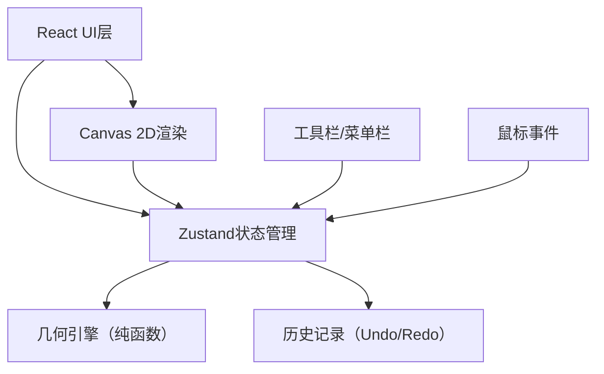

## 1. 架构设计



## 2. 技术描述

- **前端框架**：React 18 + TypeScript
- **构建工具**：Vite
- **状态管理**：Zustand
- **图形渲染**：Canvas 2D API
- **唯一ID生成**：uuid
- **开发服务器端口**：3000

## 3. 项目结构

| 文件路径 | 用途 |
|----------|------|
| package.json | 项目依赖和脚本配置 |
| vite.config.js | Vite构建配置 |
| tsconfig.json | TypeScript编译配置 |
| index.html | 应用入口页面 |
| src/main.tsx | React应用入口 |
| src/store/canvasStore.ts | Zustand状态管理（图形、约束、历史记录） |
| src/core/geometryEngine.ts | 几何计算引擎（纯函数） |
| src/components/Toolbar.tsx | 左侧工具栏组件 |
| src/components/Canvas.tsx | 主画布组件（渲染+交互） |
| src/components/MenuBar.tsx | 顶部菜单栏组件 |

## 4. 数据模型

### 4.1 图形元素类型

```typescript
type Point = {
  id: string;
  type: 'point';
  x: number;
  y: number;
  selected?: boolean;
};

type Segment = {
  id: string;
  type: 'segment';
  startPointId: string;
  endPointId: string;
  selected?: boolean;
};

type Circle = {
  id: string;
  type: 'circle';
  centerId: string;
  radiusPointId: string;
  selected?: boolean;
};

type Line = {
  id: string;
  type: 'line';
  point1Id: string;
  point2Id: string;
  selected?: boolean;
};

type Ray = {
  id: string;
  type: 'ray';
  startPointId: string;
  directionPointId: string;
  selected?: boolean;
};

type Polygon = {
  id: string;
  type: 'polygon';
  pointIds: string[];
  selected?: boolean;
};

type Shape = Point | Segment | Circle | Line | Ray | Polygon;
```

### 4.2 约束类型

```typescript
type ParallelConstraint = {
  id: string;
  type: 'parallel';
  segment1Id: string;
  segment2Id: string;
};

type PerpendicularConstraint = {
  id: string;
  type: 'perpendicular';
  segment1Id: string;
  segment2Id: string;
};

type MidpointConstraint = {
  id: string;
  type: 'midpoint';
  pointId: string;
  segmentId: string;
};

type AngleConstraint = {
  id: string;
  type: 'angle';
  segment1Id: string;
  segment2Id: string;
  angle: number;
};

type Constraint = ParallelConstraint | PerpendicularConstraint | MidpointConstraint | AngleConstraint;
```

### 4.3 画布状态

```typescript
type CanvasState = {
  shapes: Shape[];
  constraints: Constraint[];
  currentTool: ToolType;
  selectedShapeId: string | null;
  zoom: number;
  pan: { x: number; y: number };
  history: HistoryState[];
  historyIndex: number;
};
```

## 5. 核心算法

### 5.1 约束求解
- 采用迭代松弛法（Iterative Relaxation）
- 每帧多次迭代逼近约束满足
- 优先级：中点 > 平行/垂直 > 角度

### 5.2 碰撞检测
- 点：距离检测（阈值8px）
- 线段：点到线段最短距离
- 圆：圆心距离与半径比较

### 5.3 坐标变换
- 屏幕坐标 → 世界坐标：考虑缩放和平移
- 世界坐标 → 屏幕坐标：逆变换
