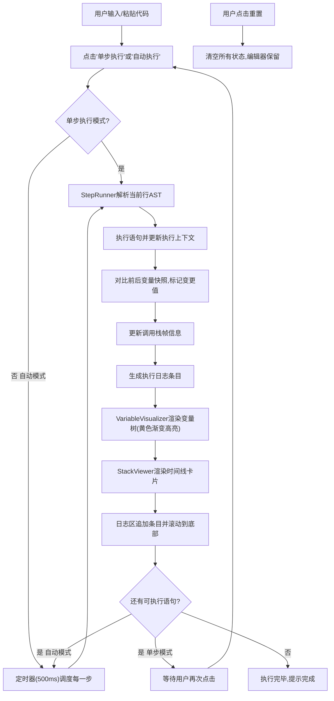

## 1. 产品概述

交互式代码调试与变量状态可视化应用，让开发者在浏览器中直观追踪JavaScript函数的执行过程、变量变化和调用栈情况，降低调试认知负担。

- 核心价值：将抽象的代码执行过程具象化为可视的时间线、变量树和调用栈，帮助开发者快速理解程序运行状态
- 目标用户：前端/全栈开发者、编程学习者、代码审计人员

## 2. 核心功能

### 2.1 功能模块

1. **主调试面板**：代码编辑器 + 可视化面板的双栏布局，支持拖拽分割条调整比例
2. **代码编辑器**：支持输入/粘贴JavaScript代码，提供类VS Code深色风格，关键字高亮
3. **单步执行引擎**：逐行解析并执行代码，维护执行上下文、作用域链和调用栈
4. **变量状态可视化**：树形结构展示当前作用域变量，高亮标记新变化值
5. **调用栈可视化**：垂直时间线形式展示函数调用与返回关系
6. **执行日志区**：实时记录执行步骤和状态变化，支持时间戳和彩色分级
7. **自动执行模式**：以0.5秒间隔连续执行，可随时停止
8. **重置功能**：一键清零所有状态，重新开始调试

### 2.3 页面详情

| 页面名称 | 模块名称 | 功能描述 |
|---------|---------|---------|
| 调试主页面 | 代码编辑区 | 左侧40%宽，深色背景#1e293b，可编辑textarea，关键字绿色高亮 |
| 调试主页面 | 可拖拽分割条 | 4px宽，颜色#cbd5e1，悬停#94a3b8，col-resize光标，拖动手感 |
| 调试主页面 | 可视化面板容器 | 右侧60%宽，浅色背景#f8fafc，分三个子区域 |
| 调试主页面 | 变量状态区 | 左上50%高，树形列表，monospace字体，变量名#1e293b，值浅蓝背景#dbeafe，新值黄色渐变动画 |
| 调试主页面 | 调用栈区 | 右上50%高，居中垂直时间线2px #94a3b8，圆角卡片220x36px白色带边框，当前帧蓝色边框高亮 |
| 调试主页面 | 执行日志区 | 下方全宽150px高，时间戳HH:mm:ss.ms #64748b，信息/警告/错误三色分级，最多100条，自动滚动到底部 |
| 调试主页面 | 单步执行按钮 | 蓝色#3b82f6，悬停#2563eb，点击缩放0.95/100ms动画，圆角6px |
| 调试主页面 | 自动执行按钮 | 切换开关，运行时红色#ef4444，停止时灰色，0.5s间隔 |
| 调试主页面 | 重置按钮 | 灰色#94a3b8，一键清零所有状态 |

## 3. 核心流程

用户输入代码 → 点击单步执行/自动执行 → 引擎逐行解析执行 → 更新变量树/调用栈/日志 → 可视化渲染（高亮变化值）→ 继续下一步或用户停止/重置

## 4. 用户界面设计

### 4.1 设计风格

- **主题**：左深右浅双色对比布局，类IDE专业调试器风格
- **主色调**：深蓝#1e293b（编辑区）、浅灰#f8fafc（可视化区）
- **强调色**：蓝色#3b82f6（主操作/高亮）、绿色#22c55e（代码关键字）、黄色#fef08a（值变化动画）、橙色#f97316（警告）、红色#ef4444（错误/停止）
- **中性色**：#cbd5e1 #94a3b8 #e2e8f0 #64748b #334155 #dbeafe
- **按钮风格**：实心圆角6px，悬停加深，点击缩放0.95/100ms过渡
- **字体**：等宽字体（Consolas/Monaco/monospace）用于代码和变量，系统无衬线用于界面文字
- **布局**：固定双栏，可拖拽分割条；>768px左右布局，<768px上下堆叠

### 4.2 页面设计概述

| 模块名称 | UI元素 | 样式细节 |
|---------|--------|---------|
| 代码编辑器 | textarea容器 | min-height:100%，深色背景，绿色关键字高亮，padding 16px，字号14px |
| 分割条 | 垂直div | 宽度4px，默认#cbd5e1，hover#94a3b8，cursor:col-resize，active时轻微阴影 |
| 变量状态区 | 树形ul/li | 缩进层级，变量名monospace #1e293b，值背景#dbeafe #3b82f6文字，padding 2px 6px，圆角3px |
| 变化值高亮 | CSS动画 | background-image线性渐变#fef08a→transparent，0.8s过渡，仅新变更值触发 |
| 调用栈区 | 卡片列表 | 居中时间线竖线2px #94a3b8，卡片220x36px绝对定位，flex居中，当前帧border 2px #3b82f6 |
| 执行日志区 | 滚动容器 | 150px固定高，overflow-y:auto，条目padding 4px 12px，时间戳灰色前缀 |
| 控制按钮组 | flex横向排列 | gap 8px，顶部对齐，margin 12px |
| 响应式断点 | @media max-width:768px | 改为上下堆叠，分割条变为水平，cursor:row-resize |

### 4.3 响应式

- Desktop优先（宽度≥768px）：左右双栏布局，代码区40%，可视化60%
- 移动端（<768px）：上下堆叠，代码区全宽，可视化区全宽，分割条改为水平拖拽row-resize
- 触控设备：按钮增大点击热区，拖拽区域增强手感

## 4.4 动画与动效

- **变量变化高亮**：background从#fef08a渐变至透明，0.8s ease-out
- **按钮点击**：transform scale(0.95)，100ms ease-in-out，松开还原
- **分割条悬停**：背景色过渡200ms，cursor切换
- **调用栈卡片入场**：新卡片从上方滑入，opacity 0→1，translateY -8→0，200ms
- **日志条目追加**：滚动到底部平滑过渡，新条目渐显
- **自动执行切换**：按钮颜色过渡150ms
