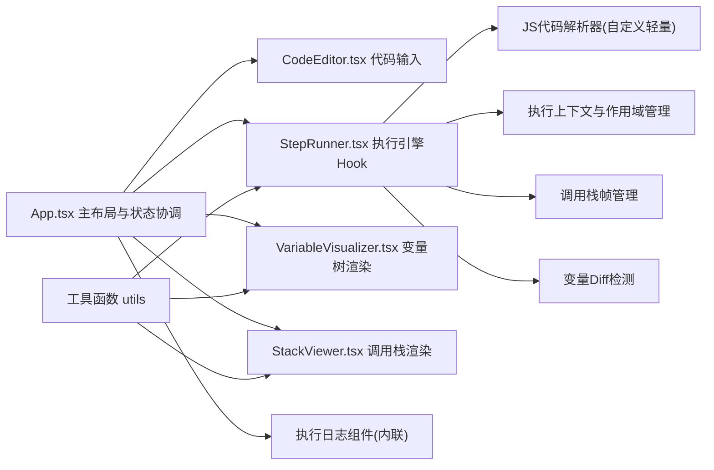

## 1. 架构设计

纯前端单页应用，采用分层架构：视图组件层 → 状态管理层 → 执行引擎层 → 工具函数层。



## 2. 技术描述

- **前端框架**：React 18 + TypeScript（严格模式，ES2020模块）
- **构建工具**：Vite 5 + @vitejs/plugin-react
- **状态管理**：React useState/useReducer（轻量场景，无需zustand）
- **代码解析**：自定义轻量级JS解析器（按语句拆分+正则关键字识别），避免引入acorn等重型依赖
- **样式方案**：原生CSS + CSS Modules + CSS变量，内联样式处理动态值
- **动画**：CSS transition/animation + keyframes，无第三方动画库
- **字体**：等宽字体栈：'Consolas', 'Monaco', 'Courier New', monospace
- **图标**：内联SVG或emoji，遵循用户要求不添加额外依赖

## 3. 文件结构（严格对齐用户需求）

```
auto84/
├── package.json          # 用户指定依赖和脚本
├── vite.config.js        # 用户指定入口配置
├── tsconfig.json         # 严格模式 ES2020
├── index.html            # 入口页面
└── src/
    ├── App.tsx           # 主组件，布局+状态+协调
    ├── CodeEditor.tsx    # 代码输入textarea+高亮
    ├── StepRunner.tsx    # 单步执行引擎（Hook形式）
    ├── VariableVisualizer.tsx  # 变量树可视化
    └── StackViewer.tsx   # 调用栈时间线可视化
```

## 4. 数据结构与类型定义

```typescript
// 变量值类型
type VarValue = string | number | boolean | null | undefined | object | VarValue[];

// 单条变量记录
interface VariableEntry {
  name: string;
  type: string;
  value: VarValue;
  isNewlyChanged: boolean;
  children?: VariableEntry[]; // 对象/数组的子属性
}

// 作用域
interface Scope {
  variables: Map<string, VarValue>;
  parent?: Scope;
  type: 'global' | 'function' | 'block';
}

// 调用栈帧
interface StackFrame {
  id: string;
  functionName: string;
  argsSummary: string;
  lineNumber: number;
  isCurrent: boolean;
  timestamp: number;
}

// 日志条目
interface LogEntry {
  id: string;
  timestamp: string; // HH:mm:ss.ms
  level: 'info' | 'warn' | 'error';
  message: string;
}

// 执行步骤
interface ExecStep {
  lineNumber: number;
  lineContent: string;
  type: 'declaration' | 'assignment' | 'condition' | 'loop' | 'function-call' | 'return' | 'other';
}

// 执行引擎状态
interface RunnerState {
  steps: ExecStep[];
  currentStepIndex: number;
  scopes: Scope[];
  callStack: StackFrame[];
  logs: LogEntry[];
  variablesSnapshot: Map<string, VarValue>; // 上一步变量快照,用于diff
  isRunning: boolean;
  isFinished: boolean;
  error: string | null;
}
```

## 5. 核心算法

### 5.1 代码解析策略

由于避免重型依赖，采用**逐行扫描 + 正则匹配 + 栈式括号匹配**策略：

1. 按换行符拆分为代码行，去除空白行和纯注释行
2. 对每行进行关键字识别：
   - `function` → 函数声明
   - `var/let/const` → 变量声明，提取名字和初值
   - `if/else if/else` → 条件分支
   - `for/while/do` → 循环
   - `return` → 返回语句
   - `[a-zA-Z_$][\w$]*\s*=` → 赋值语句
   - `[a-zA-Z_$][\w$]*\s*\(` → 函数调用
3. 用括号栈（{}、()、[]）追踪作用域嵌套层次
4. 生成扁平步骤列表`steps[]`，循环和条件分支会展开为多步（含条件判断和体执行）

### 5.2 执行引擎（StepRunner核心逻辑）

- 使用`useReducer`管理`RunnerState`
- `dispatch({ type: 'STEP' })` → 执行下一条步骤：
  1. 取出`steps[currentStepIndex]`
  2. 根据步骤类型，在当前作用域内执行求值（用`new Function`沙盒隔离，仅访问当前scope变量）
  3. 对比上一步`snapshot`和当前scope，标记变更变量`isNewlyChanged=true`
  4. 更新调用栈（函数调用push帧、return pop帧）
  5. 追加日志条目（最多100条，超出shift）
  6. `currentStepIndex++`，更新snapshot
- `dispatch({ type: 'AUTO_START/STOP' })` → 控制`isRunning`，配合`useEffect + setInterval(500ms)`驱动
- `dispatch({ type: 'RESET' })` → 清空所有状态，保留代码文本

### 5.3 变量Diff与高亮

- 每步执行后，深度对比当前变量Map与上一步snapshot
- 对比维度：新增变量、值变更变量、删除变量
- 对变化的变量设置`isNewlyChanged=true`，并记录时间戳
- CSS类`var-changed`触发`@keyframes highlight { 0%{background:#fef08a} 100%{background:transparent} }`持续0.8s
- 下一步执行时重置上一步的`isNewlyChanged`

### 5.4 定时器无漂移方案

自动执行模式下，使用`setInterval`配合`performance.now()`校准，避免渲染延迟累积漂移：

```typescript
const intervalRef = useRef<number>();
const targetTickRef = useRef<number>(0);
const INTERVAL = 500;

useEffect(() => {
  if (!isAutoRunning) return;
  targetTickRef.current = performance.now() + INTERVAL;
  const tick = () => {
    const now = performance.now();
    const drift = now - targetTickRef.current;
    const nextDelay = Math.max(0, INTERVAL - drift);
    dispatch({ type: 'STEP' });
    targetTickRef.current += INTERVAL;
    intervalRef.current = window.setTimeout(tick, nextDelay);
  };
  intervalRef.current = window.setTimeout(tick, INTERVAL);
  return () => clearTimeout(intervalRef.current);
}, [isAutoRunning]);
```

## 6. 性能保障措施

1. **渲染≤50ms延迟**：
   - 所有组件使用`React.memo`包裹，props浅比较
   - 变量树深对象延迟展开（点击展开才递归渲染子级）
   - 日志条目用`key={entry.id}`稳定key，减少DOM重建
2. **60fps动画**：
   - 变量高亮用CSS原生动画，不触发JS重计算
   - 所有过渡使用transform/opacity（GPU加速），避免layout动画
3. **内存优化**：
   - 日志最多保留100条，超出FIFO淘汰
   - 变量snapshot仅保存上一步，不累积历史
   - `StepRunner`中解析产生的临时数组在使用后立即释放引用

## 7. 执行沙盒设计

为安全执行用户输入的JavaScript代码：

- 使用`new Function('scope', codeBody)`创建隔离函数
- 将当前作用域变量通过scope对象传入，执行后写回
- 用try/catch捕获运行时错误，转为error级别日志
- 禁止访问`window/document/eval`等危险API（通过代理scope对象拦截）
