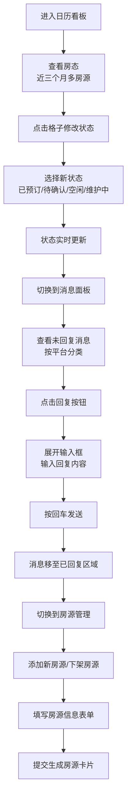

## 1. 产品概述

民宿房东管理工具是一款专为小民宿房东设计的多平台房源管理助手，解决房东同时管理多个Airbnb、小猪等平台房源时容易漏看消息、忘记更新房态的痛点。

- 核心价值：集中化管理多平台房源状态和客人消息，提升运营效率，减少因信息不及时导致的订单损失
- 目标用户：管理5-50套房源的个体民宿房东和小型民宿运营团队

## 2. 核心功能

### 2.1 用户角色
| 角色 | 注册方式 | 核心权限 |
|------|----------|----------|
| 房东 | 无需注册（本地工具） | 查看/修改房态、回复消息、管理房源 |

### 2.2 功能模块
1. **日历看板页面**：多房源日历视图、周/月切换、房态快速切换
2. **消息面板页面**：未回复消息列表、快速回复、已回复归档、搜索过滤
3. **房源管理页面**：添加房源、下架房源、房源信息展示

### 2.3 页面详情
| 页面名称 | 模块名称 | 功能描述 |
|---------|----------|----------|
| 日历看板 | 日历视图 | 展示所有房源近三个月预订状态，已预订/待确认/空闲/维护中四种状态用不同颜色区分 |
| 日历看板 | 视图切换 | 支持周视图和月视图切换，日历格子悬停放大动画，状态切换颜色渐变 |
| 日历看板 | 状态管理 | 点击日历格子弹出状态切换菜单，修改后实时更新 |
| 消息面板 | 消息列表 | 按未读/已读分类展示，显示来源平台标识，支持关键词搜索 |
| 消息面板 | 快速回复 | 点击回复按钮展开输入框，回车发送，消息自动移至已回复区域 |
| 房源管理 | 房源表单 | 填写名称、平台、价格、入住人数、照片URL，提交后生成房源卡片 |
| 房源管理 | 房源网格 | 卡片式展示所有房源，悬停边框变色，删除按钮带确认弹窗 |

## 3. 核心流程

房东登录工具后，首先在日历看板查看所有房源近期预订情况，发现需要调整的房态点击修改；然后切换到消息面板查看未回复的客人咨询，快速回复后消息自动归档；最后在房源管理页面添加新房源或下架已停止运营的房源。

## 4. 用户界面设计

### 4.1 设计风格
- **主色调**：浅灰蓝背景 #f1f5f9，深灰文字 #1e293b，蓝色主色 #3b82f6
- **状态色**：已预订橙色 #f97316、待确认黄色 #eab308、空闲绿色 #22c55e、维护中灰色 #94a3b8
- **平台色**：Airbnb红色 #ff5a5f、小猪绿色 #00b894
- **卡片样式**：圆角10px，柔和阴影，背景白色 #ffffff
- **按钮样式**：圆角8px，点击时scale 0.95瞬移反馈
- **字体**：使用系统优雅字体栈，避免Inter等通用字体，采用 "Noto Sans SC", "PingFang SC", "Microsoft YaHei" 等中文优化字体
- **布局风格**：顶部导航栏 + 三页面路由切换，卡片式内容展示

### 4.2 页面设计概述
| 页面名称 | 模块名称 | UI元素 |
|---------|----------|--------|
| 日历看板 | 导航栏 | 品牌标识、三个页面切换标签、当前日期显示 |
| 日历看板 | 视图切换 | 周/月切换按钮组，当前视图高亮 |
| 日历看板 | 日历网格 | 房源名称列 + 日期列，状态色块，悬停放大1.05倍加阴影，0.2s颜色渐变 |
| 日历看板 | 状态弹窗 | 点击格子弹出四个状态选项，圆角卡片 |
| 消息面板 | 搜索栏 | 关键词搜索输入框，未读/已读筛选标签 |
| 消息面板 | 消息卡片 | 高度80px，背景 #f8fafc，左侧4px彩色竖条标识平台，右侧回复按钮 |
| 消息面板 | 回复输入框 | 宽度100%，最大高度120px自动扩展，回车发送 |
| 房源管理 | 添加表单 | 名称、平台、价格、入住人数、照片URL字段，提交按钮 |
| 房源管理 | 房源网格 | 卡片宽度300px，圆角8px，浅灰边框 #e2e8f0，悬停边框变蓝色 #3b82f6 |
| 房源管理 | 删除按钮 | 右上角红色圆形按钮，点击弹出确认对话框 |

### 4.3 响应式设计
- **设计策略**：桌面优先，平板和手机自适应
- **断点**：768px以下为移动端适配
- **平板适配**：日历字体缩小，卡片保持网格布局但减少列数
- **手机适配**：卡片变全宽，日历简化显示，导航栏图标化
- **触摸优化**：按钮最小尺寸44x44px，点击区域足够大

### 4.4 动效设计
- 日历格子悬停：scale(1.05) + 阴影增强
- 状态切换：0.2s颜色渐变过渡
- 按钮点击：scale(0.95) 瞬移反馈
- 消息发送：卡片向上淡出后滑入已回复区域，带灰色渐变
- 页面切换：淡入淡出过渡，200ms完成
- 表单提交：按钮loading状态，成功后卡片从底部滑入
