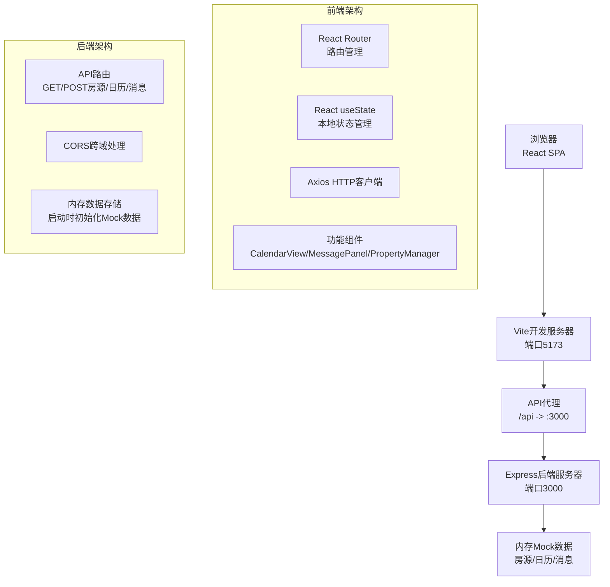
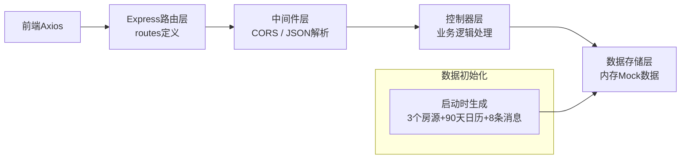
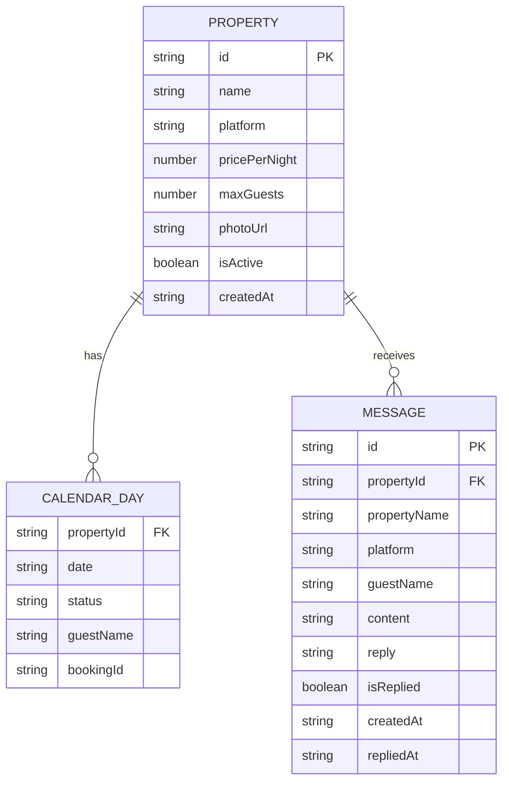

## 1. 架构设计



## 2. 技术描述

- **前端框架**：React@18 + TypeScript@5 + React Router DOM@6
- **构建工具**：Vite@5 + @vitejs/plugin-react@4
- **HTTP客户端**：Axios@1
- **工具库**：uuid@9
- **后端框架**：Express@4 + TypeScript@5
- **后端中间件**：cors@2
- **后端运行时**：ts-node@10
- **类型定义**：@types/express、@types/cors、@types/node
- **数据存储**：内存模拟数据，无需数据库

## 3. 路由定义

| 路由 | 页面 | 功能 |
|------|------|------|
| / | 日历看板 | 默认首页，展示多房源日历视图 |
| /calendar | 日历看板 | 同上，路由别名 |
| /messages | 消息面板 | 未回复消息列表和快速回复 |
| /properties | 房源管理 | 添加/删除房源，房源卡片展示 |

## 4. API 定义

### 4.1 数据类型定义

```typescript
// 房源类型
interface Property {
  id: string;
  name: string;
  platform: 'airbnb' | 'xiaozhu';
  pricePerNight: number;
  maxGuests: number;
  photoUrl: string;
  isActive: boolean;
  createdAt: string;
}

// 日历状态类型
type BookingStatus = 'booked' | 'pending' | 'available' | 'maintenance';

interface CalendarDay {
  propertyId: string;
  date: string;
  status: BookingStatus;
  guestName?: string;
  bookingId?: string;
}

// 消息类型
type MessagePlatform = 'airbnb' | 'xiaozhu';

interface Message {
  id: string;
  propertyId: string;
  propertyName: string;
  platform: MessagePlatform;
  guestName: string;
  content: string;
  reply?: string;
  isReplied: boolean;
  createdAt: string;
  repliedAt?: string;
}
```

### 4.2 接口列表

| 方法 | 路径 | 描述 | 请求体 | 响应 |
|------|------|------|--------|------|
| GET | /api/properties | 获取所有房源列表 | - | Property[] |
| POST | /api/properties | 添加新房源 | Omit<Property, 'id' \| 'isActive' \| 'createdAt'> | Property |
| DELETE | /api/properties/:id | 删除（下架）房源 | - | { success: boolean } |
| GET | /api/calendar | 获取日历数据 | query: { startDate, endDate } | CalendarDay[] |
| POST | /api/calendar | 更新日历状态 | { propertyId, date, status, guestName? } | CalendarDay |
| GET | /api/messages | 获取消息列表 | query: { isReplied?, search? } | Message[] |
| POST | /api/messages/:id/reply | 回复消息 | { reply: string } | Message |

## 5. 服务器架构图



## 6. 数据模型

### 6.1 数据模型关系



### 6.2 Mock 数据初始化

系统启动时自动生成以下模拟数据：

1. **3个房源**：覆盖Airbnb和小猪两个平台，价格从300-800元不等
2. **90天日历数据**：每个房源近90天的随机状态，包含约30%已预订、15%待确认、50%空闲、5%维护中
3. **8条消息**：5条未回复、3条已回复，覆盖两个平台和不同房源

### 6.3 性能指标

- 日历视图切换渲染时间：≤200ms
- 消息列表搜索响应时间：≤300ms
- 首屏加载时间：≤1.5s
- 交互响应延迟：≤100ms（按钮点击、状态切换）
