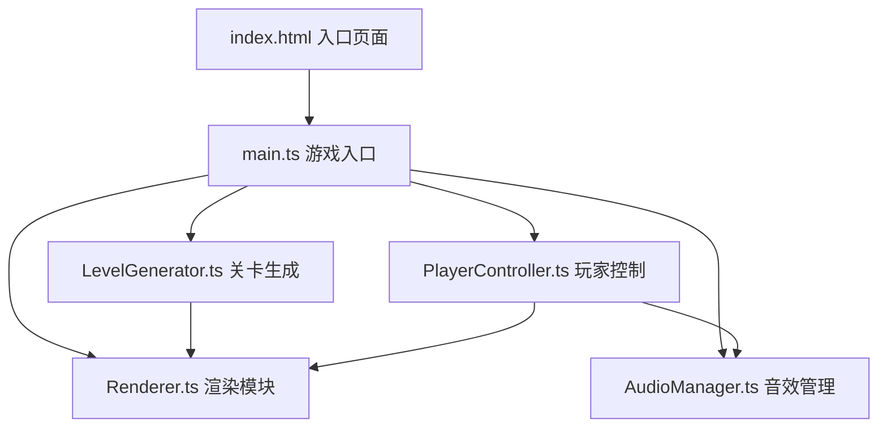

## 1. 架构设计



## 2. 技术描述

- **前端技术栈**：TypeScript + HTML5 Canvas + Vite
- **构建工具**：Vite
- **语言**：TypeScript（严格模式，ES2020模块）
- **渲染**：HTML5 Canvas 2D
- **音效**：Web Audio API
- **无后端**：纯前端游戏应用

## 3. 文件结构

```
├── package.json          # 项目配置
├── vite.config.js      # Vite配置
├── tsconfig.json       # TypeScript配置
├── index.html          # 入口页面
└── src/
    ├── main.ts         # 游戏入口
    ├── LevelGenerator.ts   # 关卡生成模块
    ├── PlayerController.ts # 玩家控制模块
    ├── Renderer.ts        # 渲染模块
    └── AudioManager.ts    # 音效管理模块
```

## 4. 核心类定义

### 4.1 Platform（平台）
```typescript
interface Platform {
  id: number;
  x: number;
  y: number;
  width: number;
  height: number;
  color: string;
  isNew: boolean; // 是否为新生成（用于滑入动画）
  spawnTime: number; // 生成时间戳
  fadeOut: boolean; // 是否正在淡出
}
```

### 4.2 Player（玩家）
```typescript
interface Player {
  x: number;
  y: number;
  width: number;
  height: number;
  vx: number;
  vy: number;
  color: string;
  onGround: boolean;
  lastPlatformId: number | null;
  tiltAngle: number;
  squashStretch: number; // 压缩拉伸因子
}
```

### 4.3 Particle（粒子）
```typescript
interface Particle {
  x: number;
  y: number;
  vx: number;
  vy: number;
  life: number;
  maxLife: number;
  color: string;
  size: number;
}
```

### 4.4 Ripple（波纹）
```typescript
interface Ripple {
  x: number;
  y: number;
  radius: number;
  maxRadius: number;
  life: number;
  maxLife: number;
  color: string;
}
```

## 5. 性能要求

- 帧率：60 FPS
- 平台生成算法耗时：≤ 5ms
- 游戏循环：requestAnimationFrame
