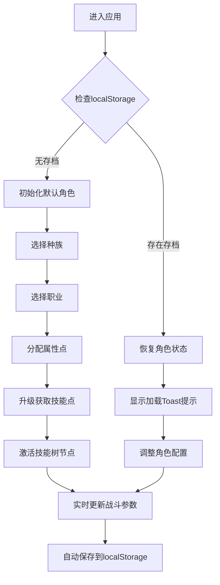

## 1. 产品概述

本产品是一款在线交互式RPG角色构建与技能搭配模拟器，为玩家提供自由创建、配置和预览游戏角色的完整工具链。目标用户是RPG游戏爱好者、游戏设计师以及需要进行角色数值规划的玩家群体。

产品价值：通过可视化的角色构建界面和实时战斗参数预览，帮助玩家在游戏投入前进行策略规划，降低试错成本，提升游戏体验。

## 2. 核心功能

### 2.1 用户角色
| 角色 | 注册方式 | 核心权限 |
|------|---------|----------|
| 游客用户 | 无需注册，直接访问 | 使用所有角色构建、技能搭配和预览功能 |

### 2.2 功能模块
1. **角色构建面板**：种族选择、职业选择、属性点分配、等级/经验系统
2. **技能树区域**：Canvas技能节点图、技能连线、技能激活/学习交互
3. **战斗预览面板**：DPS计算、命中率、暴击率、技能序列展示
4. **状态持久化**：localStorage自动保存与恢复、加载提示Toast

### 2.3 页面详情
| 页面名称 | 模块名称 | 功能描述 |
|----------|----------|----------|
| 主页面 | 角色构建面板 | 4种种族选择、6种职业选择、5项属性点分配（30点自由分配，每项基础5，上限20）、等级经验条模拟升级 |
| 主页面 | 技能树区域 | Canvas绘制节点-连线技能图，节点状态（未激活/可学习/已激活/不可学习），点击消耗技能点激活，连线颜色过渡动画 |
| 主页面 | 战斗预览面板 | 实时计算DPS、命中率、暴击率，展示按冷却排序的技能序列卡片 |
| 主页面 | 状态持久化 | 自动保存到localStorage，刷新恢复，底部Toast提示 |

## 3. 核心流程

用户进入应用 → 选择种族 → 选择职业 → 分配属性点 → 点击经验条升级获取技能点 → 在技能树中学习激活技能 → 实时查看右侧战斗参数变化 → 刷新页面自动恢复状态

## 4. 用户界面设计

### 4.1 设计风格
- 主色调：#0f172a（深色背景）、#1e293b（面板/卡片）、#3b82f6（强调蓝）、#facc15（战斗参数金）、#22c55e（成功绿）、#ef4444（警告红）
- 字体：系统无衬线字体（-apple-system, BlinkMacSystemFont, Segoe UI, Roboto, sans-serif）
- 按钮风格：圆角8px，hover/active 0.2s过渡动画
- 卡片风格：圆角8px，hover时上移3px + box-shadow
- 布局风格：三列布局（左侧角色面板300px、中间技能树flex:1、右侧预览320px）

### 4.2 页面设计概述
| 页面名称 | 模块名称 | UI元素 |
|----------|----------|--------|
| 主页面 | 角色构建面板 | 种族/职业选择卡片、属性+/-按钮（32x32px，圆角8px，蓝色#3b82f6）、大号数值显示（bold 24px #f8fafc）、进度条（8px高，#475569背景#22c55e填充）、经验条 |
| 主页面 | 技能树区域 | Canvas画布、圆形节点（48px直径）、节点状态颜色、连线颜色过渡（0.3s动画）、可学习节点闪烁动画 |
| 主页面 | 战斗预览面板 | 数值卡片（140x80px，#0f172a背景，圆角8px，内边距12px）、大号数字（32px #facc15）、小号单位（#94a3b8）、技能序列列表 |
| 主页面 | Toast提示 | 底部居中，最大宽400px，#334155背景，#f8fafc文字，圆角8px，2s自动消失 |

### 4.3 响应式设计
- 桌面端（>1200px）：三列并列布局
- 中等屏幕（992-1199px）：技能树区域折叠到角色构建面板下方，左右两列
- 移动端（<992px）：垂直布局，各面板全宽

### 4.4 性能指标
- 战斗参数计算耗时 ≤ 5ms
- Canvas渲染帧率 ≥ 30fps
- UI重渲染节流到每50ms一次
