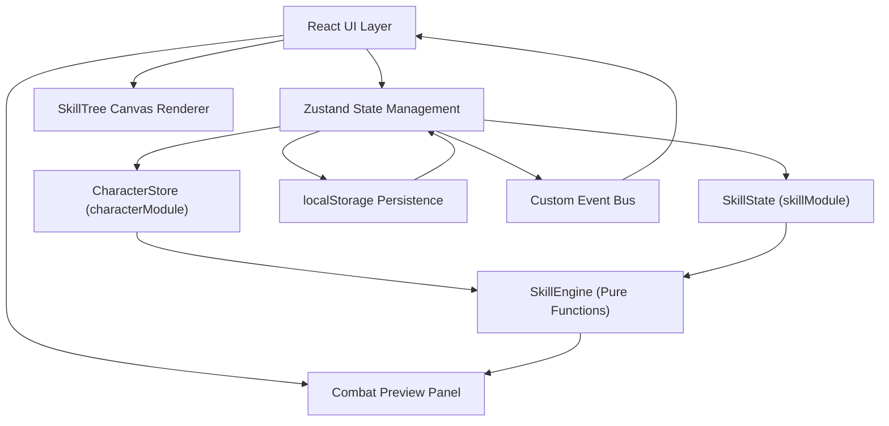
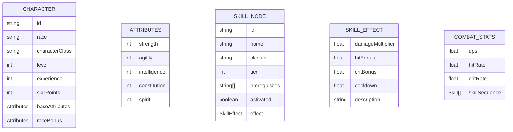

## 1. 架构设计



## 2. 技术描述

- 前端框架：React 18 + TypeScript
- 构建工具：Vite
- 状态管理：Zustand
- 路由：无需路由（单页应用）
- UI样式：原生CSS（CSS Modules）
- 工具库：uuid
- 后端：无（纯前端应用）
- 数据持久化：localStorage

## 3. 路由定义

| 路由 | 用途 |
|------|------|
| / | 主应用页面（角色构建器） |

## 4. 数据模型

### 4.1 数据模型定义



### 4.2 TypeScript类型定义

```typescript
// 种族类型
type Race = 'human' | 'elf' | 'dwarf' | 'orc';

// 职业类型
type CharacterClass = 'warrior' | 'mage' | 'ranger' | 'rogue' | 'priest' | 'warlock';

// 属性接口
interface Attributes {
  strength: number;
  agility: number;
  intelligence: number;
  constitution: number;
  spirit: number;
}

// 技能效果接口
interface SkillEffect {
  damageMultiplier: number;
  hitBonus: number;
  critBonus: number;
  cooldown: number;
  description: string;
  icon: string;
}

// 技能节点接口
interface SkillNode {
  id: string;
  name: string;
  classId: CharacterClass;
  tier: number;
  prerequisites: string[];
  effect: SkillEffect;
  x: number;
  y: number;
}

// 战斗参数接口
interface CombatStats {
  dps: number;
  hitRate: number;
  critRate: number;
  skillSequence: Array<{
    id: string;
    name: string;
    icon: string;
    cooldown: number;
  }>;
}

// 角色状态接口
interface CharacterState {
  id: string;
  race: Race;
  characterClass: CharacterClass;
  level: number;
  experience: number;
  skillPoints: number;
  baseAttributes: Attributes;
  allocatedPoints: number;
  activatedSkills: string[];
}
```

## 5. 目录结构

```
src/
├── main.tsx                          # 应用入口
├── characterModule/
│   ├── CharacterStore.ts            # Zustand角色状态管理
│   ├── types.ts                      # 角色相关类型定义
│   └── data.ts                       # 种族/职业静态数据
├── skillModule/
│   ├── SkillTree.tsx                 # Canvas技能树组件
│   ├── SkillEngine.ts                # 技能效果纯函数计算引擎
│   ├── types.ts                      # 技能相关类型定义
│   └── data.ts                       # 技能数据
├── combatModule/
│   ├── CombatPreview.tsx             # 战斗参数预览组件
│   └── types.ts                      # 战斗参数类型
├── uiModule/
│   ├── MainLayout.tsx                # 主布局组件
│   ├── CharacterPanel.tsx            # 角色构建面板
│   ├── Toast.tsx                     # Toast提示组件
│   └── styles.css                    # 全局样式
└── shared/
    ├── eventBus.ts                   # 自定义事件总线
    └── types.ts                      # 共享类型
```

## 6. 性能优化策略

1. **计算性能**：SkillEngine使用纯函数，无副作用，便于memoization；战斗参数计算复杂度控制在O(n)以内
2. **渲染性能**：Canvas使用requestAnimationFrame渲染，技能节点重绘区域最小化；React组件使用memo和useMemo避免不必要重渲染
3. **状态更新**：Zustand状态更新通过subscribe + 节流（50ms）批量处理UI更新
4. **持久化**：localStorage写入使用防抖（300ms），避免频繁IO
