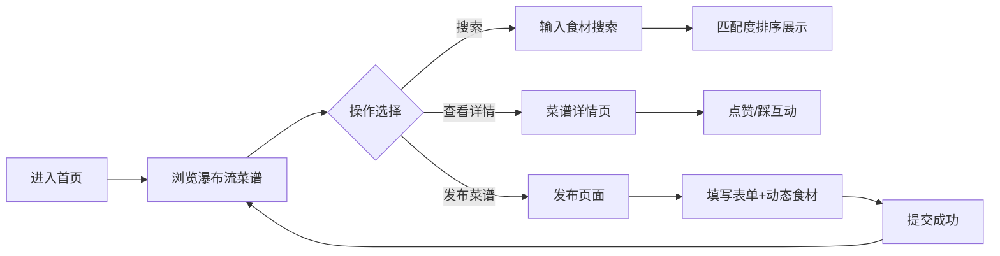

## 1. 产品概述
社区菜谱分享与智能推荐平台，帮助家庭用户系统记录私房菜谱，并根据手头食材智能匹配推荐做法。
- 解决家庭菜谱记录分散、食材利用效率低的痛点
- 打造温暖居家风格的美食分享社区

## 2. 核心功能

### 2.1 用户角色
| 角色 | 注册方式 | 核心权限 |
|------|----------|----------|
| 普通用户 | 无需注册（模拟） | 浏览菜谱、发布菜谱、搜索菜谱、点赞/踩菜谱 |

### 2.2 功能模块
1. **首页**：顶部搜索栏、热门推荐侧栏、菜谱瀑布流、用户面板侧栏
2. **菜谱发布页**：动态食材输入、菜谱表单提交、封面图上传
3. **菜谱详情**：菜谱完整信息、点赞/踩互动、匹配度展示

### 2.3 页面详情
| 页面名称 | 模块名称 | 功能描述 |
|----------|----------|----------|
| 首页 | 顶部搜索框 | 按食材搜索，圆角20px，放大镜图标 |
| 首页 | 热门推荐侧栏 | 宽220px，自定义滚动条，展示热门菜谱 |
| 首页 | 瀑布流主内容 | 卡片宽280px，间距16px，无限滚动加载，骨架屏动画 |
| 首页 | 用户面板侧栏 | 宽240px，展示最近浏览与历史发布 |
| 首页 | 菜谱卡片 | 封面裁切180px高，边框1px #e2e8f0，悬停上移4px，匹配度圆形标签 |
| 发布页 | 动态食材标签 | 圆角8px，#e2e8f0背景，#1e293b文字，删除右滑动画0.3s |
| 发布页 | 菜谱表单 | 菜名、简介、食材列表、步骤、封面图 |
| 详情页 | 互动按钮 | 喜欢(心形，填充红色#ef4444，飘爱心动画0.5s)、踩(叉号，旋转一圈变灰#64748b) |

## 3. 核心流程
用户进入首页浏览瀑布流菜谱 → 可通过顶部搜索框输入食材搜索匹配菜谱 → 点击卡片查看详情并进行点赞/踩互动 → 用户可通过发布页上传新菜谱 → 新菜谱出现在首页瀑布流中

## 4. 用户界面设计

### 4.1 设计风格
- **主色**：#f97316（暖橙）
- **辅色**：#fef3c7（淡黄）
- **背景色**：#fff7ed
- **字体色**：#334155
- **按钮风格**：圆角8px，温暖居家风格
- **布局**：三栏布局（左220px + 中间瀑布流 + 右240px）
- **图标风格**：Lucide图标，线性风格

### 4.2 页面设计概述
| 页面名称 | 模块名称 | UI元素 |
|----------|----------|----------|
| 首页 | 搜索框 | 圆角20px，#f8fafc背景，放大镜图标，输入聚焦过渡 |
| 首页 | 菜谱卡片 | 280px宽，180px高封面，1px边框，悬停上移4px阴影加深0.2s |
| 首页 | 匹配度标签 | 圆形24px，#22c55e高/#eab308中/#94a3b8低 |
| 首页 | 骨架屏 | 灰色脉冲动画1.5s |
| 发布页 | 食材标签 | 圆角8px，#e2e8f0背景，删除右滑消失0.3s |
| 详情页 | 喜欢按钮 | 心形，填充#ef4444，飘小爱心0.5s |
| 详情页 | 踩按钮 | 叉号，旋转一圈变灰#64748b |
| 全部 | 路由过渡 | 向左滑入0.3s |
| 全部 | 侧栏滚动条 | 自定义滚动条样式 |

### 4.3 响应式
- 桌面优先设计，三栏布局
- 移动端自适应：侧栏折叠，主内容单列展示

## 5. 性能指标
- 首页瀑布流首次渲染 ≤ 1s
- 滚动加载新内容渲染 ≤ 200ms
- 所有动画使用CSS过渡，不阻塞主线程
