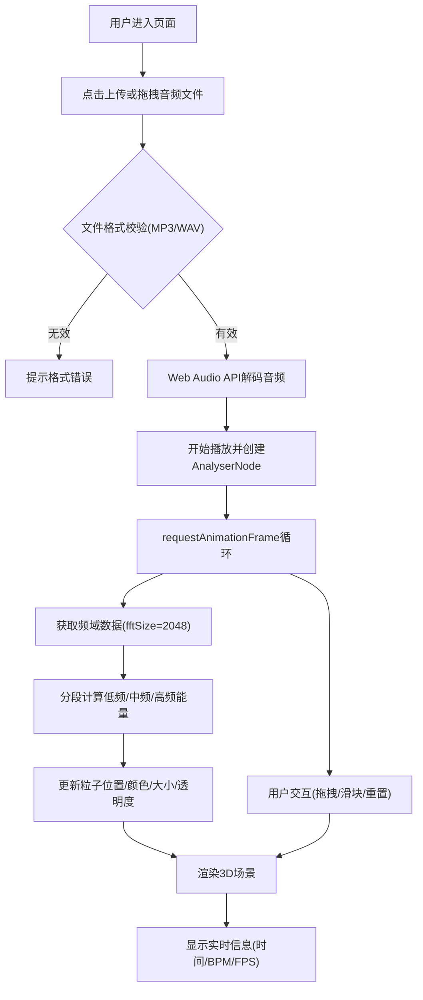

## 1. 产品概述
基于声波数据驱动的3D音乐灯光秀可视化应用，用户上传音频文件后可实时观看声波频谱对应的3D粒子灯光变幻效果。
- 面向音乐爱好者、视觉艺术创作者，提供沉浸式音频可视化体验
- 产品价值：将听觉音乐转化为震撼的3D视觉艺术，增强音乐欣赏体验

## 2. 核心功能

### 2.1 用户角色
| 角色 | 注册方式 | 核心权限 |
|------|----------|----------|
| 普通用户 | 无需注册 | 上传音频、观看可视化效果、调整参数 |

### 2.2 功能模块
1. **主可视化页面**：3D粒子渲染场景、背景参考环、光晕效果
2. **音频控制模块**：文件上传、播放暂停、进度显示
3. **交互控制模块**：场景重置、旋转灵敏度调节、鼠标拖拽旋转

### 2.3 页面详情
| 页面名称 | 模块名称 | 功能描述 |
|----------|----------|----------|
| 主可视化页面 | 3D粒子系统 | 至少8000个粒子，球体分布，按频谱频段驱动位移 |
| 主可视化页面 | 背景参考环 | 自动旋转环形几何体，BPM关联旋转速度，点缀点光源 |
| 主可视化页面 | 实时信息面板 | 播放时间、总时长、BPM、FPS显示 |
| 主可视化页面 | 文件上传区 | 点击/拖拽上传MP3/WAV格式音频 |
| 主可视化页面 | 控制栏 | 播放暂停按钮、灵敏度滑块、重置按钮 |

## 3. 核心流程
用户上传音频文件 → 系统解码音频并开始播放 → Web Audio API实时分析频谱数据 → 频谱数据按低频/中频/高频分段映射到粒子轴偏移 → 粒子位置、颜色、大小、透明度实时更新 → 背景环根据BPM旋转 → 用户可拖拽旋转视角/调整灵敏度/重置场景

## 4. 用户界面设计

### 4.1 设计风格
- 主色调：纯黑背景 #000000，强调色 #6366f1（靛蓝），辅助色 #ef4444（红）至 #fbbf24（黄）渐变
- 按钮样式：圆角6px，上传按钮120x40px，背景#6366f1，hover#4f46e5，0.2s过渡
- 字体：monospace 14px用于信息面板
- 布局：全屏沉浸式，所有UI元素边距统一8px，深色主题

### 4.2 页面设计概览
| 页面名称 | 模块名称 | UI元素 |
|----------|----------|--------|
| 主页面 | 文件上传区 | 虚线边框#94a3b8，hover时实线#6366f1 |
| 主页面 | 左下角信息面板 | monospace字体，颜色#94a3b8，实时数据 |
| 主页面 | 右上角重置按钮 | 圆形40px，背景#1e293b，hover#334155 |
| 主页面 | 底部控制栏 | 播放暂停按钮、灵敏度滑块(0.002-0.02) |

### 4.3 响应式
- 桌面端优先，自适应不同屏幕比例
- 粒子分布比例不变，粒子数量根据屏幕分辨率自动调整（1920x1080下8000个）

### 4.4 3D场景指引
- 环境：纯黑背景，无HDRI
- 光照：环形上24个点光源（每15度一个），强度0.3，颜色跟随粒子主色调
- 相机：PerspectiveCamera，初始位置(0, 0, 12)，看向原点，支持OrbitControls鼠标拖拽旋转
- 粒子：Points + BufferGeometry，球体分布半径8，按频段驱动XYZ偏移
- 效果：粒子偏移达最大值80%时触发0.1秒光晕，阻尼系数0.98使运动柔顺
- 性能：requestAnimationFrame循环，目标55+FPS
