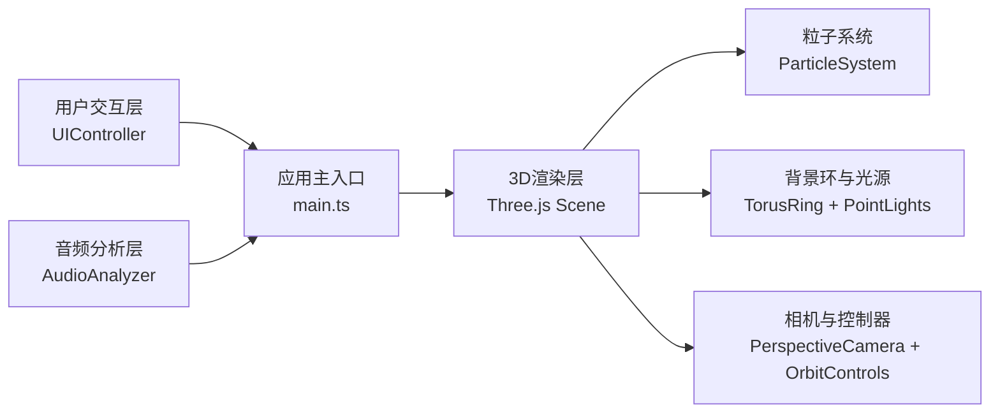

## 1. 架构设计


## 2. 技术描述
- 前端：TypeScript + Three.js + Vite
- 构建工具：Vite
- 音频处理：Web Audio API (AudioContext, AnalyserNode, AudioBufferSourceNode)
- 3D渲染：Three.js (Points, BufferGeometry, ShaderMaterial可选)
- 状态管理：模块内部状态，无额外状态管理库

## 3. 文件结构
| 文件路径 | 用途 |
|----------|------|
| package.json | 依赖：three, typescript, vite, @types/three；脚本：npm run dev |
| vite.config.js | 基础Vite配置，指定入口 |
| tsconfig.json | 严格模式，ES2020模块 |
| index.html | 入口页面，全屏Canvas和UI控制层 |
| src/main.ts | 初始化场景、相机、渲染器，启动音频分析和动画循环 |
| src/audioAnalyzer.ts | 加载解码音频，Web Audio API分析时域/频域数据 |
| src/particleSystem.ts | 粒子系统管理，BufferGeometry + Points |
| src/uiController.ts | UI控制：文件上传、播放暂停、灵敏度滑块、重置 |

## 4. 核心数据结构
```typescript
interface FrequencyBands {
  low: number;      // 20-250Hz 能量 (0-1)
  mid: number;      // 250-2000Hz 能量 (0-1)
  high: number;     // 2000-20000Hz 能量 (0-1)
  spectrum: Uint8Array;  // 完整频域数据
}

interface ParticleState {
  basePosition: Float32Array;  // 初始球面位置 [x,y,z * N]
  currentPosition: Float32Array;
  velocity: Float32Array;      // 速度用于阻尼
  colors: Float32Array;        // RGB
  sizes: Float32Array;
  opacities: Float32Array;
  glowIntensity: Float32Array; // 光晕强度
}

interface AudioInfo {
  duration: number;
  currentTime: number;
  bpm: number;
  isPlaying: boolean;
}
```

## 5. 性能优化策略
1. **粒子渲染**：使用BufferGeometry + Points，一次draw call渲染所有粒子
2. **数据更新**：TypedArray直接操作，避免GC压力
3. **动态粒子数**：根据屏幕分辨率和帧率自适应调整粒子数量
4. **帧率监控**：每帧计算FPS，低于阈值时减少粒子数
5. **阻尼平滑**：0.98阻尼系数避免粒子突变，同时减少抖动
6. **BPM估算**：低频段峰值检测，窗口平均避免抖动
