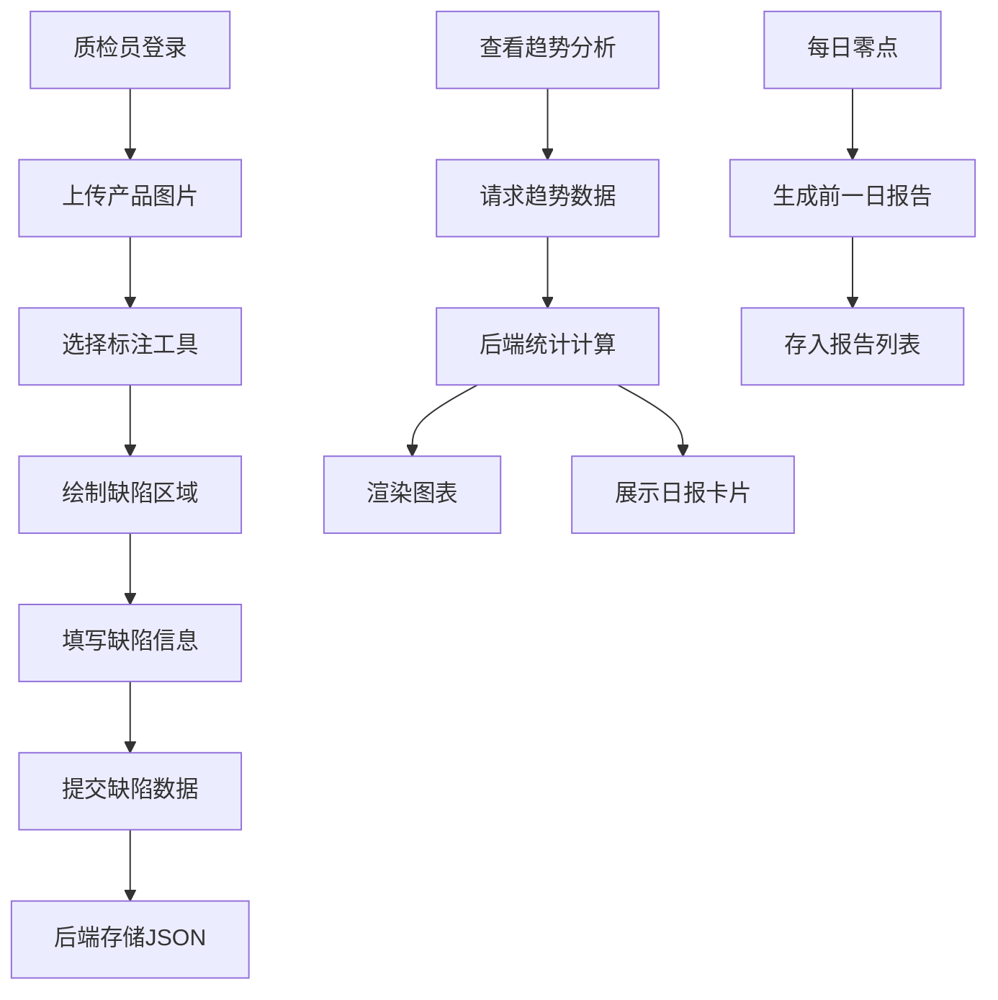

## 1. 产品概述

本产品是一款面向小型制造车间质检员的产品缺陷标注与不良率趋势分析Web应用，解决传统纸质记录难以追溯缺陷位置、无法实时汇总不良率变化趋势的问题。通过数字化标注工具和可视化数据分析，帮助质检团队高效记录、追溯和分析产品质量问题。

- **核心价值**：实现缺陷位置可视化追溯、不良率实时统计分析、自动化日报生成
- **目标用户**：制造车间质检员、质量管理人员
- **市场价值**：提升质检效率、降低质量成本、数据驱动质量改进

## 2. 核心功能

### 2.1 用户角色
| 角色 | 注册方式 | 核心权限 |
|------|----------|----------|
| 质检员 | 系统默认 | 产品图片上传、缺陷标注、数据提交 |
| 质量管理员 | 系统默认 | 查看不良率趋势、下载/分享日报 |

### 2.2 功能模块
1. **缺陷标注页面**：图片上传区、Canvas标注画布、缺陷表单浮动面板、标注工具栏
2. **不良率趋势页面**：30天不良率折线图、缺陷分类柱状图、日报卡片侧边栏
3. **数据管理模块**：缺陷数据CRUD、后端API同步、本地状态管理
4. **自动报告模块**：每日零点生成前一日不良率汇总报告

### 2.3 页面详情
| 页面名称 | 模块名称 | 功能描述 |
|----------|----------|----------|
| 缺陷标注页面 | 图片上传区 | 支持JPG/PNG拖拽上传，拖拽区域高150px，虚线边框#94a3b8，拖入时变为实线#3b82f6 |
| 缺陷标注页面 | Canvas标注画布 | 800x600尺寸，背景#f8fafc，支持矩形、圆形、自由画笔三种标注工具 |
| 缺陷标注页面 | 标注工具栏 | 矩形(2px边框#ef4444)、圆形(半径可调)、画笔(3px线条#f97316) |
| 缺陷标注页面 | 缺陷表单面板 | 右侧浮动面板宽280px，可拖拽，填写类别(裂痕/划痕/色差/污渍/其他)和严重等级(轻微/一般/严重) |
| 缺陷标注页面 | 标注管理 | 标注可选中(虚线3px边框)、拖动(cursor:move)、删除(0.2s缩放消失动画) |
| 不良率趋势页面 | 顶部导航栏 | 高56px，背景#1e293b，选中项底部2px高亮#3b82f6 |
| 不良率趋势页面 | 不良率折线图 | 30天趋势，折线#3b82f6，填充渐变#3b82f633到透明，数据点直径6px#1e293b |
| 不良率趋势页面 | 分类柱状图 | 各类别数量占比，颜色：裂痕#ef4444、划痕#f97316、色差#eab308、污渍#22c55e、其他#a855f7 |
| 不良率趋势页面 | 日报侧边栏 | 宽320px，报告卡片高160px，背景#f8fafc，左边框颜色按不良率变化 |

## 3. 核心流程

### 3.1 缺陷标注流程
质检员上传产品图片 → 选择标注工具 → 在图片上绘制缺陷区域 → 填写缺陷类别和严重等级 → 提交数据 → 后端存储 → 标注显示在画布上

### 3.2 数据分析流程
用户切换到趋势页面 → 前端请求趋势数据 → 后端统计计算 → 返回30天不良率和分类数据 → 渲染折线图和柱状图 → 展示日报卡片列表

## 4. 用户界面设计

### 4.1 设计风格
- **主色调**：深色侧边栏#1e293b，主区域浅色#f1f5f9，强调色#3b82f6
- **按钮风格**：统一高度36px，圆角8px，hover状态有阴影变化
- **输入框**：高度40px，圆角8px，边框1px solid #cbd5e1，焦点边框#3b82f6
- **字体**：系统默认无衬线字体，主体14px，标题18px，小标题16px
- **图标**：Font Awesome风格，通过CSS伪元素实现
- **布局**：深色侧边栏(240px) + 浅色主区域，主区域边距24px

### 4.2 页面设计概述
| 页面名称 | 模块名称 | UI元素 |
|----------|----------|--------|
| 缺陷标注页面 | 图片上传区 | 虚线边框、拖拽高亮、文件格式提示 |
| 缺陷标注页面 | Canvas画布 | 800x600固定尺寸、半透明填充标注、编号标签(12px白色#ffffff背景#ef4444圆角4px) |
| 缺陷标注页面 | 浮动表单面板 | 阴影-lg、顶部拖拽手柄、表单控件统一样式 |
| 缺陷标注页面 | 标注工具栏 | 工具按钮组、选中状态高亮、图标通过::before伪元素 |
| 不良率趋势页面 | 导航栏 | 深色背景、白色文字、底部选中高亮条 |
| 不良率趋势页面 | 折线图区域 | Chart.js渲染、渐变填充、圆形数据标记、Tooltip(背景#1e293b白色文字圆角6px) |
| 不良率趋势页面 | 柱状图区域 | 分类着色、hover时高度增加5px加深阴影 |
| 不良率趋势页面 | 日报侧边栏 | 卡片按日期倒序、左边框颜色指示不良率等级、下载/分享按钮 |

### 4.3 响应式
- 桌面优先设计，主内容区最小宽度1200px
- 标注画布固定800x600尺寸，不随窗口缩放
- 侧边栏固定宽度，主区域自适应

### 4.4 交互细节
- 标注创建反应时间≤200ms
- 图表首帧加载≤1秒
- API响应≤300ms
- 骨架屏加载动画(灰色#e2e8f0闪烁)
- 空状态显示插画和"暂无数据"文字(14px#94a3b8)
- 表格行交替背景#ffffff/#f8fafc，行高48px，表头#e2e8f0粗体
- 删除标注时0.2s缩放消失动画
