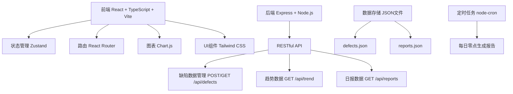
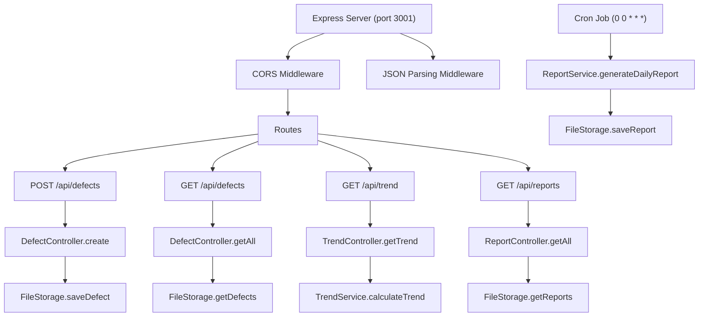
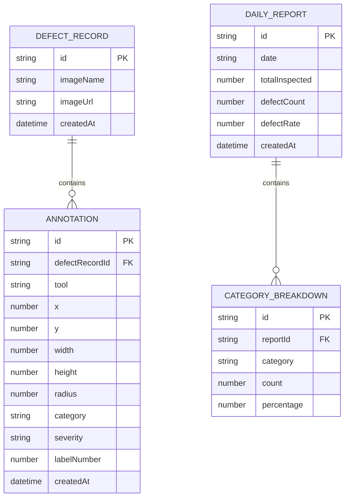

## 1. 架构设计



## 2. 技术描述

- **前端**：React 18 + TypeScript + Vite 5 + Tailwind CSS 3 + Zustand 4 + React Router 6 + Chart.js 4 + uuid 9
- **后端**：Express 4 + Node.js + CORS + node-cron
- **数据存储**：本地JSON文件（defects.json、reports.json）
- **构建工具**：Vite 5，代理API到本地端口3001
- **图标**：lucide-react

## 3. 路由定义

| 路由 | 页面 | 说明 |
|------|------|------|
| / | InspectionPage | 缺陷标注页面，默认首页 |
| /inspection | InspectionPage | 缺陷标注页面 |
| /trend | TrendPage | 不良率趋势分析页面 |

## 4. API 定义

### 4.1 类型定义

```typescript
// 缺陷类型
type DefectCategory = '裂痕' | '划痕' | '色差' | '污渍' | '其他';
type DefectSeverity = '轻微' | '一般' | '严重';
type AnnotationTool = 'rectangle' | 'circle' | 'brush';

interface Annotation {
  id: string;
  tool: AnnotationTool;
  x: number;
  y: number;
  width?: number;
  height?: number;
  radius?: number;
  points?: { x: number; y: number }[];
  category: DefectCategory;
  severity: DefectSeverity;
  labelNumber: number;
  createdAt: string;
}

interface DefectRecord {
  id: string;
  imageName: string;
  imageUrl: string;
  annotations: Annotation[];
  createdAt: string;
}

interface TrendDataPoint {
  date: string;
  totalInspected: number;
  defectCount: number;
  defectRate: number;
}

interface CategoryCount {
  category: DefectCategory;
  count: number;
  percentage: number;
}

interface DailyReport {
  id: string;
  date: string;
  totalInspected: number;
  defectCount: number;
  defectRate: number;
  categoryBreakdown: CategoryCount[];
  createdAt: string;
}
```

### 4.2 API 接口

| 方法 | 路径 | 描述 | 请求体 | 响应 |
|------|------|------|--------|------|
| POST | /api/defects | 提交缺陷记录 | `{ imageName, imageUrl, annotations[] }` | `{ id, success: true }` |
| GET | /api/defects | 获取所有缺陷记录 | - | `DefectRecord[]` |
| GET | /api/trend | 获取30天不良率趋势 | - | `{ trendData: TrendDataPoint[], categoryData: CategoryCount[] }` |
| GET | /api/reports | 获取日报列表 | - | `DailyReport[]` |

## 5. 服务器架构



## 6. 数据模型

### 6.1 ER 图



### 6.2 文件结构

```
auto94/
├── package.json
├── vite.config.js
├── tsconfig.json
├── index.html
├── src/
│   ├── App.tsx
│   ├── main.tsx
│   ├── index.css
│   ├── pages/
│   │   ├── InspectionPage.tsx
│   │   └── TrendPage.tsx
│   ├── components/
│   │   ├── Layout.tsx
│   │   ├── Navigation.tsx
│   │   ├── Sidebar.tsx
│   │   ├── ImageUploader.tsx
│   │   ├── AnnotationCanvas.tsx
│   │   ├── AnnotationToolbar.tsx
│   │   ├── DefectFormPanel.tsx
│   │   ├── TrendLineChart.tsx
│   │   ├── CategoryBarChart.tsx
│   │   ├── ReportCard.tsx
│   │   ├── ReportSidebar.tsx
│   │   ├── SkeletonLoader.tsx
│   │   └── EmptyState.tsx
│   ├── hooks/
│   │   ├── useCanvasAnnotation.ts
│   │   ├── useDrag.ts
│   │   └── useApi.ts
│   ├── utils/
│   │   ├── defectStore.ts
│   │   ├── api.ts
│   │   └── types.ts
│   └── store/
│       └── useAppStore.ts
└── server/
    ├── index.js
    ├── data/
    │   ├── defects.json
    │   └── reports.json
    ├── controllers/
    │   ├── defectController.js
    │   ├── trendController.js
    │   └── reportController.js
    ├── services/
    │   ├── trendService.js
    │   └── reportService.js
    └── utils/
        └── fileStorage.js
```

### 6.3 配置文件说明

**package.json** 依赖：
- react, react-dom, react-router-dom
- express, cors, node-cron
- chart.js, react-chartjs-2
- uuid
- zustand
- lucide-react
- typescript, vite, @vitejs/plugin-react
- @types/react, @types/react-dom, @types/express, @types/cors, @types/uuid
- tailwindcss, postcss, autoprefixer

**启动脚本**：
- `npm run dev`: 启动Vite前端开发服务器 (端口5173)
- `npm run server`: 启动Express后端服务器 (端口3001)

**vite.config.js**：
- 配置代理 `/api` 到 `http://localhost:3001`
- 使用 @vitejs/plugin-react

**tsconfig.json**：
- 严格模式 strict: true
- ES2020 模块
- JSX: react-jsx
- 路径别名 @ 指向 src
