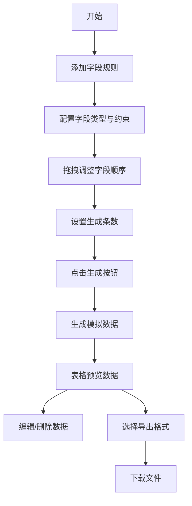

## 1. 产品概述

智能模拟数据工厂与字段规则配置应用，帮助前端工程师快速生成真实的模拟用户数据，用于表单交互和数据录入页面的测试。

- 核心价值：通过可视化拖拽配置字段规则，一键生成高质量测试数据，提升开发效率
- 目标用户：前端工程师、测试工程师、UI设计师

## 2. 核心功能

### 2.1 功能模块

1. **字段配置模块**：左侧面板拖拽管理字段规则，支持多种字段类型和约束配置
2. **数据生成模块**：基于规则批量生成模拟数据，支持1-1000条
3. **数据预览模块**：表格形式展示生成的数据，支持删除和清空操作
4. **数据导出模块**：支持JSON/CSV/TSV格式导出
5. **预设管理模块**：保存/加载/删除字段规则预设

### 2.2 页面详情

| 页面名称 | 模块名称 | 功能描述 |
|-----------|-------------|---------------------|
| 主页面 | 左侧配置面板 | 字段规则列表、拖拽排序、添加字段、约束配置、预设管理 |
| 主页面 | 右侧预览区域 | 顶部工具栏、数据表格、导出按钮、数据统计 |

## 3. 核心流程

用户添加字段规则 → 配置字段类型和约束 → 拖拽调整顺序 → 设置生成条数 → 点击生成 → 预览数据 → 导出文件

## 4. 用户界面设计

### 4.1 设计风格

- **设计主题**：深色工业风，专业工具属性
- **主色调**：深蓝 #1e293b（左侧面板）、浅灰 #f8fafc（内容区）
- **强调色**：蓝色 #3b82f6（string/主要操作）、绿色 #22c55e（number/保存）、紫色 #a855f7（email）、橙色 #f97316（date）、灰色 #64748b（address）
- **危险色**：红色 #ef4444（删除操作）
- **字体**：系统无衬线字体，清晰专业
- **布局**：左右分栏，左侧固定320px，右侧自适应
- **圆角**：12px卡片圆角，8px按钮圆角
- **阴影**：box-shadow: 0 4px 6px -1px rgba(0,0,0,0.1)
- **动效**：所有交互元素0.2s过渡动画，滑入滑出效果

### 4.2 页面设计概览

| 页面名称 | 模块名称 | UI元素 |
|-----------|-------------|-------------|
| 主页面 | 左侧配置面板 | 深色背景、字段卡片（左侧色条）、拖拽手柄、删除按钮、展开约束、添加按钮、预设列表 |
| 主页面 | 顶部工具栏 | 深色背景、数量输入框、生成按钮、导出按钮组 |
| 主页面 | 数据表格 | 固定表头、斑马纹行、悬停效果、删除按钮、虚拟滚动 |

### 4.3 响应式设计

- **桌面端**（≥768px）：左右分栏布局，左侧320px固定宽度
- **移动端**（<768px）：左侧配置面板收起为底部抽屉，展开占屏幕60%高度，右侧全宽展示

### 4.4 交互细节

- **拖拽排序**：拖拽项半透明跟随鼠标，其他项0.2s过渡让位
- **字段展开**：高度0到自动高度，0.3s ease-out动画
- **删除动画**：向左滑出消失，0.2s
- **新字段添加**：从上方滑入，0.3s ease-out
- **按钮点击**：微缩动画 scale 0.95→1.0，0.15s
- **导出进度**：旋转环形加载圈，0.8s一圈
