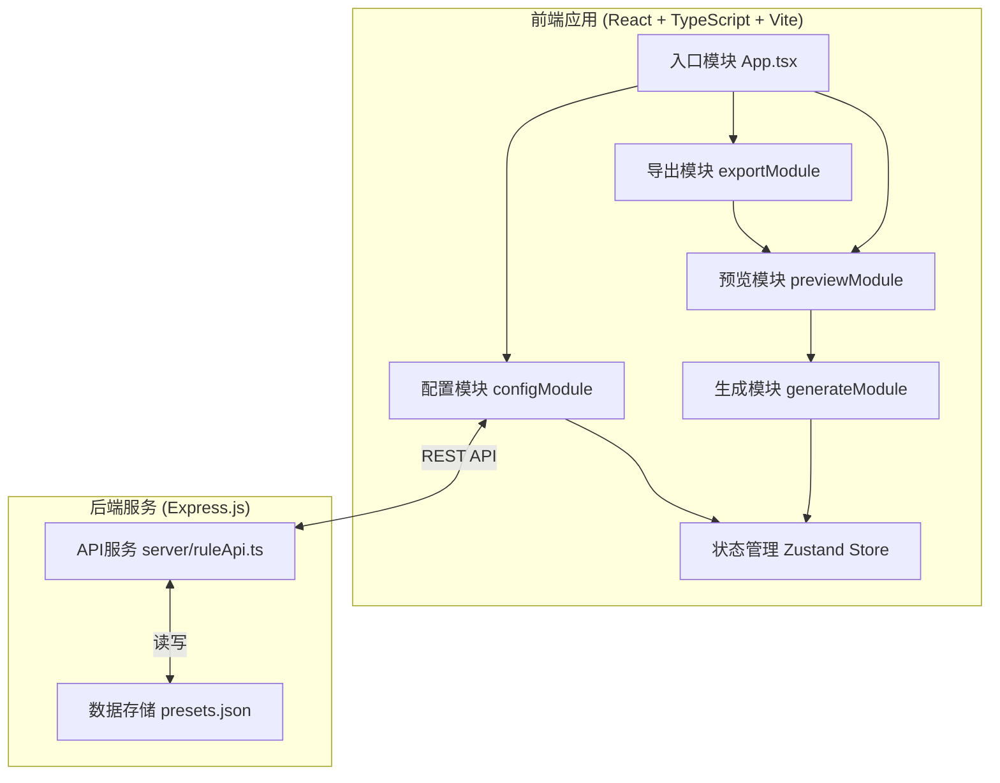

## 1. 架构设计



## 2. 技术描述

- **前端框架**: React 18 + TypeScript + Vite
- **状态管理**: Zustand
- **样式方案**: 原生 CSS (模块内联样式 + CSS变量)
- **数据生成**: faker.js
- **HTTP客户端**: axios
- **后端框架**: Express.js + TypeScript
- **数据存储**: JSON文件 (presets.json)
- **构建工具**: Vite
- **唯一ID**: uuid

## 3. 项目结构

```
.
├── src/
│   ├── configModule/          # 规则配置模块
│   │   ├── fieldRuleStore.ts  # Zustand状态管理
│   │   └── FieldConfigPanel.tsx # 左侧配置面板
│   ├── generateModule/        # 数据生成模块
│   │   └── dataGeneratorService.ts # 数据生成服务
│   ├── previewModule/         # 预览模块
│   │   └── DataPreviewTable.tsx # 数据预览表格
│   ├── exportModule/          # 导出模块
│   │   └── DataExporter.tsx   # 数据导出组件
│   ├── App.tsx                # 主应用组件
│   ├── main.tsx               # 入口文件
│   └── index.css              # 全局样式
├── server/
│   └── ruleApi.ts             # Express后端API
├── index.html                 # HTML入口
├── vite.config.ts             # Vite配置
├── tsconfig.json              # TypeScript配置
└── package.json               # 项目依赖
```

## 4. 数据模型

### 4.1 字段规则类型定义

```typescript
type FieldType = 'string' | 'number' | 'email' | 'date' | 'address';

interface StringConstraints {
  maxLength?: number;
  pattern?: string;
}

interface NumberConstraints {
  min?: number;
  max?: number;
}

interface DateConstraints {
  startDate?: string;
  endDate?: string;
}

interface AddressConstraints {
  city?: string;
}

type FieldConstraints = StringConstraints | NumberConstraints | DateConstraints | AddressConstraints;

interface FieldRule {
  id: string;
  fieldName: string;
  type: FieldType;
  constraints: FieldConstraints;
  sortIndex: number;
}
```

### 4.2 预设类型定义

```typescript
interface Preset {
  id: string;
  name: string;
  rules: FieldRule[];
  createdAt: string;
}
```

### 4.3 生成数据类型

```typescript
type DataRow = Record<string, string | number>;
```

## 5. API定义

### 5.1 获取预设列表

- **GET** `/api/presets`
- 响应: `{ presets: Preset[] }`

### 5.2 保存预设

- **POST** `/api/presets`
- 请求体: `{ name: string; rules: FieldRule[] }`
- 响应: `{ preset: Preset }`

### 5.3 删除预设

- **DELETE** `/api/presets/:id`
- 响应: `{ success: boolean }`

## 6. 数据流向

1. **配置 → 状态**: 用户在FieldConfigPanel操作 → fieldRuleStore更新
2. **状态 → 生成**: dataGeneratorService读取fieldRuleStore中的规则
3. **生成 → 预览**: DataPreviewTable调用dataGeneratorService生成数据
4. **预览 → 导出**: DataExporter从预览区域获取数据进行导出
5. **前端 → 后端**: 预设管理通过axios调用Express API
6. **后端 → 存储**: API操作presets.json文件

## 7. 性能优化

- **虚拟滚动**: 表格仅渲染可见行，支持1000条数据流畅显示
- **防抖优化**: 约束配置输入防抖处理
- **CSS动画**: 使用transform和opacity属性保证60fps动画
- **批量生成**: 使用faker原生批量生成能力
