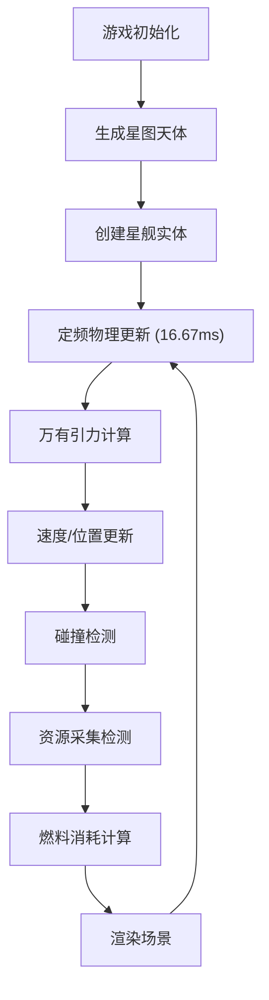

## 1. 产品概述

本项目是一个基于轨道物理的2D星舰导航与资源采集模拟游戏。玩家在星图上操控星舰进行航线规划、轨道航行和资源采集，体验真实的万有引力物理效果。

- 主要目的：提供沉浸式的太空探索体验，结合物理模拟与策略玩法
- 核心玩法：通过鼠标右键设置目标点，星舰自动沿最短路径航行，靠近恒星补充燃料，靠近资源点采集资源
- 目标用户：太空模拟爱好者、休闲游戏玩家

## 2. 核心功能

### 2.1 功能模块

1. **星图场景**：深空背景、随机分布恒星、行星椭圆轨道运行、资源点标记
2. **星舰控制**：鼠标右键设置目标点、自动转向加速、惯性漂移
3. **资源采集**：靠近资源点自动采集、采集进度条、资源计数显示
4. **燃料系统**：燃料消耗与补充、低燃料警告、燃料耗尽惯性漂移
5. **航线编辑**：E键进入编辑模式、可拖动路径点、Enter确认航行
6. **物理引擎**：万有引力计算、速度矢量更新、碰撞检测、空间哈希优化

### 2.2 页面详情

| 页面名称 | 模块名称 | 功能描述 |
|-----------|-------------|---------------------|
| 主游戏页面 | 星图渲染 | 1000x800像素星图，垂直渐变背景，闪烁恒星，行星轨道动画 |
| 主游戏页面 | 星舰渲染 | 三角形星舰，引擎尾焰粒子效果，加速度颜色变化 |
| 主游戏页面 | 资源渲染 | 六边形资源点，边缘发光动画，采集完成波纹效果 |
| 主游戏页面 | HUD界面 | 左右分栏布局，资源计数、燃料条、速度显示、目标点信息 |
| 主游戏页面 | 航线编辑 | 路径点拖放，虚线绘制，到达时间计算 |

## 3. 核心流程

### 3.1 游戏主循环

### 3.2 玩家操作流程

1. 游戏启动 → 星图生成，星舰位于中心
2. 鼠标右键点击 → 设置目标点，星舰开始自动航行
3. 星舰接近资源点 → 自动采集，资源计数增加
4. 燃料不足 → 靠近恒星补充燃料
5. 按E键 → 进入航线编辑模式，拖动路径点
6. 按Enter键 → 确认航线，星舰沿新路径航行

## 4. 用户界面设计

### 4.1 设计风格

- **主题**：深空科幻主题
- **主背景色**：#0f172a，垂直渐变从#0a0a2e到#1a1a4e
- **控件背景**：#1e293b，透明度0.85
- **边框颜色**：#334155
- **主色调**：#3b82f6（星舰、燃料条）
- **强调色**：#22c55e（资源）、#fbbf24（恒星、警告）、#a78bfa（航线）、#f97316（引擎尾焰）
- **字体**：采用科幻风格无衬线字体，避免通用字体
- **圆角**：8px统一圆角
- **动画**：数字变化0.2s缩放动画，资源点1s发光周期，0.5s波纹扩散

### 4.2 页面设计概览

| 模块名称 | UI元素 | 设计细节 |
|-----------|-------------|-------------|
| 星图背景 | 渐变背景、闪烁恒星、轨道线 | 恒星直径1-3px，闪烁频率0.5-2s，轨道线半透明 |
| 星舰 | 三角形船体、粒子尾焰 | 边长18px，粒子5-8个，颜色随加速度变化 |
| 资源点 | 六边形标记、发光效果 | 外接圆半径10px，发光强度0.3-1.0 |
| HUD-左上角 | 资源计数器 | 竖排排列，16x16px图标，16px字体，颜色#94a3b8 |
| HUD-左下角 | 燃料条、速度显示 | 200x16px，圆角8px，低于20%变红，低于5%闪烁 |
| HUD-右上角 | 目标点信息 | 格式"目标: (x, y) | 剩余: d px" |
| 航线编辑 | 路径点、虚线路径 | 路径点6px，悬停放大到10px，虚线间距8-12px |
| 编辑模式提示 | 中央提示文字 | 24px字体，#fbbf24，淡入淡出1s |

### 4.3 响应式适配

- **桌面优先**：画布最大占满视口宽度，最小宽度500px
- **UI缩放**：UI控件随画布缩放保持固定比例
- **触控优化**：支持触摸设备长按代替右键

### 4.4 性能要求

- **帧率**：稳定60fps
- **粒子上限**：最多同时存在200个粒子
- **物理更新**：固定时间步长16.67ms
- **碰撞优化**：空间哈希网格，单元大小50x50px
