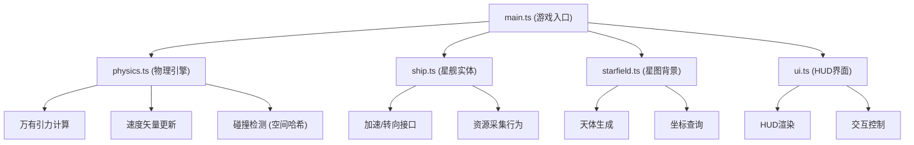
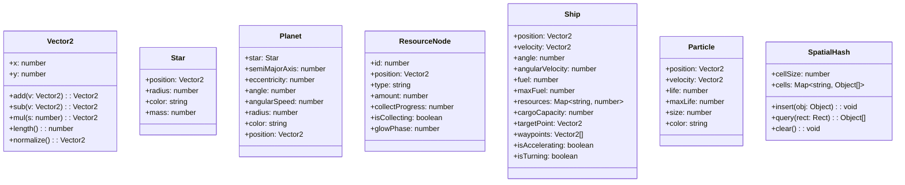

## 1. 架构设计

## 2. 技术描述

- **构建工具**：Vite 5.x
- **开发语言**：TypeScript 5.x（严格模式，ES2020模块）
- **渲染引擎**：HTML5 Canvas 2D
- **依赖**：three, @types/three（物理计算辅助）
- **物理引擎**：独立模块封装，固定时间步长16.67ms更新

## 3. 文件结构

| 文件路径 | 职责描述 |
|----------|----------|
| [package.json](file:///c:/Users/Administrator/Desktop/P/tasks/auto97/package.json) | 项目依赖配置，启动脚本：npm run dev |
| [vite.config.js](file:///c:/Users/Administrator/Desktop/P/tasks/auto97/vite.config.js) | Vite基础配置，指定入口文件 |
| [tsconfig.json](file:///c:/Users/Administrator/Desktop/P/tasks/auto97/tsconfig.json) | TypeScript严格模式配置，ES2020 |
| [index.html](file:///c:/Users/Administrator/Desktop/P/tasks/auto97/index.html) | 入口页面，全屏Canvas和UI控制层 |
| [src/main.ts](file:///c:/Users/Administrator/Desktop/P/tasks/auto97/src/main.ts) | 游戏入口，初始化场景，定频循环，模块调度 |
| [src/physics.ts](file:///c:/Users/Administrator/Desktop/P/tasks/auto97/src/physics.ts) | 轨道力学封装：万有引力、速度更新、碰撞检测 |
| [src/ship.ts](file:///c:/Users/Administrator/Desktop/P/tasks/auto97/src/ship.ts) | 星舰实体：位置、速度、燃料、资源舱、行为接口 |
| [src/starfield.ts](file:///c:/Users/Administrator/Desktop/P/tasks/auto97/src/starfield.ts) | 星图背景与天体生成：恒星、行星、资源点 |
| [src/ui.ts](file:///c:/Users/Administrator/Desktop/P/tasks/auto97/src/ui.ts) | HUD渲染与交互：燃料条、资源计数、航线编辑 |

## 4. 数据模型

### 4.1 核心类型定义

### 4.2 物理引擎核心算法

1. **万有引力计算**：F = G * m1 * m2 / r²，所有天体对星舰产生引力
2. **速度更新**：v = v0 + a * dt，位置 p = p0 + v * dt
3. **转向控制**：计算目标角度差，按最大转向速度120°/s插值
4. **碰撞检测**：空间哈希网格划分，50x50px单元，仅查询相邻单元
5. **椭圆轨道**：r = a * (1 - e²) / (1 + e * cos(θ))，计算行星位置

### 4.3 性能优化策略

- **对象池**：粒子系统使用对象池复用，避免频繁GC
- **空间哈希**：碰撞检测前用空间哈希减少检测对
- **定频更新**：物理更新与渲染分离，使用固定时间步长
- **粒子上限**：最多200个粒子，超出时淘汰最旧粒子
- **离屏剔除**：视口外的天体简化渲染或跳过

## 5. 交互事件定义

| 事件 | 触发方式 | 处理逻辑 |
|------|----------|----------|
| 右键点击 | mousedown button=2 | 设置星舰目标点，计算最短路径 |
| E键按下 | keydown key='e' | 切换航线编辑模式，显示可拖动路径点 |
| Enter键按下 | keydown key='Enter' | 确认编辑航线，星舰沿新路径航行 |
| 鼠标拖动 | mousemove + mousedown | 编辑模式下拖动路径点，实时更新路径 |
| 鼠标悬停 | mousemove | 路径点悬停放大，显示坐标标签 |
