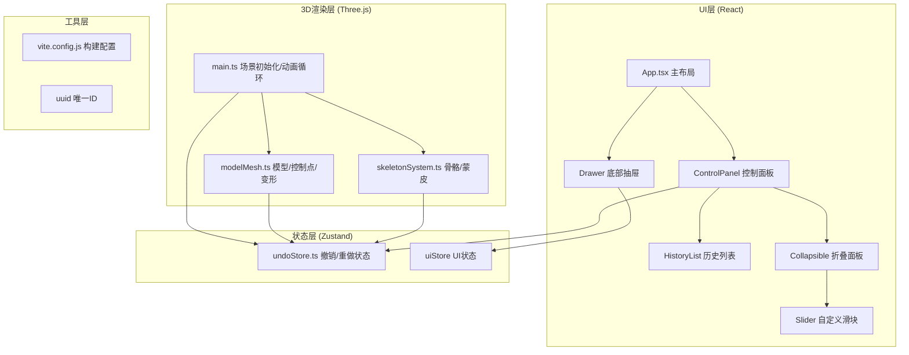

## 1. 架构设计

纯前端3D交互应用，采用分层架构：React UI层 → Zustand状态层 → Three.js 3D渲染层 → 业务逻辑模块。所有模块职责清晰分离，通过事件和状态管理协同工作。



## 2. 技术说明

- **前端框架**：React@18 + TypeScript（严格模式，ES2020模块，JSX保留）
- **构建工具**：Vite，入口index.html
- **3D引擎**：Three.js + @types/three
- **状态管理**：Zustand（撤销重做历史栈，最多10步）
- **UI库**：自定义React组件（磨砂玻璃效果backdrop-filter:blur(8px)）
- **辅助库**：uuid（控制点/骨骼唯一标识）
- **依赖包**：three, zustand, uuid, typescript, vite, @types/three, @vitejs/plugin-react

## 3. 路由定义
| 路由 | 用途 |
|-------|---------|
| / | 主应用页面，3D场景+控制面板 |

## 4. 项目文件结构
```
auto99/
├── package.json
├── vite.config.js
├── tsconfig.json
├── index.html
└── src/
    ├── main.ts          # Three.js场景初始化、相机、灯光、控制器、动画循环、模块调度
    ├── modelMesh.ts     # 低多边形模型生成、控制点创建与交互、网格变形、蒙皮权重计算
    ├── skeletonSystem.ts# 骨骼创建/父子层级、骨骼旋转驱动蒙皮变形
    ├── undoStore.ts     # Zustand状态管理：历史记录、撤销、重做（最多10步）
    ├── App.tsx          # React主布局：30%控制面板+70%场景+响应式抽屉
    ├── components/
    │   ├── ControlPanel.tsx    # 左侧控制面板（磨砂玻璃#1e293b）
    │   ├── Collapsible.tsx     # 折叠面板（标题栏48px，展开淡入0.2s）
    │   ├── DeformTools.tsx     # 变形工具区
    │   ├── SkeletonTools.tsx   # 骨骼设置区
    │   ├── HistoryList.tsx     # 历史记录区（项高40px，悬停#334155）
    │   ├── CustomSlider.tsx    # 自定义滑块（轨道4px#475569，手柄16/20px#94a3b8）
    │   └── BottomDrawer.tsx    # 移动端底部抽屉（<1024px）
    └── utils/
        └── types.ts            # 全局TypeScript类型定义
```

## 5. 核心模块职责

### 5.1 src/main.ts（核心调度器）
- 初始化Three.js：Scene、PerspectiveCamera、WebGLRenderer
- 灯光：DirectionalLight + AmbientLight
- 控制器：OrbitControls
- 背景：线性渐变CanvasTexture #1e1b4b→#0f172a
- 动画循环：requestAnimationFrame，更新变形插值、骨骼动画
- 调度modelMesh和skeletonSystem，处理快捷键(Ctrl+Z/Y)
- 响应Canvas尺寸变化

### 5.2 src/modelMesh.ts（模型与变形）
- 生成低多边形人体模型（2000-3000三角形），放置于世界原点
- 在模型表面关键位置创建控制点（SphereGeometry，直径0.3，#fbbf24）
- Raycaster实现控制点拾取：选中变#ef4444，显示半透明拖球
- 拖拽变形算法：控制点1.5半径范围内顶点，按距离权重平滑插值
- 变形动画：lerp线性插值，0.3秒过渡时间
- 存储原始顶点位置，计算每顶点受各骨骼影响权重（距离倒数归一化）
- 权重可视化：顶点色0.0→#3b82f6(蓝)，1.0→#ef4444(红)

### 5.3 src/skeletonSystem.ts（骨骼与蒙皮）
- 骨骼结构：CylinderGeometry长0.5半径0.05(#60a5fa) + 末端SphereGeometry半径0.08(#3b82f6)
- 最多3根骨骼，支持父子层级（THREE.Group组织）
- 末端球体拖拽→计算骨骼旋转四元数→更新骨骼Matrix
- 蒙皮变形：每顶点 = Σ(权重i × 骨骼i变换矩阵 × 原始顶点)
- 骨骼创建/删除API，状态同步至undoStore

### 5.4 src/undoStore.ts（Zustand撤销重做）
```typescript
interface HistoryItem {
  id: string;
  type: 'deform' | 'bone_add' | 'bone_remove' | 'bone_rotate';
  timestamp: number;
  snapshot: { vertices: Float32Array; bones: BoneState[] };
}
interface UndoState {
  history: HistoryItem[];
  currentIndex: number;
  pushHistory: (type, snapshot) => void;
  undo: () => void;  // 回退到前一状态，0.2s动画
  redo: () => void;  // 前进到后一状态，0.2s动画
  canUndo: boolean;
  canRedo: boolean;
}
```
- 历史栈最大10项，超出自动丢弃最旧记录
- undo/redo时返回目标snapshot，main.ts执行0.2s平滑插值过渡
- 订阅Ctrl+Z(undo)、Ctrl+Y(redo)键盘事件

## 6. 性能保障
- 顶点位移计算使用TypedArray(Float32Array) + 预计算邻接索引，避免GC
- 变形范围限制在1.5半径内，仅计算受影响顶点子集
- 骨骼蒙皮矩阵在动画帧中仅重建变化的骨骼
- 控制点Raycaster启用层级判断，避免全场景遍历
- requestAnimationFrame中使用performance.now()监控单帧耗时
- 目标：变形计算≤30ms，场景帧率≥45fps
