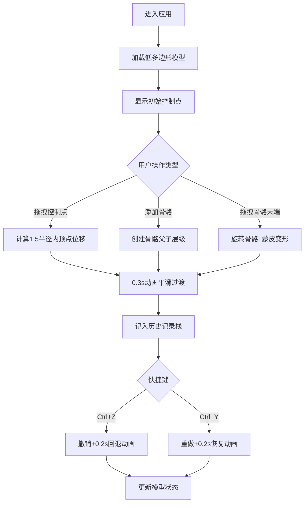

## 1. 产品概述

面向3D建模初学者的交互式Web应用，通过低门槛的拖拽操作帮助用户理解网格变形与骨骼驱动的关系。提供控制点变形、骨骼蒙皮、历史记录三大核心功能，辅以直观的控制面板和响应式布局。

- 核心价值：降低3D建模学习门槛，让初学者通过实时交互理解网格和骨骼的工作原理
- 目标用户：3D建模初学者、数字艺术爱好者、相关专业学生

## 2. 核心特性

### 2.1 功能模块
1. **主3D场景区**：低多边形人体模型渲染、控制点交互、骨骼可视化、蒙皮权重着色
2. **变形工具面板**：控制点管理、变形范围调节、动画参数设置
3. **骨骼设置面板**：骨骼创建/删除、骨骼属性编辑、权重可视化切换
4. **历史记录面板**：操作时间线、撤销/重做、状态预览

### 2.2 页面详情
| 页面名称 | 模块名称 | 功能描述 |
|-----------|-------------|---------------------|
| 主页面 | 3D场景渲染 | 导入低多边形人体模型（2000-3000三角形），支持轨道控制缩放旋转 |
| 主页面 | 控制点交互 | 控制点直径0.3，初始颜色#fbbf24，选中#ef4444+半透明拖球，1.5半径平滑插值变形，0.3秒过渡动画 |
| 主页面 | 骨骼系统 | 最多3根骨骼（圆柱长0.5半径0.05颜色#60a5fa，末端球半径0.08颜色#3b82f6），拖拽末端旋转驱动蒙皮变形，权重蓝红渐变可视化 |
| 主页面 | 控制面板 | 左侧30%宽磨砂玻璃（backdrop-filter:blur(8px)背景#1e293b），三折叠面板（标题栏48px，展开0.2s淡入） |
| 主页面 | 历史记录 | 列表项高40px悬停#334155，最多10步，Ctrl+Z/Y快捷键，撤销0.2s平滑回退 |
| 主页面 | 滑块控件 | 范围0-100步长1，轨道4px颜色#475569，手柄16px颜色#94a3b8，悬停放大到20px |
| 主页面 | 响应式布局 | 1024px以下控制面板折叠为底部抽屉，拖拽手柄收展 |

## 3. 核心流程

用户打开应用 → 加载低多边形模型 → 选择变形/骨骼工具 → 拖拽控制点或骨骼末端 → 实时预览变形效果 → 操作自动记入历史 → 可随时撤销重做 → 切换权重可视化理解蒙皮关系

## 4. 用户界面设计

### 4.1 设计风格
- **主色调**：深邃科技暗色主题，背景渐变#1e1b4b→#0f172a
- **配色方案**：控制点黄(#fbbf24)→选中红(#ef4444)，骨骼蓝(#60a5fa/#3b82f6)，权重蓝→红渐变
- **控制面板**：磨砂玻璃半透明效果，深色背景#1e293b配合blur(8px)
- **字体**：现代无衬线字体，清晰可读性优先
- **交互动效**：所有状态切换配合淡入/平滑过渡，微交互提升质感

### 4.2 页面设计概述
| 页面名称 | 模块名称 | UI元素 |
|-----------|-------------|-------------|
| 主页面 | 3D场景 | 70%宽度右侧区域，深色渐变背景，模型居中显示于原点 |
| 主页面 | 控制面板 | 30%宽度左侧，磨砂玻璃，三个可折叠分区，标题栏48px，展开淡入0.2s |
| 主页面 | 滑块控件 | 自定义轨道4px#475569，手柄16px#94a3b8悬停20px，全部0-100步长1 |
| 主页面 | 历史列表 | 项高40px，悬停#334155，操作类型+时间戳 |
| 主页面 | 响应式抽屉 | 1024px以下底部抽屉，拖拽手柄收展，遮罩背景 |

### 4.3 响应式
- 桌面端（≥1024px）：左侧30%控制面板+右侧70%场景固定布局
- 移动端（<1024px）：场景全屏，控制面板折叠为底部抽屉，拖拽顶部手柄展开，展开高度50vh

### 4.4 3D场景指导
- **环境**：深色渐变背景（#1e1b4b→#0f172a），创造沉浸式创作氛围
- **灯光**：主方向光+环境光组合，确保模型各面清晰可见，无明显过暗区域
- **相机**：透视相机，初始距离适中可完整观察模型，支持OrbitControls轨道缩放旋转
- **交互元素可视化**：控制点、骨骼、半透明拖拽球体、权重颜色渐变均有明确视觉层次
- **性能优化**：2000-3000三角形模型，变形计算≤30ms，帧率≥45fps
