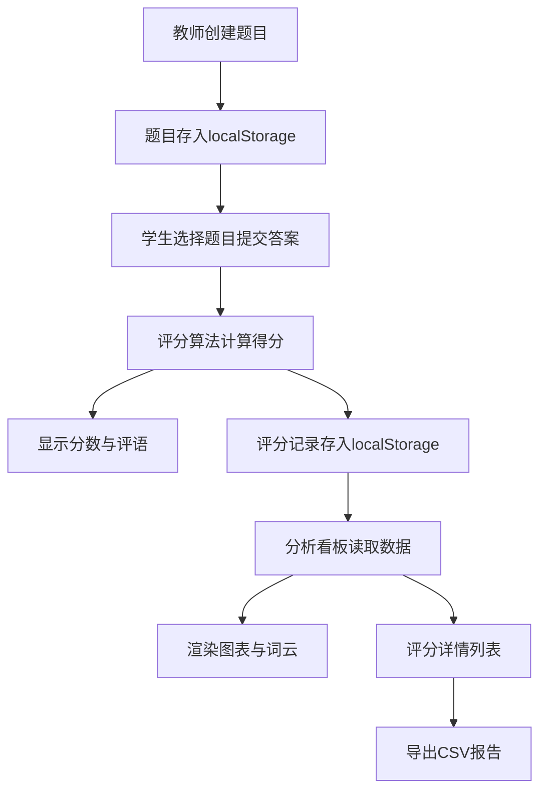

## 1. 产品概述

在线教育智能批改系统——帮助教师自动批改学生简答题并生成多维度分析报告的纯前端工具，解决手动批改效率低、评分标准不统一、反馈不及时三大痛点。

## 2. 核心功能

### 2.1 用户角色

| 角色 | 使用方式 | 核心权限 |
|------|----------|----------|
| 教师 | 直接访问 | 创建/编辑/删除题目、查看分析看板、导出报告 |
| 学生 | 直接访问 | 提交简答、查看评分结果与评语 |

### 2.2 功能模块

1. **题目管理页**：题目CRUD、参考答案与关键词设置、满分值设定、JSON导入导出
2. **学生提交页**：简答文本提交、实时字数统计、进度条、即时评分反馈
3. **分析看板页**：班级/题目/学生三维度统计、柱状图/折线图/词云、交互筛选
4. **评分记录页**：评分详情列表、按学生/题目筛选、CSV导出

### 2.3 页面详情

| 页面名称 | 模块名称 | 功能描述 |
|----------|----------|----------|
| 题目管理 | 题目列表 | 卡片式展示所有题目，支持展开/收起详情，添加/编辑/删除题目 |
| 题目管理 | 导入导出 | 支持JSON格式的题目数据导入和导出 |
| 学生提交 | 提交表单 | 选择题目、输入简答文本，实时字数统计和进度条显示 |
| 学生提交 | 即时反馈 | 提交后1秒内显示评分结果、评语，顶部全局统计面板动画更新 |
| 分析看板 | 筛选侧边栏 | 按班级、题目、学生筛选数据 |
| 分析看板 | 图表区域 | 柱状图（平均分分布）、折线图（得分率趋势）、词云（常见错误关键词） |
| 分析看板 | 评分详情 | 右侧评分详情列表，支持维度切换淡入动画 |
| 评分记录 | 记录列表 | 显示原题、学生答案、细项得分、评语、评分时间 |
| 评分记录 | 筛选导出 | 按学生或题目筛选，导出为CSV报告 |

## 3. 核心流程

**教师创建题目流程**：教师进入题目管理页 → 点击添加题目 → 填写题目文本、参考答案、关键词及得分点、满分值 → 保存至本地存储

**学生提交答案流程**：学生进入提交页 → 选择题目 → 输入简答文本（实时字数统计）→ 提交 → 系统自动评分（关键词匹配+长度比率+语义相似度）→ 1秒内显示分数和评语 → 全局统计面板动画更新

**教师分析流程**：教师进入分析看板 → 选择维度（班级/题目/学生）→ 查看柱状图/折线图/词云 → 切换维度时图表淡入动画 → 点击评分详情查看具体答卷

## 4. 用户界面设计

### 4.1 设计风格

- 主色调：柔和蓝绿渐变（#e0f7fa 到 #b2dfdb）
- 辅助色：深青色（#00695c）用于强调、深灰色（#37474f）用于文本
- 按钮样式：圆角（8px），悬停时轻微上浮阴影效果
- 字体：Noto Sans SC（正文）+ Source Han Serif（标题），尺寸层级：24px/18px/14px/12px
- 布局：左侧固定导航栏220px + 主内容区自适应
- 卡片式布局，带圆角和柔和阴影

### 4.2 页面设计概览

| 页面名称 | 模块名称 | UI元素 |
|----------|----------|--------|
| 题目管理 | 题目卡片列表 | 卡片式布局，每张卡片可展开/收起，蓝绿渐变边框，白色背景 |
| 学生提交 | 提交表单 | 输入区域带实时字数统计，底部进度条，聚焦时边框渐变为主题色 |
| 学生提交 | 评分结果 | 弹出式结果面板，分数以大号数字显示，评语列表 |
| 分析看板 | 三栏网格 | 左侧筛选侧边栏（200px）、中间图表区域、右侧评分详情列表 |
| 分析看板 | 图表组件 | 柱状图、折线图、词云标签云，切换维度0.3秒淡入动画 |
| 评分记录 | 记录表格 | 表格式布局，支持排序和筛选，导出按钮 |
| 全局 | 导航栏 | 左侧固定220px，图标+文字，当前页高亮 |

### 4.3 响应式适配

- 桌面端（≥1024px）：完整布局，侧边栏展开
- 平板端（768px-1023px）：侧边栏折叠为图标模式（60px）
- 手机端（<768px）：侧边栏隐藏，汉堡菜单触发；表格转为竖向堆叠布局；触摸控件≥44px

### 4.4 动效设计

- 页面切换：0.3秒淡入动画（ease-in-out）
- 图表维度切换：0.3秒淡入+位移（translateY 10px → 0）
- 全局统计数字：滚动数字动画效果
- 按钮悬停：上浮2px + 阴影加深
- 输入框聚焦：边框颜色从灰色渐变为主题色
- 卡片展开/收起：高度动画过渡
