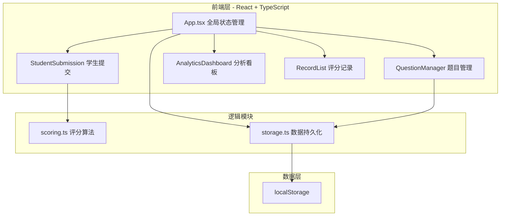
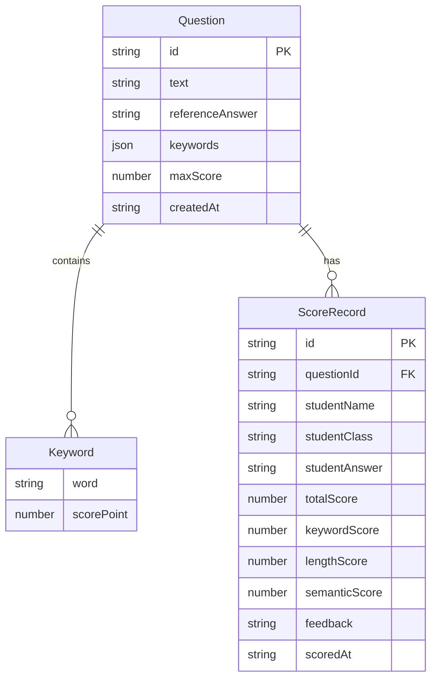

## 1. 架构设计



## 2. 技术说明

- 前端：React@18 + TypeScript（严格模式）+ Tailwind CSS + Vite
- 初始化工具：vite-init（react-ts模板）
- 状态管理：Zustand
- 图表库：Recharts（柱状图、折线图）
- 词云：react-tagcloud
- 文件导出：file-saver
- 后端：无（纯前端应用）
- 数据库：localStorage（浏览器本地存储）

## 3. 路由定义

| 路由 | 用途 |
|------|------|
| / | 重定向到题目管理页 |
| /questions | 题目管理页，添加/编辑/删除题目 |
| /submit | 学生提交页，选择题目并提交简答 |
| /analytics | 分析看板，三维度统计图表 |
| /records | 评分记录列表，筛选与导出 |

## 4. API定义

无后端API。所有数据通过localStorage读写，由storage.ts模块封装。

### 核心函数签名

```typescript
// scoring.ts
interface ScoringResult {
  totalScore: number;
  keywordScore: number;
  lengthScore: number;
  semanticScore: number;
  feedback: string;
}

function scoreAnswer(question: Question, studentAnswer: string): ScoringResult;

// storage.ts
function saveData<T>(key: string, data: T): void;
function loadData<T>(key: string): T | null;
```

## 5. 数据模型

### 5.1 数据模型定义



### 5.2 TypeScript 类型定义

```typescript
interface Question {
  id: string;
  text: string;
  referenceAnswer: string;
  keywords: Keyword[];
  maxScore: number;
  createdAt: string;
}

interface Keyword {
  word: string;
  scorePoint: number;
}

interface ScoreRecord {
  id: string;
  questionId: string;
  studentName: string;
  studentClass: string;
  studentAnswer: string;
  totalScore: number;
  keywordScore: number;
  lengthScore: number;
  semanticScore: number;
  feedback: string;
  scoredAt: string;
}

interface GlobalStats {
  totalSubmissions: number;
  averageScore: number;
  highestScore: number;
  lowestScore: number;
}
```

## 6. 评分算法设计

综合评分公式：`totalScore = keywordWeight * keywordScore + lengthWeight * lengthScore + semanticWeight * semanticScore`

- **关键词匹配（权重0.5）**：逐个检查学生答案是否包含参考答案中的关键词，按得分点累加
- **长度比率（权重0.2）**：学生答案长度 / 参考答案长度，上限1.0
- **语义相似度（权重0.3）**：基于余弦相似度的简化实现（词袋模型+TF-IDF），不依赖外部API
