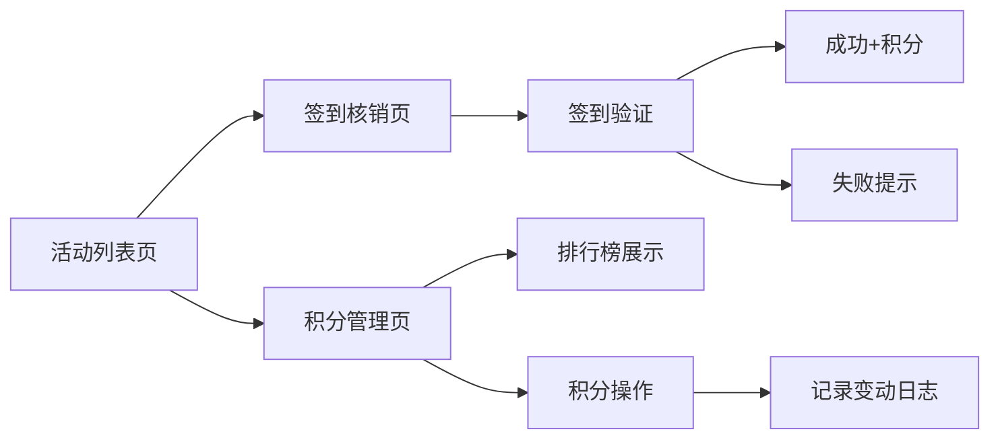

## 1. 产品概述

活动签到与积分管理系统是一款面向活动组织者的高效管理工具，支持快速签到核销、自动积分累计和参与者排名管理。

- 核心目标：简化活动签到流程，通过积分机制提升参与者活跃度
- 目标用户：活动组织者、社群运营人员、企业行政
- 核心价值：扫码秒级核销、自动积分统计、数据持久化存储

## 2. 核心功能

### 2.1 用户角色

| 角色 | 登录方式 | 核心权限 |
|------|----------|----------|
| 组织者/管理员 | 本地访问 | 创建/编辑/删除活动、签到核销、积分管理、数据导入导出 |

### 2.2 功能模块

1. **活动列表页**：活动卡片网格展示、新建/编辑/删除活动、签到率统计、数据导入导出
2. **签到核销页**：扫码/手动输入签到码、实时签到人数统计、签到成功/失败动画反馈
3. **积分管理页**：积分排名榜、手动增减积分、积分变动日志、数据导入导出

### 2.3 页面详情

| 页面名称 | 模块名称 | 功能描述 |
|---------|---------|----------|
| 活动列表页 | 活动卡片网格 | 渐变首字母缩略图、活动详情摘要、报名人数、签到率进度条 |
| 活动列表页 | 活动管理操作 | 新建活动弹窗、编辑活动、删除二次确认、淡出动画 |
| 活动列表页 | 数据管理 | 导出JSON、导入JSON、Toast提示 |
| 签到核销页 | 签到入口 | 扫码模拟、6位签到码输入、核销按钮 |
| 签到核销页 | 实时统计 | 顶部签到人数计数器、数字翻滚动画 |
| 签到核销页 | 反馈动画 | 成功绿色勾+弹跳、失败红色抖动+错误消息 |
| 积分管理页 | 排行榜 | 金银铜牌高亮、灰色圆点编号、即时排序 |
| 积分管理页 | 积分操作 | 手动增减积分输入、正负整数支持 |
| 积分管理页 | 变动日志 | 时间线展示、新记录滑入动画 |

## 3. 核心流程

**签到核销流程**：
组织者选择活动 → 获取签到码 → 参与者出示签到码 → 扫码/手动输入 → 系统验证有效性 → 签到成功+积分+10 / 失败提示错误

**积分管理流程**：
管理员进入积分页面 → 查看排行榜 → 选择参与者 → 输入积分变动值 → 积分更新 → 排行榜重排 → 记录变动日志

**活动管理流程**：
组织者进入活动列表 → 新建/编辑活动 → 填写活动信息 → 保存 → 卡片更新展示

## 4. 用户界面设计

### 4.1 设计风格

- 主色调：靛蓝 #3B82F6
- 辅助色：珊瑚橙 #F97316
- 背景色：浅蓝灰 #F0F4F8
- 卡片样式：白色圆角卡片、轻微阴影、悬停上移2px+阴影加深
- 按钮样式：统一圆角8px、悬停背景色渐变过渡0.2s ease
- 字体：现代无衬线字体，清晰的层级结构
- 动效：签到成功弹性绿色勾、失败CSS抖动动画、数字上下翻滚

### 4.2 页面设计概览

| 页面名称 | 模块名称 | UI元素 |
|---------|---------|-------|
| 活动列表页 | 活动卡片 | 渐变首字母图、标题、时间地点、人数进度条、操作按钮 |
| 签到核销页 | 签到区 | 大输入框、核销按钮、成功/失败状态提示 |
| 签到核销页 | 计数器 | 大号数字、翻滚动画、签到人列表 |
| 积分管理页 | 排行榜 | 金银铜奖牌样式、排名编号、积分数字 |
| 积分管理页 | 时间线 | 时间轴、变动记录、滑入动画 |

### 4.3 响应式设计

- 桌面端：活动卡片网格布局（多列）、积分页左右分栏
- 移动端（<768px）：活动列表单列、卡片自适应宽度、积分页上下堆叠
- 触摸优化：按钮最小点击区域、合理间距

### 4.4 性能优化

- 使用 React.memo 优化组件渲染
- 长列表采用虚拟列表或分页策略
- 100条数据初次加载 < 500ms
- 滚动帧率 ≥ 50fps
