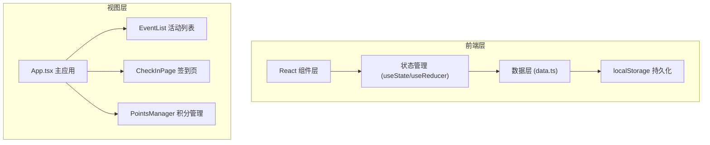

## 1. 架构设计



## 2. 技术描述

- **前端框架**：React 18 + TypeScript
- **构建工具**：Vite
- **状态管理**：React Hooks (useState, useEffect, useCallback)
- **数据持久化**：localStorage
- **样式方案**：原生 CSS + CSS Variables
- **图标方案**：Lucide React
- **路由方案**：状态驱动的页面切换（简单应用无需 react-router）

## 3. 页面路由

由于是单页应用，使用状态管理实现页面切换：

| 页面 | 标识 | 说明 |
|-----|------|------|
| 活动列表 | events | 默认首页，展示所有活动 |
| 签到核销 | checkin | 选中活动后进入签到 |
| 积分管理 | points | 积分排行榜与操作 |

## 4. 数据模型

### 4.1 类型定义 (types.ts)

```typescript
interface Event {
  id: string;
  name: string;
  time: string;
  location: string;
  maxParticipants: number;
  checkInCode: string;
  participantIds: string[];
  checkedInIds: string[];
  createdAt: number;
}

interface Participant {
  id: string;
  name: string;
  points: number;
}

interface CheckInRecord {
  id: string;
  eventId: string;
  participantId: string;
  timestamp: number;
}

interface PointsLog {
  id: string;
  participantId: string;
  eventId?: string;
  change: number;
  reason: string;
  timestamp: number;
}
```

### 4.2 数据模块 (data.ts)

- 提供模拟初始数据
- 封装 localStorage 读写函数
- 提供 CRUD 操作接口
- 数据导入导出功能

## 5. 核心模块设计

### 5.1 App.tsx
- 管理全局状态（当前页面、当前活动）
- 页面路由切换
- 共享数据状态与操作方法

### 5.2 EventList.tsx
- 活动卡片网格布局
- 新建/编辑/删除活动
- 签到率计算与进度条
- 数据导入导出
- 删除确认弹窗+淡出动画

### 5.3 CheckInPage.tsx
- 签到码输入与验证
- 签到成功/失败动画
- 实时签到人数统计（翻滚数字）
- 签到列表展示

### 5.4 PointsManager.tsx
- 积分排行榜（金银铜高亮）
- 手动增减积分
- 积分变动时间线
- 数据导入导出

### 5.5 性能优化策略

1. **React.memo**：对列表项组件使用 memo 避免不必要重渲染
2. **虚拟列表**：超过100条数据时使用虚拟滚动（或分页）
3. **useMemo/useCallback**：优化计算属性和回调函数
4. **防抖/节流**：输入框搜索等高频操作使用防抖
