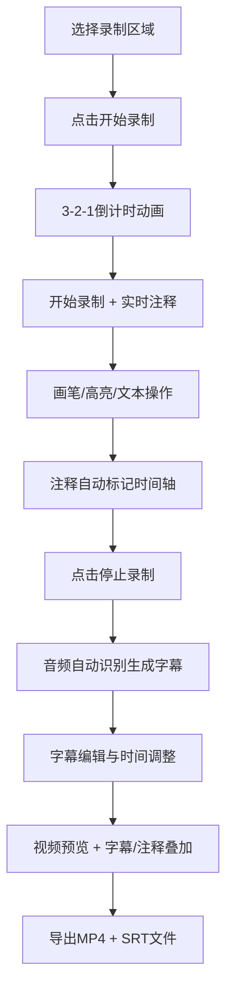

## 1. 产品概述

ScreenCap Studio 是一款基于浏览器的高质量屏幕录制工具，专注于快速生成带字幕和注释的教程视频。解决传统录屏工具功能臃肿、无法实时添加字幕和画笔注释、后期剪辑耗时的痛点。

- 主要用途：快速制作教学演示视频、产品教程、问题反馈录屏
- 目标用户：教育工作者、产品经理、技术支持人员、内容创作者
- 核心价值：录制即成品，无需后期剪辑，一键导出带字幕的教程视频

## 2. 核心功能

### 2.1 用户角色

| 角色 | 注册方式 | 核心权限 |
|------|----------|----------|
| 普通用户 | 无需注册，浏览器直接使用 | 使用全部录制、注释、字幕和导出功能 |

### 2.2 功能模块

1. **录制控制面板**：区域选择、倒计时动画、录制状态控制、实时时长统计
2. **实时注释系统**：画笔工具、高亮工具、文本工具、注释时间轴标记
3. **智能字幕生成**：音频自动识别、SRT格式生成、字幕编辑与时间偏移
4. **预览与导出**：视频预览播放器、字幕/注释叠加显示、MP4+SRT导出

### 2.3 页面详情

| 页面名称 | 模块名称 | 功能描述 |
|----------|----------|----------|
| 主应用页 | 录制控制面板 | 半透明悬浮面板，支持拖拽移动，包含开始/暂停/停止按钮和实时时长计数器 |
| 主应用页 | 倒计时动画 | 3-2-1倒计时，数字从屏幕中心弹出并缩放消失 |
| 主应用页 | 注释工具栏 | 画笔（五色可选）、高亮、文本输入工具，快捷键激活 |
| 主应用页 | 字幕编辑面板 | 字幕列表展示，每条可独立编辑内容和时间偏移 |
| 主应用页 | 预览播放器 | 视频播放、进度控制、字幕和注释叠加显示 |
| 主应用页 | 导出模块 | MP4视频（内嵌字幕）和独立SRT文件下载 |

## 3. 核心流程

用户操作流程：选择录制区域 → 开始录制 → 实时添加注释 → 停止录制 → 自动生成字幕 → 编辑字幕 → 预览效果 → 导出成品。

## 4. 用户界面设计

### 4.1 设计风格

- **主题风格**：深色科技感，深蓝黑到深紫的渐变背景，营造专业录制氛围
- **主色调**：
  - 背景渐变：`#1a1a2e` → `#16213e`
  - 按钮渐变：`#0f3460`（霓虹蓝） → `#533483`（电光紫）
  - 文字颜色：`#ffffff`、`#e0e0e0`、`#8892b0`
- **视觉效果**：
  - 控制面板：磨砂玻璃效果（`backdrop-filter: blur(16px)`），半透明背景（`rgba(26, 26, 46, 0.85)`）
  - 按钮悬停：轻微上浮（`translateY(-2px)`）+ 光晕扩散（`box-shadow` 动画）
  - 倒计时数字：粗体白色，从屏幕中心弹出并缩小消失，带缩放和透明度动画

### 4.2 排版设计

- **字体**：Google Fonts - Inter（400, 500, 600, 700）
- **字体层级**：
  - 倒计时数字：`font-size: 120px`, `font-weight: 700`
  - 面板标题：`font-size: 18px`, `font-weight: 600`
  - 按钮文字：`font-size: 14px`, `font-weight: 500`
  - 字幕条目：`font-size: 13px`, `font-weight: 400`
  - 辅助文字：`font-size: 12px`, `font-weight: 400`, `color: #8892b0`

### 4.3 页面设计概述

| 页面名称 | 模块名称 | UI Elements |
|----------|----------|-------------|
| 主应用页 | 整体布局 | 桌面端（≥1200px）三栏布局：左侧控制、中间预览、右侧字幕编辑；移动端（<768px）纵向堆叠单栏 |
| 主应用页 | 录制控制面板 | 半透明悬浮卡片，可拖拽移动，按钮带渐变填充和悬停动画，实时计时器显示 |
| 主应用页 | 倒计时动画 | 全屏居中显示，数字3→2→1依次弹出缩放消失 |
| 主应用页 | 注释工具栏 | 垂直排列工具图标，颜色选择器横向排列，激活状态高亮显示 |
| 主应用页 | 预览播放器 | 简约线条图标控制按钮，进度条使用霓虹蓝到电光紫渐变色填充 |
| 主应用页 | 字幕编辑面板 | 列表式布局，每条字幕独立卡片，输入框编辑内容，时间偏移微调按钮 |
| 主应用页 | 导出区域 | 大尺寸渐变按钮，带下载图标和格式说明 |

### 4.4 动画效果

| 元素 | 动画效果 | 时长 | 缓动函数 |
|------|----------|------|----------|
| 倒计时数字出现 | `scale(0.5) → scale(1.2)`，`opacity: 0 → 1` | 300ms | `cubic-bezier(0.34, 1.56, 0.64, 1)` |
| 倒计时数字消失 | `scale(1.2) → scale(0.8)`，`opacity: 1 → 0` | 200ms | `ease-out` |
| 按钮悬停 | `translateY(-2px)`，光晕扩散 | 200ms | `ease-out` |
| 面板拖拽 | 跟随鼠标平滑移动 | 实时 | `requestAnimationFrame` |
| 注释绘制 | 线条实时跟随鼠标 | < 100ms | Canvas 实时绘制 |
| 页面加载 | 三栏依次淡入，错开100ms | 500ms | `ease-out` |

### 4.5 响应式设计

- **桌面端（≥1200px）**：三栏布局，左栏300px，中栏自适应，右栏320px
- **平板端（768px-1199px）**：两栏布局，左侧控制+预览，右侧字幕编辑折叠为底部面板
- **移动端（<768px）**：单栏堆叠，控制面板→预览→字幕编辑，全屏预览模式

### 4.6 性能指标

| 指标 | 目标值 | 实现方案 |
|------|--------|----------|
| 预览帧率 | ≥ 30fps | 使用 `requestAnimationFrame` 优化渲染 |
| 注释响应延迟 | < 100ms | Canvas 离屏缓冲 + 事件节流 |
| 字幕生成处理 | ≤ 5秒 | Web Speech API 本地处理，流式识别 |
| 首次加载 | < 2秒 | 代码分割，按需加载 |
