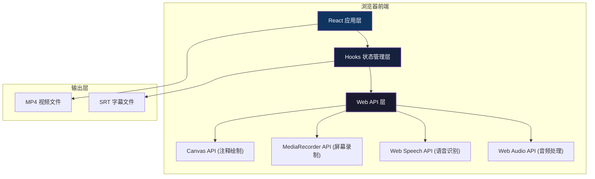

## 1. 架构设计



## 2. 技术描述

### 2.1 技术栈

| 类别 | 技术选型 | 版本 | 用途 |
|------|----------|------|------|
| 框架 | React | ^18.2.0 | UI 组件化开发 |
| 语言 | TypeScript | ^5.3.0 | 类型安全开发 |
| 构建工具 | Vite | ^5.0.0 | 快速构建与热更新 |
| 工具库 | uuid | ^9.0.0 | 生成唯一 ID（注释、字幕条目） |
| HTTP 客户端 | axios | ^1.6.0 | 网络请求（预留扩展） |
| 类型定义 | @types/react | ^18.2.0 | React 类型定义 |
| 类型定义 | @types/react-dom | ^18.2.0 | React DOM 类型定义 |

### 2.2 核心技术方案

| 功能模块 | 技术方案 | 关键 API |
|----------|----------|----------|
| 屏幕录制 | MediaRecorder API | `getDisplayMedia()`, `MediaRecorder` |
| 音频录制 | Web Audio API | `getUserMedia()`, `AudioContext` |
| 注释绘制 | Canvas 2D API | `getContext('2d')`, `requestAnimationFrame` |
| 语音识别 | Web Speech API | `webkitSpeechRecognition`, `SpeechRecognition` |
| 字幕合成 | SRT 格式生成 | 自定义格式化逻辑 |
| 视频导出 | Blob + URL.createObjectURL | `Blob`, `URL.createObjectURL()` |
| 视频预览 | HTML5 Video Element | `<video>`, `<track>` (WebVTT) |

## 3. 项目结构

```
auto101/
├── package.json              # 项目依赖与脚本
├── index.html                # 入口 HTML
├── vite.config.js            # Vite 构建配置
├── tsconfig.json             # TypeScript 配置
├── src/
│   ├── types.ts              # 全局类型定义
│   ├── hooks/
│   │   ├── useRecorder.ts    # 录制控制 Hook
│   │   ├── useAnnotator.ts   # 注释管理 Hook
│   │   └── useSubtitles.ts   # 字幕生成 Hook
│   ├── components/
│   │   ├── ControlPanel.tsx  # 录制控制面板
│   │   ├── PreviewPlayer.tsx # 预览播放器
│   │   └── SubtitleEditor.tsx # 字幕编辑器
│   ├── App.tsx               # 根组件
│   ├── main.tsx              # 应用入口
│   └── index.css             # 全局样式
└── .trae/
    └── documents/
        ├── prd.md
        └── technical-architecture.md
```

## 4. 类型定义

### 4.1 核心类型

```typescript
// src/types.ts

export enum RecordingState {
  IDLE = 'idle',
  COUNTDOWN = 'countdown',
  RECORDING = 'recording',
  PAUSED = 'paused',
  STOPPED = 'stopped',
  PROCESSING = 'processing'
}

export enum AnnotationTool {
  NONE = 'none',
  PEN = 'pen',
  HIGHLIGHT = 'highlight',
  TEXT = 'text'
}

export type AnnotationColor = 'red' | 'yellow' | 'blue' | 'green' | 'white';

export interface Point {
  x: number;
  y: number;
}

export interface BaseAnnotation {
  id: string;
  timestamp: number;
  tool: AnnotationTool;
  color: AnnotationColor;
}

export interface PenAnnotation extends BaseAnnotation {
  tool: AnnotationTool.PEN;
  points: Point[];
  lineWidth: number;
}

export interface HighlightAnnotation extends BaseAnnotation {
  tool: AnnotationTool.HIGHLIGHT;
  startPoint: Point;
  endPoint: Point;
}

export interface TextAnnotation extends BaseAnnotation {
  tool: AnnotationTool.TEXT;
  position: Point;
  text: string;
  fontSize: number;
}

export type Annotation = PenAnnotation | HighlightAnnotation | TextAnnotation;

export interface SubtitleEntry {
  id: string;
  startTime: number;
  endTime: number;
  text: string;
  offset: number;
}

export interface RecordingConfig {
  video: boolean;
  audio: boolean;
  displayMediaOptions: DisplayMediaStreamOptions;
}

export interface RecordingData {
  blob: Blob | null;
  url: string | null;
  duration: number;
  annotations: Annotation[];
  subtitles: SubtitleEntry[];
}
```

## 5. Hooks 设计

### 5.1 useRecorder Hook

**职责**：封装 MediaRecorder API，管理录制状态

**返回值**：
```typescript
{
  state: RecordingState;
  duration: number;
  blob: Blob | null;
  videoUrl: string | null;
  startRecording: (options?: DisplayMediaStreamOptions) => Promise<void>;
  pauseRecording: () => void;
  resumeRecording: () => void;
  stopRecording: () => void;
  resetRecording: () => void;
}
```

### 5.2 useAnnotator Hook

**职责**：管理注释工具状态和 Canvas 绘制

**返回值**：
```typescript
{
  currentTool: AnnotationTool;
  currentColor: AnnotationColor;
  annotations: Annotation[];
  setTool: (tool: AnnotationTool) => void;
  setColor: (color: AnnotationColor) => void;
  undoAnnotation: () => void;
  clearAnnotations: () => void;
  setCanvasRef: (canvas: HTMLCanvasElement | null) => void;
  startDrawing: (x: number, y: number) => void;
  draw: (x: number, y: number) => void;
  endDrawing: () => void;
  addTextAnnotation: (x: number, y: number, text: string) => void;
  renderAllAnnotations: () => void;
}
```

### 5.3 useSubtitles Hook

**职责**：封装语音识别，生成和管理字幕

**返回值**：
```typescript
{
  subtitles: SubtitleEntry[];
  isGenerating: boolean;
  generateSubtitles: (audioBlob: Blob) => Promise<void>;
  updateSubtitle: (id: string, updates: Partial<SubtitleEntry>) => void;
  adjustOffset: (id: string, offsetMs: number) => void;
  deleteSubtitle: (id: string) => void;
  addSubtitle: (entry: Omit<SubtitleEntry, 'id'>) => void;
  exportSRT: () => string;
  mergeAudio: (videoBlob: Blob, audioBlob: Blob) => Promise<Blob>;
}
```

## 6. 组件设计

### 6.1 组件层级

```
App.tsx
├── ControlPanel.tsx
│   ├── RecordingControls (开始/暂停/停止)
│   ├── TimerDisplay (时长计数器)
│   ├── AnnotationToolbar (工具选择)
│   ├── ColorPicker (颜色选择)
│   └── CountdownOverlay (倒计时动画)
├── PreviewPlayer.tsx
│   ├── VideoElement (视频播放)
│   ├── ProgressBar (进度条)
│   ├── PlaybackControls (播放/暂停/音量)
│   └── AnnotationOverlay (注释叠加)
└── SubtitleEditor.tsx
    ├── SubtitleList (字幕列表)
    ├── SubtitleItem (单条字幕编辑)
    └── ExportButtons (导出按钮)
```

### 6.2 全局状态管理

使用 React Context + Hooks 组合：

```typescript
// AppContext
interface AppContextType {
  recordingState: RecordingState;
  duration: number;
  videoBlob: Blob | null;
  videoUrl: string | null;
  annotations: Annotation[];
  subtitles: SubtitleEntry[];
  // 操作方法...
}
```

## 7. 性能优化方案

| 优化点 | 方案 | 预期效果 |
|--------|------|----------|
| 绘制性能 | Canvas 离屏缓冲 + `requestAnimationFrame` 批量绘制 | 注释响应 < 100ms |
| 内存管理 | 录制停止后及时释放 `URL.revokeObjectURL` | 避免内存泄漏 |
| 事件节流 | 鼠标移动事件使用 `throttle` 限制触发频率 | 降低 CPU 占用 |
| 组件重渲染 | `useMemo` / `useCallback` 优化依赖 | 减少不必要重渲染 |
| 字幕生成 | 流式语音识别，增量更新字幕列表 | 处理时间 ≤ 5秒 |
| 视频预览 | 使用 `MediaSource` 分段加载（可选） | 大文件流畅播放 |

## 8. 兼容性处理

| API | 浏览器兼容 | 降级方案 |
|-----|-----------|----------|
| `getDisplayMedia` | Chrome 72+, Firefox 66+, Edge 79+ | 提示用户更新浏览器 |
| `MediaRecorder` | Chrome 47+, Firefox 25+, Edge 79+ | 降级为仅视频预览 |
| `webkitSpeechRecognition` | Chrome 33+, Edge 79+ | 手动输入字幕模式 |
| `backdrop-filter` | Chrome 76+, Firefox 103+, Edge 17+ | 降级为半透明背景 |

## 9. 关键算法

### 9.1 SRT 时间格式化

```typescript
function formatSRTTime(ms: number): string {
  const hours = Math.floor(ms / 3600000);
  const minutes = Math.floor((ms % 3600000) / 60000);
  const seconds = Math.floor((ms % 60000) / 1000);
  const milliseconds = ms % 1000;
  return `${hours.toString().padStart(2, '0')}:${minutes.toString().padStart(2, '0')}:${seconds.toString().padStart(2, '0')},${milliseconds.toString().padStart(3, '0')}`;
}
```

### 9.2 注释点轨迹简化（Douglas-Peucker 算法）

```typescript
function simplifyPath(points: Point[], tolerance: number): Point[] {
  // 减少绘制点数量，优化性能
  // ...
}
```

## 10. 开发与构建

| 命令 | 说明 |
|------|------|
| `npm install` | 安装项目依赖 |
| `npm run dev` | 启动开发服务器（默认端口 5173） |
| `npm run build` | 生产环境构建 |
| `npm run preview` | 预览生产构建结果 |
| `npm run type-check` | TypeScript 类型检查 |
