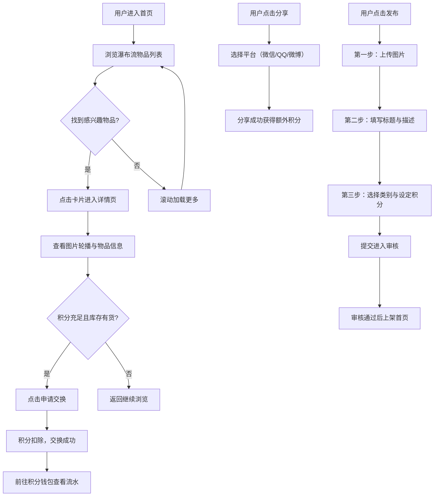

## 1. 产品概述

校园闲置物品漂流交换平台——让高校学生通过虚拟积分交换闲置教材、电子产品和生活用品，解决毕业生离校物品丢弃浪费、低年级学生重复采购的痛点，打造绿色循环的校园共享生态。

- 目标用户：在校大学生（毕业生发布闲置、低年级学生获取所需）
- 核心价值：减少浪费、降低采购成本、构建校园互助社区

## 2. 核心功能

### 2.1 用户角色

| 角色 | 注册方式 | 核心权限 |
|------|----------|----------|
| 普通用户 | 校园邮箱注册 | 浏览物品、发布物品、申请交换、查看积分钱包、分享获积分 |

### 2.2 功能模块

1. **首页**：瀑布流物品卡片列表、搜索筛选、滚动无限加载
2. **发布页**：分步式引导发布物品（上传图片→填写信息→选择类别与积分）
3. **详情页**：图片轮播、物品信息展示、交换申请
4. **积分钱包页**：积分总览、7天变化柱状图、积分流水列表、分享赚积分

### 2.3 页面详情

| 页面名称 | 模块名称 | 功能描述 |
|----------|----------|----------|
| 首页 | 瀑布流卡片列表 | 调用 /api/items 获取物品列表，瀑布流布局展示物品缩略图、标题、期望积分、发布者头像；卡片从底部滑入+淡出入场动画；悬停上浮+阴影扩散；滚动无限加载 |
| 首页 | 顶部导航栏 | Logo、搜索框、发布按钮、积分钱包入口 |
| 发布页 | 第一步：上传图片 | 支持多选图片上传，拖拽排序，上传进度条+缩略图预览，首张图片右上角显示"封面"标记 |
| 发布页 | 第二步：填写标题与描述 | 标题输入框、描述文本域（字数统计，最多300字限制） |
| 发布页 | 第三步：选择类别与积分 | 彩色图标按钮组选择类别（选中时图标放大+弹性回弹动画），设定所需积分数 |
| 发布页 | 审核提示条 | 提交后页面顶部显示淡蓝色提示条（可手动关闭，带收缩动画），提示物品进入审核状态 |
| 详情页 | 图片轮播 | 左侧图片轮播，支持左右滑动和缩放手势 |
| 详情页 | 物品信息面板 | 右侧展示物品标题、描述、类别、期望积分、发布者信息 |
| 详情页 | 交换申请按钮 | "申请交换"按钮，颜色随库存状态变化（充足→翠绿渐变、紧张→橙黄渐变） |
| 积分钱包页 | 积分总览 | 顶部显示总积分余额 |
| 积分钱包页 | 7天变化柱状图 | 柱状图从底部生长入场动画，柱子颜色从冷蓝渐变到暖橙表示增长趋势 |
| 积分钱包页 | 积分流水列表 | 每条记录左侧正负号图标：收入绿色↑、支出红色↓ |
| 积分钱包页 | 分享赚积分 | 分享按钮点击后弹出悬浮窗，含微信/QQ/微博图标，悬停放大+光晕效果 |

## 3. 核心流程

用户浏览首页物品列表 → 点击卡片进入详情页 → 查看物品信息和图片 → 点击"申请交换"消耗积分获取物品。同时，用户可以通过发布闲置物品赚取积分，或通过分享物品页面给好友获取额外积分。

## 4. 用户界面设计

### 4.1 设计风格

- 主色：柔和天蓝 #6BB7F0，辅色：灰色背景 #F5F7FA
- 按钮：渐变填充，0.2s 缓动 hover 效果
- 卡片与面板：12px 圆角设计
- 字体：标题使用 Outfit（粗体 600/700），正文使用 Noto Sans SC（常规 400）
- 布局：卡片式瀑布流，顶部导航栏
- 图标：Lucide React 图标库，搭配彩色圆形背景

### 4.2 页面设计概览

| 页面名称 | 模块名称 | UI 元素 |
|----------|----------|---------|
| 首页 | 瀑布流卡片列表 | 双列瀑布流布局，白色卡片+12px圆角+轻阴影，缩略图+标题+积分标签+头像，入场滑入淡出动画，悬停上浮+阴影扩散 |
| 首页 | 顶部导航栏 | 天蓝渐变背景，白色Logo文字，搜索框，发布按钮（渐变填充），钱包图标 |
| 发布页 | 图片上传区 | 虚线边框拖拽区，缩略图网格排列，进度条覆盖，首张"封面"角标 |
| 发布页 | 表单区域 | 分步指示器（1-2-3圆点），标题输入框，描述文本域+字数统计，彩色类别按钮组 |
| 发布页 | 审核提示条 | 淡蓝色背景条，信息图标，关闭按钮，收缩关闭动画 |
| 详情页 | 图片轮播 | 左侧大图轮播，底部缩略点指示器，支持滑动和缩放 |
| 详情页 | 信息面板 | 右侧物品标题（大号粗体）、描述、类别标签、积分数字，交换按钮（渐变色随库存变化） |
| 积分钱包页 | 积分总览 | 大号积分数字，余额卡片 |
| 积分钱包页 | 柱状图 | 7根柱子，冷蓝→暖橙渐变色，从底部生长动画 |
| 积分钱包页 | 流水列表 | 条目式列表，左绿↑/红↓图标，描述文字，积分变化数值 |
| 积分钱包页 | 分享悬浮窗 | 半透明遮罩，居中白色卡片，三个平台图标（微信绿/QQ蓝/微博红），悬停放大+光晕 |

### 4.3 响应式设计

- 桌面优先设计，移动端自适应
- 移动端（<768px）：单列布局，隐藏侧边栏，卡片全宽展示
- 平板（768-1024px）：双列瀑布流
- 桌面（>1024px）：三列瀑布流，详情页左右分栏

### 4.4 性能要求

- 滚动列表帧率不低于 50fps
- 图片懒加载
- 卡片虚拟化或分页加载
