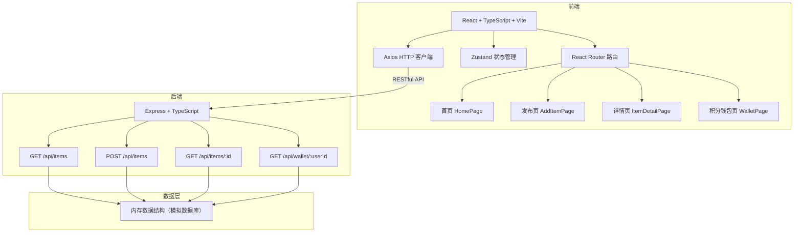
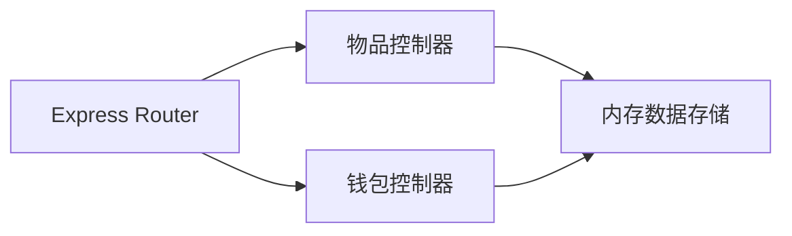
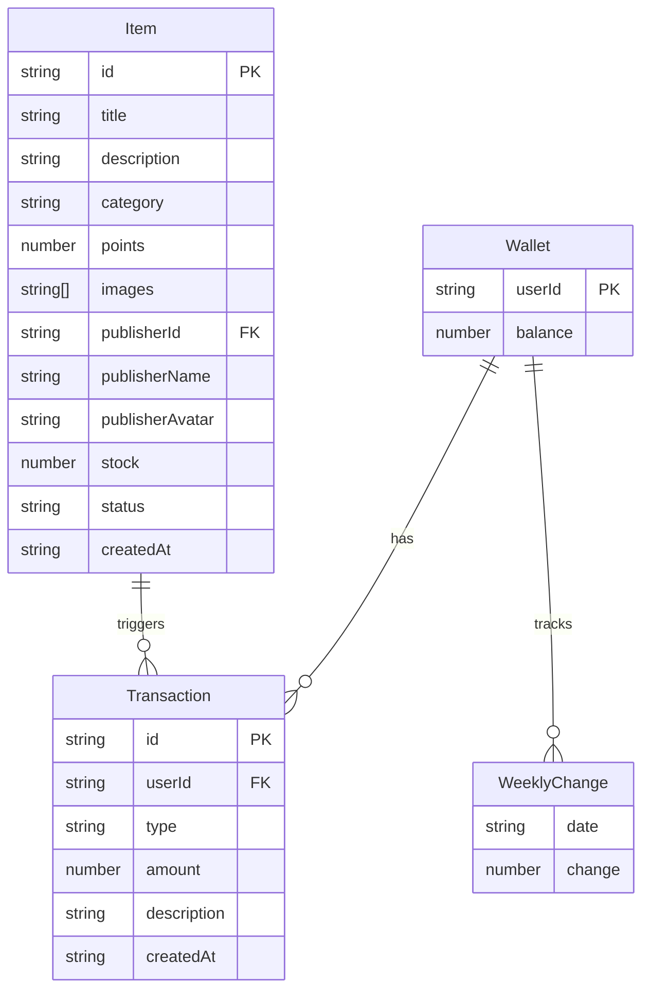

## 1. 架构设计



## 2. 技术说明

- 前端：React@18 + TypeScript + Vite + TailwindCSS + Zustand + Axios + React Router DOM
- 初始化工具：vite-init（react-express-ts 模板）
- 后端：Express@4 + TypeScript + CORS + UUID
- 数据库：内存数据结构模拟（无持久化）
- 图标：lucide-react

## 3. 路由定义

| 路由 | 用途 |
|------|------|
| / | 首页，瀑布流展示物品列表 |
| /add | 发布页，分步式引导发布物品 |
| /item/:id | 详情页，展示物品详情与交换申请 |
| /wallet | 积分钱包页，积分总览、柱状图、流水列表 |

## 4. API 定义

### 4.1 TypeScript 类型定义

```typescript
interface Item {
  id: string;
  title: string;
  description: string;
  category: string;
  points: number;
  images: string[];
  publisherId: string;
  publisherName: string;
  publisherAvatar: string;
  stock: number;
  status: 'pending' | 'approved' | 'exchanged';
  createdAt: string;
}

interface Wallet {
  userId: string;
  balance: number;
  weeklyChanges: { date: string; change: number }[];
  transactions: Transaction[];
}

interface Transaction {
  id: string;
  type: 'income' | 'expense';
  amount: number;
  description: string;
  createdAt: string;
}
```

### 4.2 请求/响应模式

| 方法 | 路径 | 请求体 | 响应 |
|------|------|--------|------|
| GET | /api/items | - | `{ items: Item[] }` |
| POST | /api/items | `Omit<Item, 'id' | 'status' | 'createdAt'>` | `{ item: Item }` |
| GET | /api/items/:id | - | `{ item: Item }` |
| GET | /api/wallet/:userId | - | `{ wallet: Wallet }` |

## 5. 服务端架构图



## 6. 数据模型

### 6.1 数据模型定义



### 6.2 初始数据

后端使用内存数组模拟，启动时预置 12 条物品数据和 1 个用户的钱包数据（含 7 天积分变化和流水记录），确保首页和钱包页有内容展示。
