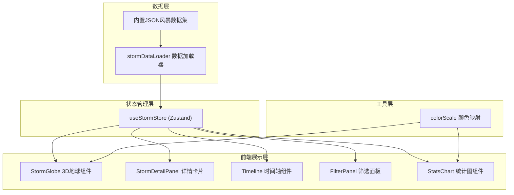

## 1. 架构设计



## 2. 技术说明

- **前端框架**：React 18 + TypeScript（严格模式）
- **构建工具**：Vite
- **3D渲染**：Three.js + @react-three/fiber + @react-three/drei
- **状态管理**：Zustand
- **数据可视化**：d3-scale（颜色/坐标映射）、d3-time-format（时间格式化）
- **样式方案**：CSS Modules + Tailwind CSS
- **数据来源**：内置JSON数据集（无后端服务）
- **初始化工具**：vite-init（react-ts模板）

## 3. 路由定义

| 路由 | 用途 |
|------|------|
| / | 单页应用，包含3D地球可视化与所有交互控件 |

## 4. 文件结构

```
├── package.json
├── index.html
├── tsconfig.json
├── vite.config.js
├── src/
│   ├── main.tsx                    # 应用入口
│   ├── App.tsx                     # 根组件，布局管理
│   ├── App.css                     # 全局样式
│   ├── data/
│   │   ├── stormDataLoader.ts      # 风暴数据解析与过滤
│   │   └── stormRecords.json       # 内置风暴记录数据集
│   ├── components/
│   │   ├── StormGlobe.tsx          # 3D地球与路径渲染
│   │   ├── StormDetailPanel.tsx    # 风暴详情卡片
│   │   ├── Timeline.tsx            # 时间轴滑块与播放
│   │   ├── FilterPanel.tsx         # 筛选面板（等级/海域）
│   │   └── StatsChart.tsx          # 统计折线图
│   ├── store/
│   │   └── useStormStore.ts        # Zustand全局状态
│   └── utils/
│       └── colorScale.ts           # 颜色映射工具
```

## 5. 数据模型

### 5.1 核心类型定义

```typescript
interface StormRecord {
  id: string;
  name: string;
  year: number;
  basin: string;           // 海域: "NA"(北大西洋), "EP"(东太平洋), "WP"(西太平洋), "NI"(北印度洋), "SI"(南印度洋), "SP"(南太平洋)
  category: number;        // Saffir-Simpson等级 1-5
  maxWind: number;         // 最大风速(knots)
  minPressure: number;     // 最低气压(hPa)
  landfall: string;        // 登陆区域
  path: StormPathPoint[];
}

interface StormPathPoint {
  lat: number;
  lon: number;
  windSpeed: number;       // 该时刻风速(knots)
  pressure: number;        // 该时刻气压(hPa)
  timestamp: string;       // ISO时间戳
}

interface FilterState {
  yearRange: [number, number];   // [1900, 2024]
  category: number | null;       // null表示全部
  basin: string | null;          // null表示全部
}
```

### 5.2 数据集设计

内置约50-80条代表性风暴记录，覆盖1900-2024年各海域的重大飓风/台风/气旋，每条风暴包含8-30个路径点。数据来源基于公开IBTrACS数据集的精简版本。
