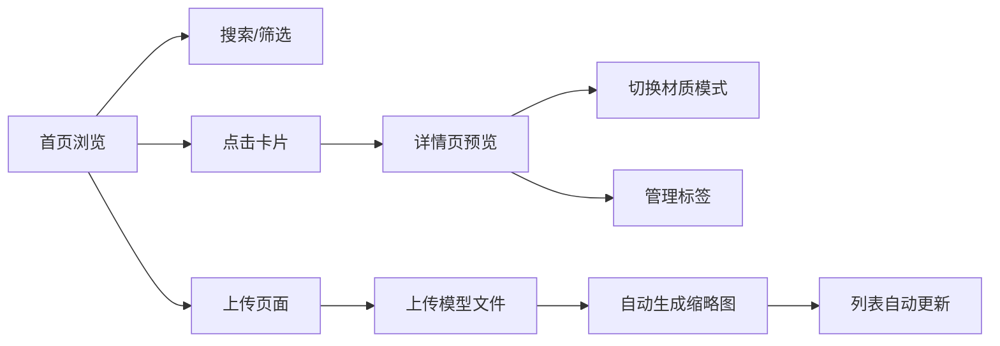

# 产品需求文档 - 3D模型资产管理平台

## 1. 产品概述

个人闲置3D模型资产管理与在线预览展示平台，为3D建模爱好者和独立开发者提供模型文件的集中管理、在线预览、标签分类和分享功能。

- 核心价值：一站式管理个人3D模型资产，提升模型查找和复用效率
- 目标用户：3D建模爱好者、独立游戏开发者、数字艺术家

## 2. 核心功能

### 2.1 功能模块

1. **首页列表**：瀑布流网格展示模型卡片，支持搜索和筛选
2. **详情预览**：交互式3D预览，材质模式切换，标签管理
3. **上传管理**：本地上传模型文件，自动生成缩略图
4. **状态管理**：统一数据层，模块间数据共享与通信

### 2.2 页面详情

| 页面名称 | 模块名称 | 功能描述 |
|-----------|-------------|---------------------|
| 首页 | 顶部导航栏 | Logo、搜索框、上传按钮、筛选器 |
| 首页 | 模型卡片列表 | 瀑布流网格布局、自动旋转预览、入场动画、悬停效果 |
| 详情页 | 3D预览窗口 | 拖拽旋转、滚轮缩放、多光源照明 |
| 详情页 | 信息面板 | 模型信息、材质切换、标签管理 |
| 上传页 | 上传区域 | 拖拽上传、进度条动画、状态反馈 |

## 3. 核心流程

### 3.1 主要用户流程

用户进入首页，浏览瀑布流模型卡片列表；通过搜索或筛选快速定位目标模型；点击卡片进入详情页查看3D交互预览；可添加标签或切换材质模式；也可前往上传页上传新模型，上传后自动生成缩略图并更新列表。

## 4. 用户界面设计

### 4.1 设计风格

- **主色调**：深灰 #1e1e2f（背景）
- **强调色**：品蓝 #3b82f6（主按钮、链接）
- **高亮色**：青蓝 #06b6d4（辅助强调、进度条终点）
- **卡片样式**：圆角 12px，多层级阴影
- **按钮交互**：悬停高亮、按下缩小 0.95 倍、松手弹回
- **字体**：Inter（Google Fonts）

### 4.2 页面设计概述

| 页面名称 | 模块名称 | UI 元素 |
|-----------|-------------|-------------|
| 首页 | 模型卡片 | 3D旋转预览、名称、面数、尺寸、标签、悬停遮罩 |
| 首页 | 筛选栏 | 搜索框、标签筛选、排序下拉 |
| 详情页 | 3D预览区 | 全幅渲染、轨道控制、环境光效 |
| 详情页 | 侧边面板 | 模型元数据、材质切换器、标签列表、添加输入 |
| 上传页 | 上传区域 | 拖拽区、文件列表、渐变色进度条、完成提示 |

### 4.3 响应式设计

桌面端4列布局、平板端2列布局、手机端1列布局。侧边栏在移动端转为底部抽屉或堆叠展示。所有交互支持触摸操作。

### 4.4 3D场景指引

- **环境**：深色空间感背景，配合柔和环境光
- **光照**：环境光 + 平行光 + 点光源三点布光
- **相机**：透视相机，OrbitControls 轨道控制
- **动画**：入场光点展开动画、自动旋转预览、材质渐变过渡
- **性能**：10MB 以内模型加载 < 1500ms，列表滚动 60fps
