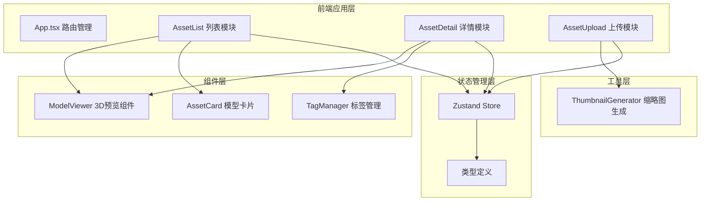
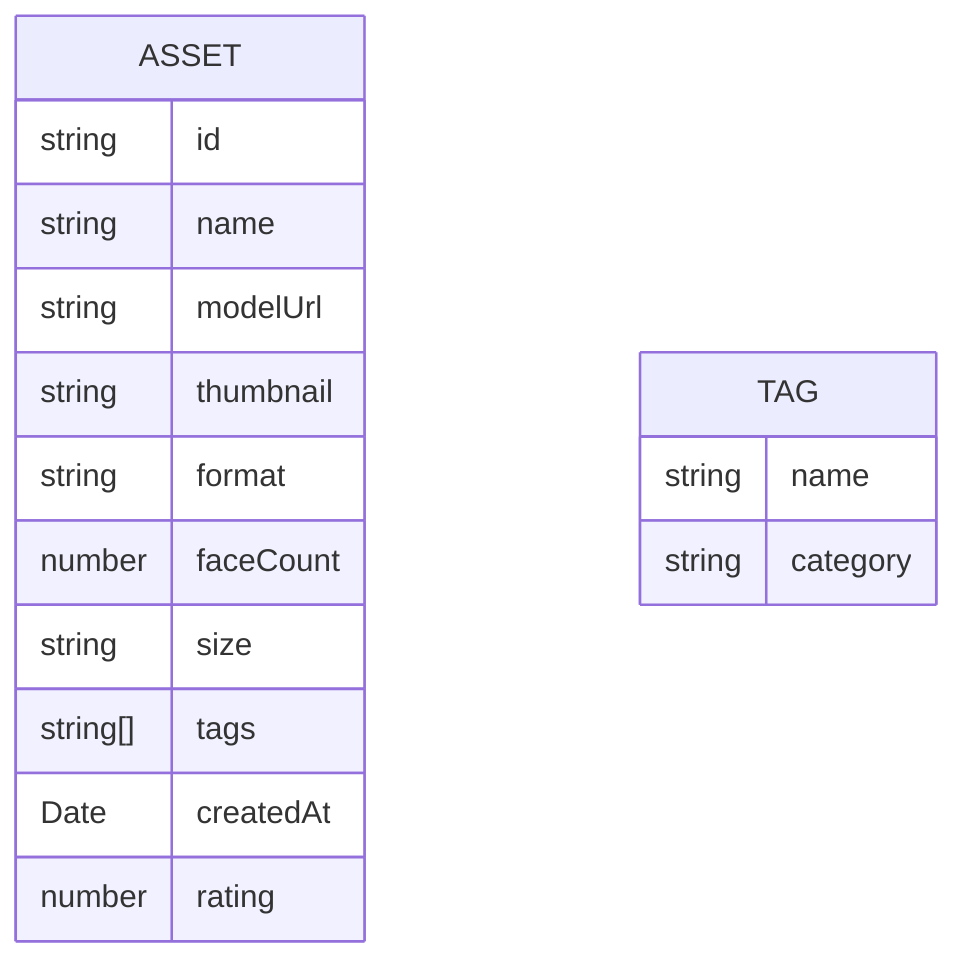

# 技术架构文档 - 3D模型资产管理平台

## 1. 架构设计



## 2. 技术选型

- **前端框架**：React 18 + TypeScript
- **构建工具**：Vite
- **3D渲染**：Three.js + @react-three/fiber + @react-three/drei
- **状态管理**：Zustand
- **路由管理**：React Router DOM
- **样式方案**：CSS Modules + CSS Variables
- **工具库**：uuid、date-fns

## 3. 路由定义

| 路由 | 页面 | 说明 |
|-------|------|------|
| / | 首页 | 模型列表瀑布流展示 |
| /asset/:id | 详情页 | 3D预览与模型详情 |
| /upload | 上传页 | 模型文件上传 |

## 4. 数据模型

### 4.1 数据模型定义



### 4.2 类型定义

- **Asset**：模型资产接口，包含id、名称、模型URL、缩略图、格式、面数、尺寸、标签列表、创建时间、评分
- **TagStyle**：标签风格枚举（科幻、写实、卡通、低多边形等）
- **SortOption**：排序选项类型（按时间、按名称、按评分）
- **MaterialMode**：材质模式（标准、线框、半透明）

## 5. 模块结构

```
src/
├── modules/
│   ├── asset-store/          # 状态管理模块
│   │   ├── store.ts          # Zustand store
│   │   └── types.ts          # 类型定义
│   ├── asset-list/           # 列表模块
│   │   └── AssetList.tsx
│   ├── asset-detail/         # 详情模块
│   │   ├── AssetDetail.tsx
│   │   └── ThumbnailGenerator.ts
│   └── asset-upload/         # 上传模块
│       └── AssetUpload.tsx
├── components/               # 公共组件
│   └── ModelViewer.tsx
├── App.tsx
└── main.tsx
```

## 6. 核心技术点

1. **3D性能优化**：使用 @react-three/fiber 的场景复用、实例化渲染、LOD 策略
2. **缩略图生成**：离屏 Canvas + Three.js 渲染截图
3. **状态管理**：Zustand 统一管理，模块间解耦通信
4. **动画效果**：CSS transitions/keyframes + Three.js 动画系统
5. **响应式布局**：CSS Grid + 媒体查询，4/2/1 列自适应
