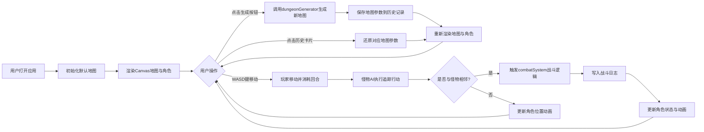

## 1. 产品概述

本项目是一个基于网格的Roguelike地下城生成器与回合制战斗模拟器，为游戏开发者和玩家提供程序化生成的随机地下城地图体验。用户可以通过点击按钮生成不同参数的随机地图，并在其中进行回合制战斗测试，每次游戏体验都不同且保持平衡性。

- 主要用途：Roguelike游戏开发测试、程序化地图生成演示、回合制战斗机制验证
- 目标用户：游戏开发者、Roguelike游戏爱好者、编程学习者

## 2. 核心功能

### 2.1 功能模块
1. **主游戏界面**：Canvas像素风格地图渲染、角色状态面板、战斗日志区域、生成历史记录
2. **地图生成系统**：随机房间生成、走廊连接、墙壁布局、渐变光效渲染
3. **回合制战斗系统**：玩家移动控制、怪物AI追踪、自动战斗触发、血量计算
4. **状态管理系统**：HP/MP进度条、技能图标与冷却、属性变化动画
5. **历史记录系统**：地图参数保存、历史卡片展示、地图还原功能

### 2.2 页面详情

| 页面名称 | 模块名称 | 功能描述 |
|---------|---------|---------|
| 主游戏界面 | 地图控制区 | 生成按钮、地图参数设置（大小、房间数） |
| 主游戏界面 | Canvas游戏区 | 像素风格网格地图渲染、玩家/怪物显示、移动动画 |
| 主游戏界面 | 角色状态面板 | HP/MP渐变进度条、技能图标与描述、冷却显示 |
| 主游戏界面 | 战斗日志区 | 带时间戳的滚动日志、敌我行动颜色区分、淡入效果 |
| 主游戏界面 | 历史记录区 | 横向卡片展示、时间逆序排列、悬停缩放、点击还原 |

## 3. 核心流程

## 4. 用户界面设计

### 4.1 设计风格
- **主色调**：深灰背景 #1a1a2e，面板色 #16213e
- **渐变色彩**：地图边际蓝紫渐变，HP酒红→鲜红渐变，MP湖蓝→靛蓝渐变
- **按钮样式**：圆角矩形，边框微光脉动效果
- **布局风格**：左侧Canvas主游戏区 + 右侧状态面板 + 底部历史记录
- **视觉特效**：毛玻璃效果（backdrop-filter: blur(8px)）、像素风格渲染、弹性动画

### 4.2 页面设计概述

| 页面名称 | 模块名称 | UI元素 |
|---------|---------|--------|
| 主游戏界面 | Canvas游戏区 | 像素网格、粗边框、蓝紫边际光、玩家绿色发光方块、怪物红色闪烁方块 |
| 主游戏界面 | 角色状态面板 | 毛玻璃背景、HP/MP渐变进度条带弹性动画、圆形技能按钮悬停显示描述 |
| 主游戏界面 | 战斗日志区 | 可滚动区域、条目交替底色（浅红/浅绿）、时间戳、淡入效果 |
| 主游戏界面 | 历史记录区 | 横向卡片、时间逆序、悬停缩放阴影加深、显示种子与参数 |
| 主游戏界面 | 控制按钮 | 圆角矩形、边框微光脉动、暗色背景 |

### 4.3 响应式设计
- **桌面端（>768px）**：左侧Canvas主游戏区 + 右侧垂直状态面板
- **移动端（≤768px）**：Canvas占满宽度，状态面板折叠为底部横向条带
- **触摸优化**：按钮尺寸适合触摸操作，虚拟方向键支持

### 4.4 动画规范
- **帧率**：60FPS
- **移动/攻击动画**：250ms线性插值过渡
- **进度条变化**：弹性收缩动画
- **日志条目**：淡入效果
- **历史卡片**：悬停缩放 + 阴影加深
