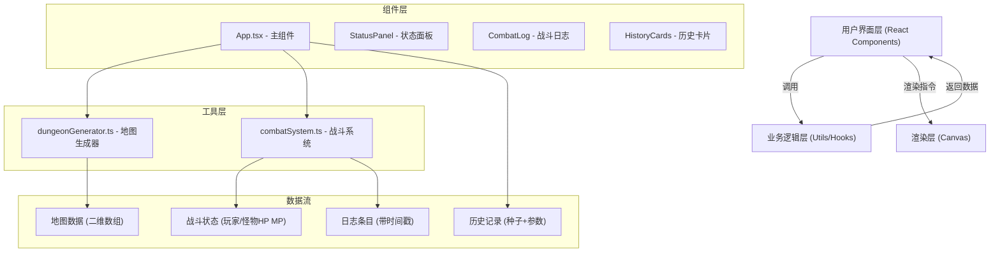

## 1. 架构设计



## 2. 技术描述
- **前端框架**：React 18 + TypeScript
- **构建工具**：Vite
- **渲染方式**：Canvas 2D API（像素风格地图）
- **状态管理**：React Hooks (useState, useEffect, useRef, useCallback)
- **CSS方案**：原生CSS + CSS变量（实现暗色主题与渐变效果）
- **动画方案**：requestAnimationFrame + CSS transitions/animations
- **唯一标识**：uuid（用于日志条目和历史记录ID）

## 3. 项目文件结构

| 文件路径 | 职责说明 |
|---------|---------|
| `package.json` | 项目依赖与脚本配置 |
| `vite.config.js` | Vite构建配置 |
| `tsconfig.json` | TypeScript编译配置（严格模式，ES2020） |
| `index.html` | 应用入口HTML |
| `src/main.tsx` | React应用入口 |
| `src/App.tsx` | 主组件，协调地图生成与战斗，管理整体状态 |
| `src/dungeonGenerator.ts` | 随机网格地图生成器（房间、走廊、墙壁） |
| `src/combatSystem.ts` | 回合制战斗逻辑（攻击、AI、血量计算） |
| `src/types.ts` | 全局TypeScript类型定义 |
| `src/App.css` | 主样式文件（暗色主题、动画、响应式） |

## 4. 核心数据模型

### 4.1 地图数据结构
```typescript
// 格子类型
enum TileType {
  WALL = 0,      // 墙壁
  FLOOR = 1,     // 房间地板
  CORRIDOR = 2,  // 走廊
}

// 地图数据
interface DungeonMap {
  width: number;
  height: number;
  tiles: TileType[][];  // 二维数组 [y][x]
  rooms: Room[];
  seed: number;
}

// 房间
interface Room {
  x: number;
  y: number;
  width: number;
  height: number;
  centerX: number;
  centerY: number;
}
```

### 4.2 角色数据结构
```typescript
// 玩家
interface Player {
  x: number;
  y: number;
  hp: number;
  maxHp: number;
  mp: number;
  maxMp: number;
  attack: number;
  skills: Skill[];
}

// 怪物
interface Monster {
  id: string;
  x: number;
  y: number;
  hp: number;
  maxHp: number;
  attack: number;
  name: string;
}

// 技能
interface Skill {
  id: string;
  name: string;
  description: string;
  damage: number;
  mpCost: number;
  cooldown: number;
  currentCooldown: number;
  icon: string;
}
```

### 4.3 战斗日志
```typescript
interface LogEntry {
  id: string;
  timestamp: Date;
  message: string;
  type: 'player' | 'enemy' | 'system';
}
```

### 4.4 历史记录
```typescript
interface HistoryRecord {
  id: string;
  timestamp: Date;
  seed: number;
  mapWidth: number;
  mapHeight: number;
  roomCount: number;
  monsterCount: number;
}
```

## 5. 性能优化策略

### 5.1 地图生成性能（≤50ms）
- 使用简单高效的房间放置算法（随机+重叠检测）
- 走廊连接采用曼哈顿路径 + 简单随机拐点
- 避免循环嵌套过深，20x20地图控制在400次迭代内

### 5.2 渲染性能（60FPS）
- Canvas离屏渲染静态地图元素
- 仅在角色移动时重绘变化区域
- 使用requestAnimationFrame实现平滑动画
- 角色位移采用线性插值（LERP）250ms过渡

### 5.3 状态更新优化
- 使用useRef存储高频更新数据（动画帧）
- 战斗日志限制100条，超出自动丢弃最旧条目
- 组件合理拆分，避免不必要的重渲染
