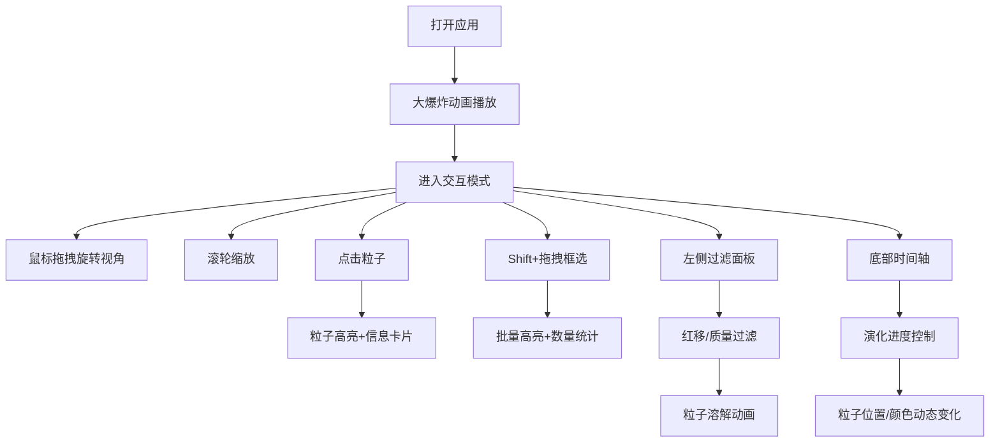

## 1. 产品概述

粒子宇宙演化可视化应用，通过3D实时渲染技术让普通用户直观理解宇宙大尺度结构和星系分布规律。解决现有天文可视化工具过于专业或缺乏沉浸感的问题，提供沉浸式的宇宙探索体验。

- **核心价值**：以直观的粒子可视化方式展示宇宙从大爆炸到星系形成的演化过程
- **目标用户**：天文爱好者、学生、科普教育工作者
- **市场价值**：降低宇宙学知识的理解门槛，使复杂的天文概念变得可视化和可交互

## 2. 核心功能

### 2.1 用户角色

| 角色 | 注册方式 | 核心权限 |
|------|----------|----------|
| 访客用户 | 无需注册 | 浏览宇宙演化、交互探索粒子、使用过滤和时间轴功能 |

### 2.2 功能模块

1. **粒子宇宙生成模块**：大爆炸动画、粒子飞散、轨迹尾迹、星簇形成
2. **3D交互渲染模块**：视角旋转、缩放、粒子朝向相机、点击/框选交互
3. **信息查询模块**：粒子高亮、信息卡片、统计面板
4. **过滤控制模块**：红移过滤、质量过滤、时间轴控制
5. **UI界面模块**：毛玻璃面板、响应式布局、动画反馈

### 2.3 页面详情

| 页面名称 | 模块名称 | 功能描述 |
|-----------|-------------|---------------------|
| 主页面 | 大爆炸动画 | 中央奇点爆发，粒子飞散形成3D宇宙星簇，持续约5秒 |
| 主页面 | 3D场景渲染 | 全屏3D宇宙场景，5000+粒子实时渲染，深空背景+静态星光 |
| 主页面 | 左侧控制面板 | 红移值过滤滑块、质量过滤滑块，支持面板展开/收起 |
| 主页面 | 底部时间轴 | 宇宙演化进度滑块(0%-100%)，控制粒子位置和颜色变化 |
| 主页面 | 信息卡片 | 右下角弹出，显示选中粒子的ID、红移值、距离、星簇名称 |
| 主页面 | 统计面板 | 框选时显示选中粒子数量统计 |

## 3. 核心流程

用户打开应用后，首先观看大爆炸动画，奇点爆发形成粒子宇宙。动画结束后进入交互模式，用户可通过鼠标拖拽旋转视角、滚轮缩放。点击单个粒子查看详细信息，或按住Shift拖拽进行框选。使用左侧过滤面板筛选粒子，通过底部时间轴观察宇宙不同阶段的演化状态。

## 4. 用户界面设计

### 4.1 设计风格

- **主色调**：深空黑色(#0a0a12)作为背景，深蓝(#1a1a2e)作为面板背景
- **强调色**：红移粒子使用红橙色系(#ff6b35, #ff9f1c)，蓝移粒子使用蓝紫色系(#4cc9f0, #7209b7)
- **面板样式**：毛玻璃效果(backdrop-filter: blur(12px))，半透明背景(rgba(26, 26, 46, 0.7))，细边框(1px solid rgba(255, 255, 255, 0.1))，微弱发光(box-shadow: 0 0 20px rgba(76, 201, 240, 0.15))
- **字体**：Google Fonts - Space Mono 等宽字体
- **图标风格**：线性极简风格，使用lucide-react图标库
- **动效**：所有交互带300ms弹性动画，hover时轻微缩放(scale: 1.02)和亮度提升

### 4.2 页面设计概述

| 页面名称 | 模块名称 | UI元素 |
|-----------|-------------|-------------|
| 主页面 | 3D场景 | 全屏中央区域，深空黑背景，随机稀疏星光点，5000+彩色粒子 |
| 主页面 | 左侧控制面板 | 悬浮于左侧，毛玻璃效果，可展开/收起(窄屏自动收起为图标)，包含两个过滤滑块组 |
| 主页面 | 底部时间轴 | 悬浮于底部中央，毛玻璃效果，横向滑块，显示当前演化百分比 |
| 主页面 | 信息卡片 | 右下角弹出，毛玻璃效果，显示粒子ID、红移值、估计距离、所属星簇 |
| 主页面 | 选择框 | 半透明蓝色边框矩形，内部填充淡蓝色 |

### 4.3 响应式设计

- **桌面端(1920x1080)**：左侧面板完全展开，所有控件完整显示
- **平板端(1024x768)**：左侧面板默认展开，可手动收起
- **移动端横屏**：左侧面板自动收起为图标按钮，点击展开
- **触摸优化**：支持双指捏合缩放，单指滑动旋转视角

### 4.4 3D场景指导

- **环境**：纯深空黑色背景，添加200-300个随机静态星光点作为背景装饰，使用柔和的雾效(fog)增强空间感
- **光照**：环境光(AmbientLight)强度0.4，点光源(PointLight)位于场景中心，强度1.0，颜色偏冷白色
- **相机**：PerspectiveCamera，fov=60，初始距离200，启用OrbitControls，禁用平移，启用阻尼效果
- **粒子系统**：使用THREE.Points渲染，自定义ShaderMaterial，粒子大小根据质量(0.5-2.0)，颜色根据红移值插值，添加AdditiveBlending混合模式
- **轨迹尾迹**：使用LineSegments渲染，每条轨迹10个顶点，颜色透明度渐变，通过update函数逐渐衰减
- **交互**：使用Raycaster进行粒子拾取，检测距离阈值0.5，选中粒子添加光环效果
- **后处理**：轻微Bloom效果增强发光感，FXAA抗锯齿
- **性能优化**：使用BufferGeometry存储所有粒子数据，GPU instancing，帧率目标60FPS

## 5. 非功能需求

- **性能**：稳定60FPS渲染至少5000个粒子，框选交互响应时间≤100ms
- **兼容性**：支持Chrome 90+、Firefox 88+、Safari 14+
- **无障碍**：所有控件可键盘操作，支持屏幕阅读器
