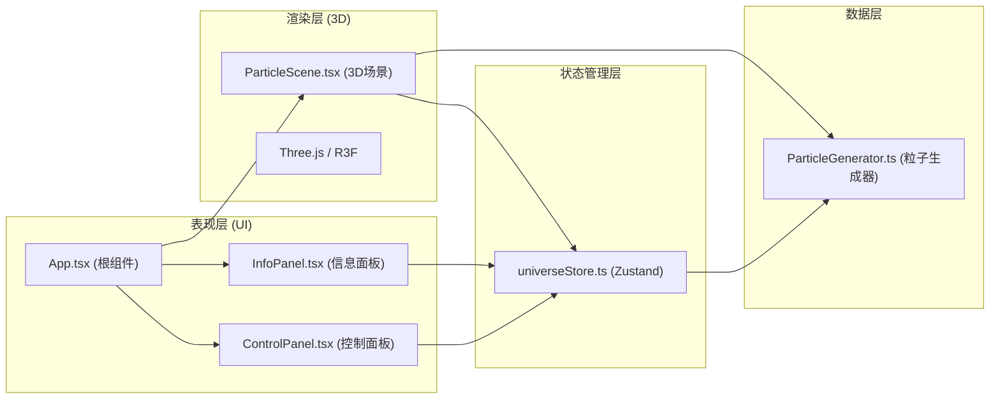

## 1. 架构设计



## 2. 技术栈描述

- **前端框架**：React 18 + TypeScript 5
- **构建工具**：Vite 5
- **3D渲染**：Three.js 0.160 + @react-three/fiber 8.15 + @react-three/drei 9.92
- **状态管理**：Zustand 4.4
- **UI样式**：Tailwind CSS 3.4
- **图标库**：lucide-react 0.294
- **工具库**：uuid 9.0

## 3. 核心数据结构

### 3.1 粒子数据结构

```typescript
interface Particle {
  id: string;
  position: { x: number; y: number; z: number };
  initialPosition: { x: number; y: number; z: number };
  velocity: { x: number; y: number; z: number };
  redshift: number; // -1.0 (蓝移) 到 1.0 (红移)
  mass: number; // 0.5 到 2.0
  size: number;
  color: { r: number; g: number; b: number };
  clusterName: string;
  distance: number;
  trajectory: Array<{ x: number; y: number; z: number }>;
  visible: boolean;
  opacity: number;
}

interface UniverseState {
  particles: Particle[];
  timeProgress: number; // 0.0 到 1.0
  animationPhase: 'idle' | 'explosion' | 'expanding' | 'stable';
  animationTime: number;
  filters: {
    redshiftMin: number;
    redshiftMax: number;
    massMin: number;
    massMax: number;
  };
  selectedParticleIds: string[];
  isBoxSelecting: boolean;
  boxSelection: {
    start: { x: number; y: number } | null;
    end: { x: number; y: number } | null;
  };
  panelExpanded: boolean;
}
```

## 4. 核心模块定义

### 4.1 ParticleGenerator.ts

```typescript
export function createUniverse(count: number): Particle[];
export function evolveUniverse(
  particles: Particle[],
  timeProgress: number,
  deltaTime: number
): Particle[];
```

**职责**：
- 生成指定数量的粒子，分配唯一ID、初始位置、速度、红移值、质量
- 根据时间进度计算粒子在宇宙演化不同阶段的位置和颜色
- 管理粒子轨迹尾迹数据

### 4.2 universeStore.ts

```typescript
const useUniverseStore = create<UniverseState & {
  setParticles: (particles: Particle[]) => void;
  updateParticle: (id: string, updates: Partial<Particle>) => void;
  setTimeProgress: (progress: number) => void;
  setAnimationPhase: (phase: UniverseState['animationPhase']) => void;
  setFilters: (filters: Partial<UniverseState['filters']>) => void;
  selectParticle: (id: string | null) => void;
  selectParticlesInBox: (ids: string[]) => void;
  clearSelection: () => void;
  setBoxSelection: (box: UniverseState['boxSelection']) => void;
  togglePanel: () => void;
  applyFilters: () => void;
}>((set, get) => ({ ... }));
```

**职责**：
- 管理全局宇宙状态
- 提供状态更新和查询方法
- 处理过滤逻辑

### 4.3 ParticleScene.tsx

**职责**：
- 创建Three.js场景、相机、光照
- 渲染粒子系统(Points)和轨迹尾迹
- 处理鼠标交互：点击选择、Shift+框选
- 实现大爆炸动画效果
- 暴露sceneRef给外部

### 4.4 ControlPanel.tsx

**职责**：
- 渲染红移过滤双滑块
- 渲染质量过滤双滑块
- 渲染时间轴滑块
- 调用store更新过滤状态和时间进度
- 面板展开/收起动画

### 4.5 InfoPanel.tsx

**职责**：
- 显示单个选中粒子的详细信息卡片
- 显示框选时的粒子数量统计
- 动画进入/退出效果

## 5. 目录结构

```
src/
├── modules/
│   ├── data/
│   │   └── ParticleGenerator.ts    # 粒子数据生成模块
│   ├── render/
│   │   └── ParticleScene.tsx       # 3D渲染模块
│   └── ui/
│       ├── ControlPanel.tsx        # 过滤控制面板
│       └── InfoPanel.tsx           # 信息展示面板
├── store/
│   └── universeStore.ts            # Zustand状态管理
├── App.tsx                         # 根组件
├── main.tsx                        # 应用入口
└── index.css                       # 全局样式
```

## 6. 关键技术实现

### 6.1 粒子渲染优化

- 使用 `THREE.BufferGeometry` 存储所有粒子的位置、颜色、大小数据
- 自定义 `ShaderMaterial` 实现GPU端的粒子大小衰减和颜色计算
- 使用 `AdditiveBlending` 实现发光效果
- 帧更新时只更新必要的Buffer属性，避免全量数据拷贝

### 6.2 大爆炸动画

- 0.0s - 0.5s：奇点放大并增强亮度
- 0.5s - 2.0s：粒子从中心爆发飞散，指数级加速
- 2.0s - 5.0s：粒子减速扩散，轨迹尾迹逐渐消失
- 5.0s+：动画结束，进入稳定交互模式

### 6.3 框选实现

- 监听Shift+鼠标拖拽事件
- 使用NDC坐标转换将屏幕矩形映射到3D空间
- 对所有粒子进行视锥体剔除检测
- 使用空间划分算法优化5000+粒子的框选性能

### 6.4 时间轴演化

- 粒子位置：根据时间进度在初始位置和最终位置之间插值(非线性，模拟宇宙膨胀加速)
- 粒子颜色：早期偏蓝紫色(蓝移)，晚期偏红橙色(红移)
- 粒子密度：早期密集，晚期稀疏

## 7. 性能指标

| 指标 | 目标值 |
|------|--------|
| 粒子数量 | ≥ 5000 |
| 帧率 | 60 FPS |
| 框选响应时间 | ≤ 100ms |
| 内存占用 | ≤ 200MB |
| 首屏加载时间 | ≤ 3s |
