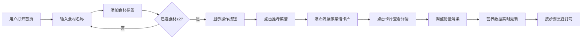

## 1. 产品概述

"配方灵感工坊"是一款面向家庭烹饪爱好者的智能菜谱推荐工具，基于冰箱剩余食材快速生成菜谱建议，解决"翻遍冰箱不知道做什么"和"网上菜谱份量总是不合适"的痛点。

- 核心价值：通过智能食材匹配和动态份量调整，让家庭烹饪更高效、更贴心
- 目标用户：25-45岁的家庭主妇/主夫、租房独居的年轻白领、烹饪初学者
- 市场定位：轻量级、高颜值、实用性强的厨房辅助Web工具

## 2. 核心功能

### 2.1 用户角色

| 角色 | 注册方式 | 核心权限 |
|------|----------|----------|
| 普通用户 | 无需注册，直接使用 | 食材输入、菜谱推荐、份量调整、营养计算 |

### 2.2 功能模块

1. **首页搜索区**：渐变色搜索栏、食材输入框、毛玻璃标签管理
2. **动态操作区**：推荐菜谱、随机搭配、清空所有三个波纹按钮
3. **菜谱展示区**：瀑布流卡片布局、动画入场效果
4. **菜谱详情页**：全屏展开视图、份量滑条、实时营养面板、分步烹饪指引

### 2.3 页面详情

| 页面名称 | 模块名称 | 功能描述 |
|----------|----------|----------|
| 首页 | 搜索栏 | 深绿到橙黄渐变背景，中央大号白色输入框，支持食材输入和回车添加 |
| 首页 | 食材标签区 | 毛玻璃效果标签展示已选食材，标签带删除按钮，点击有缩小淡出动画 |
| 首页 | 操作按钮区 | 选择≥2种食材后显示，三个动态波纹按钮，点击触发对应操作 |
| 首页 | 菜谱卡片区 | 瀑布流网格布局，卡片从底部滑入带轻微旋转，显示烹饪时间环、匹配度进度条 |
| 详情页 | 成份列表 | 左侧展示所需食材，每条带可拖拽份量滑条 |
| 详情页 | 营养面板 | 右侧展示卡路里、蛋白质、脂肪、碳水，数字变化带翻转动画 |
| 详情页 | 烹饪步骤 | 分步说明，每步可打勾完成，完成后文字变灰带删除线效果 |

## 3. 核心流程

用户输入食材 → 添加为毛玻璃标签 → 选择足够食材后出现操作按钮 → 点击推荐 → 浏览菜谱卡片 → 点击展开详情 → 调整份量查看营养 → 分步烹饪打勾完成

## 4. 用户界面设计

### 4.1 设计风格

- **主色调**：奶油白背景 (#FFF8F0)，深橄榄绿 (#2D4A3E) 作为主强调色，琥珀橙 (#E8A838) 作为辅助强调色
- **渐变色**：搜索栏使用深橄榄绿 #2D4A3E → 琥珀橙 #E8A838 的线性渐变
- **按钮风格**：大圆角 (16px)，微妙阴影 (box-shadow: 0 4px 20px rgba(0,0,0,0.08))，悬停时轻微上浮 (translateY(-2px))
- **字体**：Noto Sans SC，标题 20px/600，正文 14px/400，小字 12px/400
- **布局风格**：卡片式设计，圆角柔和，层次分明，毛玻璃效果 (backdrop-filter: blur(12px))
- **图标**：Font Awesome 图标，线条风格，与整体圆润风格统一

### 4.2 页面设计概述

| 页面名称 | 模块名称 | UI 元素 |
|----------|----------|----------|
| 首页 | 搜索栏 | 渐变背景 (linear-gradient(135deg, #2D4A3E 0%, #E8A838 100%))，圆角输入框，提示文字"输入你冰箱里的食材..." |
| 首页 | 食材标签 | 背景 rgba(255,255,255,0.7)，毛玻璃模糊，圆角 20px，删除按钮 hover 缩放 1.1 |
| 首页 | 操作按钮 | 波纹动画效果 (pulse)，渐变色按钮，点击有缩放反馈 |
| 首页 | 菜谱卡片 | 宽度 280px，圆角 20px，阴影层级 3 层，入场动画 stagger 0.1s |
| 详情页 | 成份滑条 | 自定义 range 样式，进度条渐变，拖拽手柄圆形放大 |
| 详情页 | 营养面板 | 数字字体加粗，翻转动画 (flip)，颜色随数值变化 |
| 详情页 | 烹饪步骤 | 序号圆形标签，打勾后文字灰度 0.5，删除线从左滑入 |

### 4.3 响应式设计

- **桌面端** (≥1024px)：卡片网格 3-4 列，详情页左右分栏布局
- **平板端** (768-1023px)：卡片网格 2 列，详情页左右分栏
- **移动端** (<768px)：卡片单列布局，详情页上下堆叠，触摸区域 ≥48px，按钮放大至 100% 宽度

### 4.4 动画与交互

- **标签删除**：scale 1→0 + opacity 1→0，duration 300ms，ease-out
- **卡片入场**：translateY(40px)→0 + rotate(2deg)→0 + opacity 0→1，stagger 100ms
- **波纹按钮**：::after 伪元素 scale 0→3，opacity 0.5→0，循环动画
- **数字翻转**：3D 翻转效果，backface-visibility hidden
- **步骤完成**：删除线 width 0→100%，transition 400ms ease-in-out
