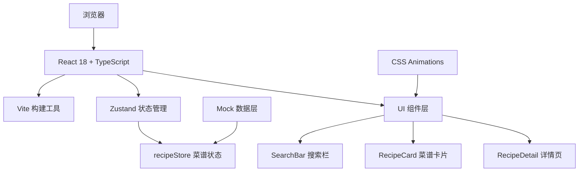

## 1. 架构设计



## 2. 技术描述

- **前端框架**：React 18 + TypeScript 5
- **构建工具**：Vite 5
- **状态管理**：Zustand 4
- **样式方案**：纯 CSS3 + CSS Variables，无 Tailwind，手动实现所有动画效果
- **工具库**：
  - uuid：生成唯一 ID
  - date-fns：时间格式化（如有需要）
- **第三方资源**：
  - Google Fonts: Noto Sans SC
  - Font Awesome: 图标库
- **图片资源**：使用 Trae 图片 API 生成高质量菜谱图片

## 3. 目录结构

```
d:\P\tasks\auto108/
├── index.html              # 入口 HTML
├── package.json            # 项目依赖
├── tsconfig.json           # TypeScript 配置
├── vite.config.js          # Vite 配置
├── src/
│   ├── App.tsx             # 主应用组件
│   ├── main.tsx            # 应用入口
│   ├── index.css           # 全局样式与 CSS 变量
│   ├── components/
│   │   ├── SearchBar.tsx   # 搜索栏组件
│   │   ├── RecipeCard.tsx  # 菜谱卡片组件
│   │   └── RecipeDetail.tsx# 菜谱详情组件
│   ├── store/
│   │   └── recipeStore.ts  # Zustand 状态管理
│   ├── data/
│   │   └── mockRecipes.ts  # Mock 菜谱数据
│   └── types/
│       └── index.ts        # TypeScript 类型定义
```

## 4. 数据模型

### 4.1 TypeScript 类型定义

```typescript
interface Ingredient {
  id: string;
  name: string;
  amount: number;       // 基础份量（克/个）
  unit: string;         // 单位：g, 个, 勺
  calories: number;     // 每单位卡路里
  protein: number;      // 每单位蛋白质(g)
  fat: number;          // 每单位脂肪(g)
  carbs: number;        // 每单位碳水(g)
}

interface RecipeStep {
  id: string;
  order: number;
  description: string;
  completed: boolean;
}

interface Recipe {
  id: string;
  name: string;
  description: string;
  imageUrl: string;
  cookTime: number;     // 分钟
  difficulty: 'easy' | 'medium' | 'hard';
  ingredients: Ingredient[];
  steps: RecipeStep[];
  baseServings: number; // 基础份数
  matchScore: number;   // 匹配度 0-100
}

interface RecipeStore {
  selectedIngredients: string[];
  recipes: Recipe[];
  activeRecipe: Recipe | null;
  showDetail: boolean;
  currentServings: number;
  completedSteps: string[];
  addIngredient: (name: string) => void;
  removeIngredient: (name: string) => void;
  clearIngredients: () => void;
  recommendRecipes: () => void;
  randomRecipes: () => void;
  setActiveRecipe: (recipe: Recipe | null) => void;
  setCurrentServings: (servings: number) => void;
  toggleStep: (stepId: string) => void;
}
```

## 5. 性能优化方案

### 5.1 搜索响应优化

- **目标**：搜索和推荐逻辑 ≤ 500ms
- **实现**：
  - 所有菜谱数据本地预加载，无需网络请求
  - 使用 `useMemo` 缓存匹配计算结果
  - 匹配算法采用简单的数组过滤 + 排序，时间复杂度 O(n log n)
  - 防抖处理食材输入，避免频繁计算

### 5.2 动画性能优化

- **目标**：滚动和动画保持 60fps
- **实现**：
  - 所有动画使用 `transform` 和 `opacity` 属性，触发 GPU 加速
  - 使用 `will-change` 提示浏览器优化
  - 长列表使用 CSS `contain: layout paint`
  - 卡片入场使用 `IntersectionObserver` 实现懒加载动画
  - 避免在动画期间触发 `layout` 和 `paint`

## 6. 核心组件规范

### 6.1 SearchBar 组件

- 职责：食材输入、标签展示、操作按钮
- 状态：本地输入框状态，食材列表从 store 获取
- 动画：标签删除动画、按钮渐入动画、波纹效果

### 6.2 RecipeCard 组件

- 职责：单张菜谱卡片渲染、入场动画、点击交互
- 状态：从 props 获取菜谱数据
- 动画：卡片入场滑入旋转、图片模糊到清晰、进度环动画

### 6.3 RecipeDetail 组件

- 职责：全屏详情、份量滑条、营养面板、步骤管理
- 状态：当前份数从 store 获取，步骤完成状态本地管理
- 动画：展开/收起动画、数字翻转动画、步骤完成删除线动画

## 7. 状态管理设计

### 7.1 recipeStore

```typescript
import { create } from 'zustand';

export const useRecipeStore = create<RecipeStore>((set, get) => ({
  selectedIngredients: [],
  recipes: mockRecipes,
  activeRecipe: null,
  showDetail: false,
  currentServings: 2,
  completedSteps: [],
  
  addIngredient: (name) => {
    const trimmed = name.trim();
    if (trimmed && !get().selectedIngredients.includes(trimmed)) {
      set(state => ({
        selectedIngredients: [...state.selectedIngredients, trimmed]
      }));
    }
  },
  
  removeIngredient: (name) => {
    set(state => ({
      selectedIngredients: state.selectedIngredients.filter(i => i !== name)
    }));
  },
  
  clearIngredients: () => set({ selectedIngredients: [] }),
  
  recommendRecipes: () => {
    const { selectedIngredients, recipes } = get();
    const scored = recipes.map(recipe => {
      const matchCount = recipe.ingredients.filter(ing =>
        selectedIngredients.some(selected =>
          ing.name.includes(selected) || selected.includes(ing.name)
        )
      ).length;
      const score = Math.round((matchCount / recipe.ingredients.length) * 100);
      return { ...recipe, matchScore: score };
    }).sort((a, b) => b.matchScore - a.matchScore);
    set({ recipes: scored });
  },
  
  randomRecipes: () => {
    const shuffled = [...get().recipes].sort(() => Math.random() - 0.5);
    set({ recipes: shuffled });
  },
  
  setActiveRecipe: (recipe) => {
    set({
      activeRecipe: recipe,
      showDetail: !!recipe,
      currentServings: recipe?.baseServings || 2,
      completedSteps: []
    });
  },
  
  setCurrentServings: (servings) => set({ currentServings: servings }),
  
  toggleStep: (stepId) => {
    set(state => ({
      completedSteps: state.completedSteps.includes(stepId)
        ? state.completedSteps.filter(id => id !== stepId)
        : [...state.completedSteps, stepId]
    }));
  }
}));
```
