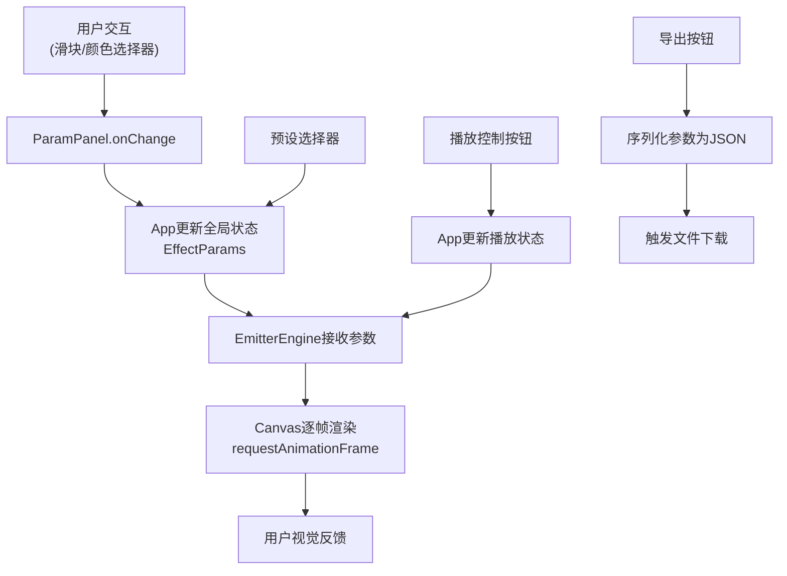

## 1. 产品概述

2D连击特效编辑器是一款面向独立游戏开发者的实时粒子特效创作工具，解决游戏开发中刀光、爆炸、魔法阵等特效制作周期长、参数调试效率低的痛点。用户通过可视化参数面板实时调整粒子属性，即时在Canvas预览区查看动画效果，最终导出可复用的JSON配置文件。

### 目标用户
- 独立游戏开发者
- 2D游戏美术设计师
- 需要快速原型验证的游戏团队

### 产品价值
- 将特效制作周期从数小时缩短至数分钟
- 消除"修改-编译-运行"的反复调试循环
- 提供可复用的特效配置，便于团队协作和资源积累

---

## 2. 核心功能

### 2.1 功能模块

1. **参数调节面板**：粒子数量、生命周期、速度、颜色渐变、缩放曲线、发射角度、随机扰动等参数的实时调整
2. **Canvas实时预览**：60FPS流畅动画渲染，支持拖尾效果、脉冲发射原点、粒子生命周期完整呈现
3. **播放控制系统**：播放/暂停、重置、循环发射
4. **预设特效管理**：内置斩击刀光、火焰爆炸、神圣法阵三种预设，支持一键切换
5. **JSON导出功能**：一键序列化当前参数并下载配置文件

### 2.2 页面详情

| 页面名称 | 模块名称 | 功能描述 |
|---------|---------|---------|
| 主编辑页面 | 参数调节面板 | 滑块、颜色选择器、下拉菜单、贝塞尔曲线编辑器组成的参数控制区 |
| 主编辑页面 | Canvas预览区 | 实时渲染粒子特效，中央脉冲发射原点，深灰色背景 |
| 主编辑页面 | 播放控制栏 | 播放/暂停按钮、重置按钮、导出JSON按钮 |
| 主编辑页面 | 预设选择器 | 下拉菜单切换内置预设特效 |

---

## 3. 核心流程

### 3.1 用户操作流程

用户打开应用后，默认显示斩击刀光预设特效，粒子从中央发射点持续循环发射。用户可以：
1. 通过左侧面板调节各项参数，Canvas实时更新效果
2. 从预设下拉菜单切换不同特效类型
3. 点击播放/暂停冻结当前动画帧
4. 点击重置清除所有粒子重新开始
5. 调整满意后点击导出按钮下载JSON配置文件

### 3.2 数据流向图

---

## 4. 用户界面设计

### 4.1 设计风格

**极简暗色调科技风**

- **主背景色**：#1a1a2e（深空蓝紫）
- **面板背景**：毛玻璃效果（backdrop-filter: blur(10px)，rgba(255,255,255,0.05)半透明白色遮罩）
- **Canvas背景**：#2d2d44（深灰紫）
- **主色调**：紫色渐变 #7c3aed → #a855f7
- **强调色**：绿色渐变 #10b981 → #34d399（导出按钮）
- **滑块轨道**：紫蓝渐变 #6c63ff → #48c6ef
- **滑块手柄**：白色圆形带微弱光晕
- **面板分隔线**：rgba(255,255,255,0.1) 浅灰色细边框

**字体选择**：
- 显示字体：Space Grotesk（现代几何感，适合科技类工具）
- 正文字体：IBM Plex Mono（等宽字体，增强工具感和精准度）

**按钮样式**：
- 圆角矩形，8px圆角
- 紫色渐变背景，白色文字
- hover时亮度提升15%，轻微上浮2px，box-shadow增强
- 导出按钮采用绿色渐变区分

### 4.2 页面设计概览

| 页面名称 | 模块名称 | UI元素 |
|---------|---------|---------|
| 主编辑页面 | 顶部标题栏 | 应用logo、标题"连击特效编辑器"、版本号 |
| 主编辑页面 | 左侧参数面板 | 宽度350px，毛玻璃背景，参数块用浅灰边框分隔，各参数组配图标和标题 |
| 主编辑页面 | Canvas预览区 | 占剩余空间，中央脉冲圆环动画（5px→20px循环），深灰背景 |
| 主编辑页面 | 底部控制栏 | 左对齐：预设选择下拉框；右对齐：播放/暂停、重置、导出按钮 |
| 主编辑页面 | 响应式抽屉 | 窗口<900px时，参数面板变为顶部可折叠抽屉，Canvas填满剩余高度 |

### 4.3 响应式设计

**桌面优先，移动端适配**

- **≥900px**：左右分栏布局，左侧参数面板350px固定宽度，右侧Canvas自适应
- **<900px**：参数面板收起到顶部抽屉式菜单，点击展开/折叠按钮显示参数面板，Canvas区域填满剩余高度
- **触控优化**：滑块和按钮增加触控热区（最小44x44px），颜色选择器适配移动端交互

### 4.4 动画与微交互

- **页面加载**：参数面板从左侧滑入，Canvas渐显，控制按钮错落延迟出现
- **滑块交互**：拖动时手柄光晕增强，数值实时跳动显示
- **按钮hover**：背景亮度提升，轻微上浮，阴影扩散
- **预设切换**：Canvas粒子快速消散后新特效渐入，过渡平滑
- **脉冲原点**：中央发射点圆环半径5px→20px循环动画，透明度同步变化
- **粒子拖尾**：每个粒子保留5个历史位置，渐隐圆点链形成拖尾效果
