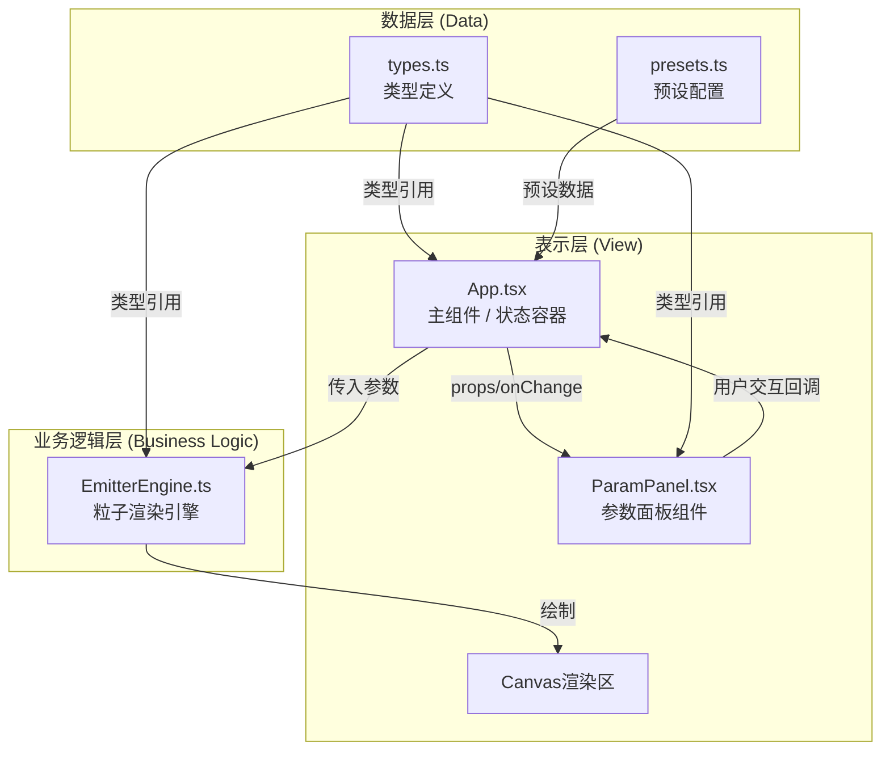

## 1. 架构设计



### 模块调用关系说明

1. **types.ts**：最底层，定义所有数据结构接口，被其他所有模块引用
2. **presets.ts**：依赖types.ts，存储内置特效预设配置数据
3. **EmitterEngine.ts**：独立渲染引擎，依赖types.ts，不依赖React，专注于Canvas粒子渲染逻辑
4. **ParamPanel.tsx**：纯UI组件，依赖types.ts，接收props和onChange回调，无内部状态
5. **App.tsx**：顶层组件，整合所有模块，维护全局状态，协调数据流向

### 数据流方向

```
用户交互 → ParamPanel.onChange → App.setState → EmitterEngine.updateParams → Canvas渲染
预设选择 → presets数据 → App.setState → EmitterEngine.updateParams → Canvas渲染
导出功能 → App.state → JSON序列化 → 文件下载
```

---

## 2. 技术栈描述

### 前端核心技术
- **框架**：React@18 + TypeScript@5（严格模式）
- **构建工具**：Vite@5
- **UI库**：纯CSS实现，不引入第三方UI框架，保证轻量和定制化
- **动画库**：原生Canvas API + requestAnimationFrame，不引入额外动画库
- **额外依赖**：uuid@9（生成粒子唯一ID）

### 开发规范
- 严格TypeScript模式（strict: true）
- 所有函数参数和返回值必须显式声明类型
- 使用readonly修饰不可变数据
- 避免any类型，使用unknown代替并做类型守卫

### 性能优化策略
- Canvas离屏渲染优化（如果需要）
- 粒子对象池复用，避免频繁GC
- requestAnimationFrame帧率控制，稳定60FPS
- 参数更新防抖处理（滑块拖动时）
- 粒子数量上限500，确保中等设备流畅运行

---

## 3. 目录结构与文件职责

```
src/
├── types.ts              # 类型定义（EffectParams, Particle, ColorStop, CurvePoint等）
├── presets.ts            # 内置预设特效配置
├── EmitterEngine.ts      # 粒子渲染引擎类（独立于React）
├── ParamPanel.tsx        # 参数面板纯UI组件
├── App.tsx               # 主应用组件（状态管理、布局、模块协调）
├── main.tsx              # React入口文件
├── index.css             # 全局样式
└── vite-env.d.ts         # Vite类型声明
```

### 文件间调用关系

| 文件 | 依赖 | 被依赖 | 核心职责 |
|-----|-----|-------|---------|
| types.ts | 无 | App.tsx, ParamPanel.tsx, EmitterEngine.ts, presets.ts | 定义所有数据接口 |
| presets.ts | types.ts | App.tsx | 存储预设特效参数 |
| EmitterEngine.ts | types.ts | App.tsx | Canvas粒子渲染、生命周期管理 |
| ParamPanel.tsx | types.ts | App.tsx | 参数调节UI渲染、用户交互回调 |
| App.tsx | types.ts, presets.ts, EmitterEngine.ts, ParamPanel.tsx | main.tsx | 全局状态、布局、事件处理 |

---

## 4. 核心数据模型

### 4.1 特效参数接口 (EffectParams)

```typescript
export interface ColorStop {
  readonly color: string;      // hex颜色值
  readonly position: number;   // 0-1 百分比位置
  readonly id: string;         // 唯一标识，用于拖拽排序
}

export interface CurvePoint {
  readonly x: number;          // 时间点 0-1
  readonly y: number;          // 缩放值 0-2
  readonly id: string;
}

export interface EffectParams {
  // 基础参数
  readonly particleCount: number;           // 粒子总数 1-500
  readonly lifetimeMin: number;             // 最小存活时间 0.5-5s
  readonly lifetimeMax: number;             // 最大存活时间 0.5-5s
  
  // 速度参数
  readonly velocityXMin: number;            // X方向最小速度 -300~300
  readonly velocityXMax: number;            // X方向最大速度 -300~300
  readonly velocityYMin: number;            // Y方向最小速度 -300~300
  readonly velocityYMax: number;            // Y方向最大速度 -300~300
  
  // 发射角度
  readonly emissionAngleStart: number;      // 扇形起始角度 0-360
  readonly emissionAngleEnd: number;        // 扇形结束角度 0-360
  
  // 颜色渐变
  readonly colorGradient: readonly ColorStop[];  // 至少3个关键帧
  
  // 缩放曲线
  readonly scaleCurve: readonly CurvePoint[];    // 贝塞尔曲线控制点
  readonly scaleCurvePreset: 'linear' | 'easeOut' | 'sine' | 'custom';
  
  // 旋转
  readonly rotationSpeed: number;          // 旋转角速度 -360~360 度/秒
  
  // 随机扰动
  readonly randomOffset: number;           // 随机扰动偏移 0-50px
  
  // 发射原点偏移
  readonly originOffsetX: number;
  readonly originOffsetY: number;
}
```

### 4.2 粒子运行时状态 (Particle)

```typescript
interface Particle {
  readonly id: string;
  x: number;
  y: number;
  vx: number;
  vy: number;
  lifetime: number;        // 总生命周期
  currentAge: number;      // 当前存活时间
  rotation: number;        // 当前旋转角度
  rotationSpeed: number;   // 旋转角速度
  size: number;            // 基础大小
  colorStops: readonly ColorStop[];
  history: { x: number; y: number; age: number }[];  // 拖尾历史位置
}
```

### 4.3 应用状态接口

```typescript
interface AppState {
  readonly params: EffectParams;
  readonly isPlaying: boolean;
  readonly currentPreset: string;
}
```

---

## 5. 核心模块设计

### 5.1 EmitterEngine 粒子引擎

**核心方法**：
- `constructor(canvas: HTMLCanvasElement)` - 绑定Canvas元素
- `setParams(params: EffectParams)` - 更新特效参数
- `start()` - 开始动画循环
- `stop()` - 停止动画循环
- `reset()` - 清除所有粒子
- `destroy()` - 销毁引擎，清理资源

**渲染流程**（每帧执行）：
1. 计算时间差 deltaTime
2. 发射新粒子（根据particleCount和lifetime计算发射频率）
3. 遍历更新所有粒子：位置、年龄、旋转、历史位置
4. 移除生命周期结束的粒子
5. 绘制拖尾效果
6. 绘制当前帧粒子（颜色插值、缩放曲线计算）
7. 绘制中央脉冲发射原点

### 5.2 ParamPanel 参数面板

**参数分组**：
1. 基础设置（粒子数量、存活时间）
2. 速度设置（X/Y速度范围）
3. 发射设置（扇形角度范围、原点偏移）
4. 颜色设置（颜色渐变关键帧编辑器）
5. 形态设置（缩放曲线预设、贝塞尔编辑器、旋转速度）
6. 扰动设置（随机偏移强度）

**交互组件**：
- 范围滑块（带数值显示）
- 颜色选择器（hex + 位置百分比）
- 下拉选择器（预设、曲线类型）
- 可排序列表（颜色关键帧拖拽排序）
- 贝塞尔曲线编辑器（可视化拖拽控制点）

### 5.3 预设特效配置

| 预设名称 | 核心参数特点 | 视觉效果 |
|---------|-------------|---------|
| 斩击刀光 | 粒子数量150，存活时间0.8s，X速度200-300，扇形角度30-60度，颜色渐变白→淡蓝→透明，缩放曲线先快后慢 | 快速划过的弧形刀光，拖尾明显 |
| 火焰爆炸 | 粒子数量300，存活时间1.5s，速度全方向随机，扇形角度0-360度，颜色渐变黄→橙→红→黑，缩放曲线正弦波动 | 圆形向外爆炸的火焰效果 |
| 神圣法阵 | 粒子数量200，存活时间3s，速度缓慢向外，旋转角速度180度/秒，颜色渐变金→白→金，缩放曲线匀速增大 | 旋转发光的魔法阵效果 |

---

## 6. 性能保障方案

### 6.1 渲染性能
- **粒子对象池**：预分配Particle对象数组，避免频繁创建和销毁
- **requestAnimationFrame**：使用原生API同步显示器刷新率
- **时间差计算**：基于deltaTime的帧间更新，保证不同设备动画速度一致
- **Canvas状态管理**：尽量减少save()/restore()调用，批量绘制同类型粒子

### 6.2 交互响应
- **滑块防抖**：使用lodash-es/debounce（或自定义）延迟50ms更新，避免过于频繁的重绘
- **参数增量更新**：只更新变化的参数，不重建整个引擎
- **离屏计算**：颜色插值、曲线采样等计算在内存中完成，不阻塞UI线程

### 6.3 内存管理
- **粒子上限**：严格限制最大500个粒子
- **历史位置限制**：每个粒子最多保留5个历史位置用于拖尾
- **引擎销毁**：组件卸载时调用engine.destroy()，清除定时器和事件监听

---

## 7. 构建与部署配置

### package.json 依赖
```json
{
  "dependencies": {
    "react": "^18.2.0",
    "react-dom": "^18.2.0",
    "uuid": "^9.0.0"
  },
  "devDependencies": {
    "@types/react": "^18.2.0",
    "@types/react-dom": "^18.2.0",
    "@types/uuid": "^9.0.0",
    "typescript": "^5.0.0",
    "vite": "^5.0.0"
  },
  "scripts": {
    "dev": "vite",
    "build": "tsc && vite build",
    "preview": "vite preview"
  }
}
```

### tsconfig.json 严格模式
```json
{
  "compilerOptions": {
    "strict": true,
    "noImplicitAny": true,
    "strictNullChecks": true,
    "strictFunctionTypes": true,
    "strictBindCallApply": true,
    "strictPropertyInitialization": true,
    "noImplicitThis": true,
    "useUnknownInCatchVariables": true,
    "alwaysStrict": true,
    "exactOptionalPropertyTypes": true,
    "noImplicitReturns": true,
    "noFallthroughCasesInSwitch": true,
    "noUncheckedIndexedAccess": true,
    "noImplicitOverride": true,
    "noPropertyAccessFromIndexSignature": true
  }
}
```

### vite.config.js
```javascript
import { defineConfig } from 'vite';
import react from '@vitejs/plugin-react';

export default defineConfig({
  plugins: [react()],
  server: {
    port: 3000,
    open: true
  }
});
```
