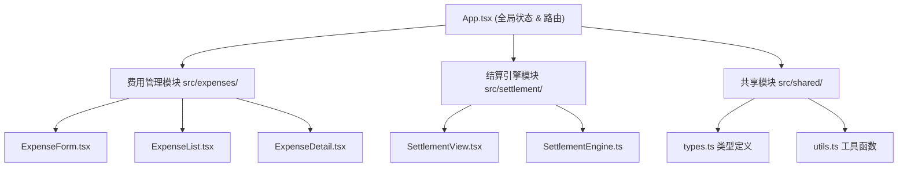
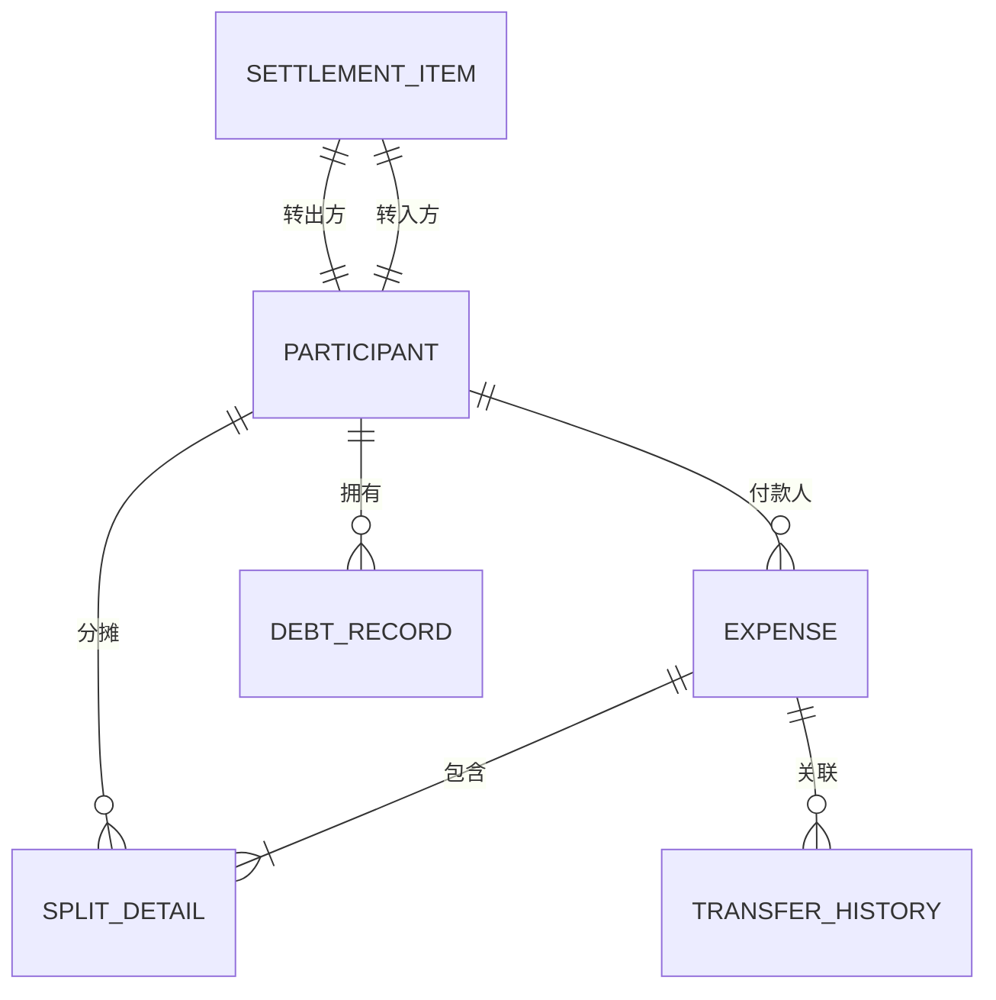

## 1. 架构设计



## 2. 技术描述
- **前端框架**：React@18 + TypeScript@5 + Vite@5
- **状态管理**：React useState/useReducer（轻量级场景，无需额外状态管理库）
- **样式方案**：CSS Modules + CSS Variables，不使用Tailwind
- **动画方案**：CSS Transitions + Keyframes + SVG SMIL
- **初始化工具**：vite-init（react-ts模板）
- **后端**：无，纯前端应用，数据存储于 localStorage
- **数据持久化**：localStorage + JSON序列化

## 3. 路由定义
| 路由 | 用途 |
|------|------|
| / | 首页 - 费用录入与列表 |
| /settlement | 结算页面 - 展示最优转账方案 |
| /history | 历史页面 - 已结算记录归档 |

## 4. 数据模型

### 4.1 类型定义（src/shared/types.ts）

```typescript
// 参与人
interface Participant {
  id: string;
  name: string;
  avatar: string; // emoji
  isCurrentUser?: boolean;
}

// 分摊方式
type SplitType = 'equal' | 'proportion' | 'designated';

// 分摊明细
interface SplitDetail {
  participantId: string;
  weight: number; // 权重或指定金额
  amount: number; // 应付金额
}

// 费用记录
interface Expense {
  id: string;
  description: string;
  amount: number;
  payerId: string;
  splitType: SplitType;
  splitDetails: SplitDetail[];
  createdAt: Date;
  isSettled: boolean;
}

// 结算项
interface SettlementItem {
  id: string;
  fromParticipantId: string;
  toParticipantId: string;
  amount: number;
  isIgnored: boolean;
  isAdjusted: boolean;
}

// 债务记录
interface DebtRecord {
  participantId: string;
  paid: number;      // 已付总额
  shouldPay: number; // 应付总额
  balance: number;   // 差额（正=应收，负=应付）
}

// 转账历史
interface TransferHistory {
  id: string;
  fromParticipantId: string;
  toParticipantId: string;
  amount: number;
  settledAt: Date;
  relatedExpenseIds: string[];
}
```

### 4.2 数据模型ER图



## 5. 核心算法

### 5.1 最小化转账次数算法（SettlementEngine.ts）

算法原理：
1. 计算每人的净债务（正数=应收，负数=应付）
2. 分离债权人（余额>0）和债务人（余额<0）
3. 每次取最大债权人和最大债务人进行匹配
4. 转账金额取两者绝对值的较小值
5. 清零已结算的一方，重复直到所有余额为0

时间复杂度：O(n log n)，空间复杂度：O(n)

### 5.2 分摊计算逻辑

- **均分**：金额 ÷ 参与人数
- **按比例**：金额 × (个人权重 ÷ 权重总和)
- **指定人**：直接使用指定金额，需校验总和等于总金额

## 6. 文件结构

```
src/
├── App.tsx              # 主应用组件，路由管理，全局状态
├── shared/
│   ├── types.ts         # TypeScript 接口定义
│   └── utils.ts         # 工具函数（金额格式化、ID生成等）
├── expenses/
│   ├── ExpenseForm.tsx  # 费用输入表单
│   ├── ExpenseList.tsx  # 费用列表展示
│   └── ExpenseDetail.tsx # 费用详情弹窗
└── settlement/
    ├── SettlementView.tsx  # 结算建议展示
    └── SettlementEngine.ts # 结算算法（纯函数）
```

## 7. 性能优化策略

1. **memo优化**：使用 React.memo 包装列表项组件，避免不必要重渲染
2. **防抖处理**：拖拽权重调整时使用 50ms 防抖
3. **CSS动画**：使用 transform 和 opacity 实现动画，避免 layout thrashing
4. **虚拟列表**：历史记录超过50条时使用虚拟滚动
5. **局部重算**：参与人变动时只重算未结算费用
