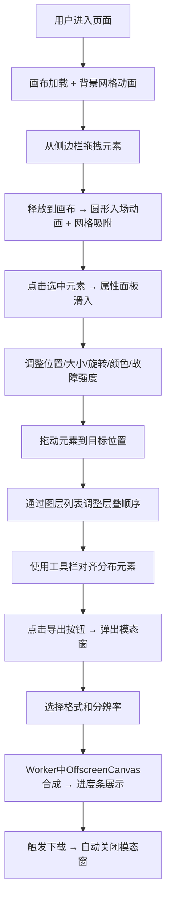

## 1. 产品概述

赛博街牌生成器是一款面向数字艺术爱好者和设计师的Web端可视化创作工具，用户通过拖拽组合预设几何元素，快速生成带有霓虹光感和故障艺术风格的个性化数字海报。

- **核心目标**：降低数字艺术创作门槛，打破模板化设计的同质化问题，让普通用户也能创作出专业级赛博朋克风格视觉作品。
- **目标用户**：设计师、自媒体运营者、社交媒体内容创作者、数字艺术爱好者。
- **市场价值**：填补低门槛、高自由度的赛博朋克风格海报生成工具空白，满足Z世代对个性化视觉内容的创作需求。

## 2. 核心功能

### 2.1 功能模块

1. **无限画布系统**：支持无限缩放、平移、网格吸附、元素淡入动画入场
2. **元素库侧边栏**：按类别组织的可拖拽预设元素库（基本形状、装饰线条、文字标题、噪点纹理）
3. **属性编辑面板**：实时调整元素位置、大小、旋转、颜色、故障特效强度
4. **图层管理面板**：可视化图层列表，支持拖拽排序、可见性切换、Web Worker异步缩略图生成
5. **顶部工具栏**：对齐工具（居中、水平分布、垂直分布）、撤销重做（10步历史）、导出功能
6. **高清导出系统**：PNG/SVG格式选择，1x/2x/4x分辨率，OffscreenCanvas + Web Worker异步合成

### 2.2 页面详情

| 页面名称 | 模块名称 | 功能描述 |
|-----------|-------------|---------------------|
| 主画布页 | 侧边栏（元素库） | 按4大类展示预设元素，卡片悬浮阴影+悬停放大，HTML5拖拽API |
| 主画布页 | 中央画布 | 深灰底纹背景，拖拽时显示浅蓝色虚线网格，元素入场圆形扩散动画，自动吸附网格，无限缩放平移 |
| 主画布页 | 属性面板（右侧） | 选中元素后平滑滑入，X/Y坐标输入、大小滑块、旋转旋钮、霓虹色盘+自定义取色器、S型曲线故障特效滑块 |
| 主画布页 | 图层面板（左下角） | 浮动毛玻璃面板，拖拽排序（蓝色高亮条），眼睛图标控制可见性（闪烁动画），Web Worker异步缩略图 |
| 主画布页 | 顶部工具栏 | 居中对齐、水平/垂直分布（缓动动画）、撤销重做、导出模态窗 |
| 主画布页 | 导出模态窗 | 格式选择（PNG/SVG）、分辨率选择（1x/2x/4x）、进度条+百分比、Worker合成不阻塞UI |

## 3. 核心流程

**关键交互流程说明**：
1. 元素拖拽：从侧边栏 → 画布 → 圆形扩散动画入场 → 自动吸附最近网格线
2. 属性调整：选中元素 → 右侧面板滑入 → 实时响应（含故障抖动特效）
3. 图层操作：眼睛点击 → 元素闪烁 → 显示/隐藏；拖拽 → 蓝色高亮条 → 重排
4. 导出流程：模态窗 → 参数选择 → Worker异步合成 → 进度条 → 下载

## 4. 用户界面设计

### 4.1 设计风格
- **主色调**：深灰黑（#0a0a0f / #15151d）作为基底，品红（#ff2d95）+ 青蓝（#00f0ff）双霓虹主色，辅以亮绿（#39ff14）、橙黄（#ffb347）、紫色（#c77dff）
- **按钮风格**：霓虹边框（1px渐变描边）+ 内部微光（box-shadow内发光）+ 悬停时彩色粒子/波纹特效
- **面板风格**：毛玻璃效果（backdrop-filter: blur(20px)）+ 暗色渐变边框（rgba(255,45,149,0.2)→rgba(0,240,255,0.2)）
- **字体**：标题使用 Orbitron（赛博朋克等宽字体），正文使用 JetBrains Mono 或 Roboto Mono
- **背景**：缓慢流动的极细网格线动画（品红+青蓝渐变）
- **图标风格**：Lucide线性图标，霓虹色描边

### 4.2 页面设计概览

| 模块 | UI元素 | 细节说明 |
|------|--------|---------|
| 侧边栏 | 可折叠半透明面板 | 左上角折叠按钮；展开宽度280px；分类Tab（基本形状/装饰线条/文字标题/噪点纹理）；元素卡片（80px×80px，网格布局，悬浮阴影，hover:scale(1.08)） |
| 中央画布 | 全屏容器 | 深灰底纹（radial-gradient + 噪点纹理）；拖拽时显示40px网格（浅蓝色虚线rgba(0,240,255,0.3)）；元素入场：scale(0)→scale(1) + opacity(0)→opacity(1) + radial reveal |
| 属性面板 | 右侧滑入 | 宽度320px；translateX(100%)→translateX(0)平滑过渡；分组：位置/大小/旋转/颜色/故障；旋钮使用SVG圆形+拖拽角度；色盘：5个预设霓虹色圆形色块 + react-colorful取色器 |
| 图层面板 | 左下角浮动 | 宽度260px，max-height 40vh；列表项（48px高，缩略图40px×40px + 名称 + 眼睛图标）；拖拽目标位置：2px蓝色高亮条；可见性切换：元素先opacity(1)→opacity(0.2)→opacity(1)闪烁再消失/出现 |
| 顶部工具栏 | 固定顶部 | 高度56px；按钮组间距8px；对齐按钮组3个 + 撤销/重做2个 + 导出主按钮1个；导出按钮：品红霓虹色，脉冲发光动画 |
| 导出模态窗 | 居中弹窗 | 尺寸420px×320px；格式单选（卡片式）；分辨率单选（1x/2x/4x标签）；确认按钮后切换为进度条视图（6px高度，青蓝渐变填充 + 百分比数字居中） |

### 4.3 响应式设计
- **桌面端（≥1024px）**：左侧栏展开（可折叠）+ 中央画布 + 右侧属性面板（选中时滑出）+ 左下角图层浮动面板
- **平板端（768px-1023px）**：侧边栏自动变为底部抽屉式（点击Tab从底部滑出）；属性面板改为右侧抽屉可手动呼出；工具栏转为可横向滚动标签组
- **手机端（<768px）**：侧边栏底部抽屉；属性面板底部全屏抽屉；工具栏底部固定可滚动；画布支持双指捏合缩放

### 4.4 动效与微交互
- **元素入场**：圆形扩散动画（clip-path: circle(0%)→circle(150%)）+ 0.4s cubic-bezier(0.34, 1.56, 0.64, 1)
- **故障特效**：应用瞬间：transform抖动(±2px) + RGB色彩分离(红移+3px,青移-3px) 共200ms，之后保留色彩错位残影(强度由滑块控制0-100%)
- **按钮悬停**：波纹扩散（径向渐变圆形0→100%）+ 10-15个彩色粒子（品红/青蓝/亮绿）向外扩散淡出
- **面板切换**：侧边栏折叠：宽度280px→0px；属性面板滑入：translateX(320px)→0px；均为0.35s ease
- **对齐动画**：所有选中元素以0.5s cubic-bezier(0.25, 0.46, 0.45, 0.94)缓动移动到目标位置
- **可见性切换**：opacity(1)→opacity(0.3)→opacity(1)→(隐藏则继续→opacity(0)) 共400ms
