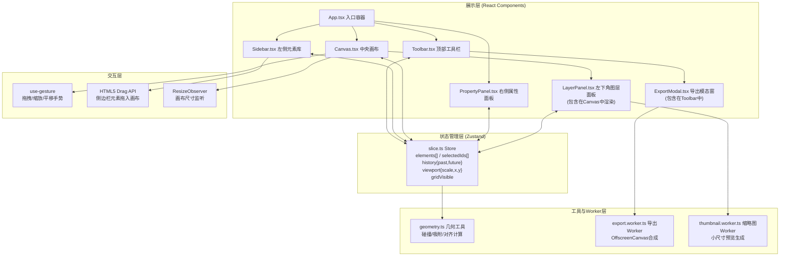

## 1. 架构设计



## 2. 技术描述

- **前端框架**：React 18 + TypeScript 5
- **构建工具**：Vite 5（React插件 + CSS Modules + 产物哈希）
- **状态管理**：Zustand 4（轻量级不可变状态 + Immer中间件用于历史记录）
- **手势交互**：@use-gesture/react（拖拽、缩放、平移手势处理）
- **尺寸监听**：use-resize-observer
- **颜色选择器**：react-colorful（轻量级HSL颜色选择器）
- **ID生成**：uuid
- **渲染策略**：
  - 画布元素：绝对定位 + CSS Transform（GPU加速）
  - 元素入场/故障特效：CSS Keyframes + Clip-path
  - 高分辨率导出：OffscreenCanvas（Web Worker线程）
  - 图层缩略图：独立Web Worker异步渲染
- **性能目标**：
  - 拖动元素帧率 ≥ 45fps（使用will-change + transform避免重排）
  - 4x PNG导出 ≤ 8秒（分块绘制 + Worker异步）

## 3. 核心数据模型

### 3.1 元素数据模型（CanvasElement）

```typescript
interface CanvasElement {
  id: string;                          // uuid
  type: 'shape' | 'line' | 'text' | 'texture';
  presetId: string;                    // 关联预设ID
  name: string;
  x: number;                           // 画布坐标（相对画布中心/原点）
  y: number;
  width: number;
  height: number;
  rotation: number;                    // 角度 0-360
  color: string;                       // hex颜色值
  glitchIntensity: number;             // 故障强度 0-100
  visible: boolean;
  zIndex: number;                      // 层叠顺序
  isNew?: boolean;                     // 标记是否需要入场动画
  isFlashing?: boolean;                // 可见性切换闪烁标记
  isGlitching?: boolean;               // 故障抖动标记
}
```

### 3.2 预设元素模型（PresetElement）

```typescript
interface PresetElement {
  id: string;
  category: 'basic' | 'line' | 'text' | 'texture';
  name: string;
  type: 'shape' | 'line' | 'text' | 'texture';
  defaultWidth: number;
  defaultHeight: number;
  svgPath: string;                     // SVG内容字符串，用于渲染
  defaultColor: string;
}
```

### 3.3 Store状态模型

```typescript
interface StoreState {
  // 元素
  elements: CanvasElement[];
  selectedIds: string[];
  
  // 视口
  viewport: {
    x: number;                         // 画布平移X
    y: number;                         // 画布平移Y
    scale: number;                     // 缩放比例 0.1 - 5
  };
  gridVisible: boolean;                // 拖拽时显示网格
  isDragging: boolean;
  
  // 历史记录
  history: {
    past: CanvasElement[][];           // 最多10步
    future: CanvasElement[][];
  };
  
  // UI状态
  sidebarCollapsed: boolean;
  responsiveMode: 'desktop' | 'tablet' | 'mobile';
}

interface StoreActions {
  addElement(preset: PresetElement, x: number, y: number): void;
  updateElement(id: string, patch: Partial<CanvasElement>, pushHistory?: boolean): void;
  deleteElements(ids: string[]): void;
  reorderElement(id: string, targetIndex: number): void;
  selectElements(ids: string[], additive?: boolean): void;
  
  // 对齐
  alignCenter(): void;
  distributeHorizontal(): void;
  distributeVertical(): void;
  
  // 历史
  undo(): void;
  redo(): void;
  _pushHistory(): void;                // 内部：保存当前快照
  
  // 视口
  setViewport(vp: Partial<StoreState['viewport']>): void;
  setGridVisible(v: boolean): void;
  setDragging(v: boolean): void;
  
  // UI
  toggleSidebar(): void;
  setResponsiveMode(m: StoreState['responsiveMode']): void;
}
```

## 4. 文件结构

```
auto111/
├── package.json
├── index.html
├── tsconfig.json
├── vite.config.js
└── src/
    ├── main.tsx                      # React入口
    ├── App.tsx                       # 根组件，布局编排
    ├── index.css                     # 全局样式 + CSS变量 + 动画keyframes
    │
    ├── store/
    │   └── slice.ts                  # Zustand Store
    │
    ├── components/
    │   ├── Canvas.tsx                # 核心画布 + 图层列表面板
    │   ├── Toolbar.tsx               # 顶部工具栏 + 导出模态窗
    │   ├── Sidebar.tsx               # 左侧元素库（可折叠）
    │   ├── PropertyPanel.tsx         # 右侧属性面板
    │   ├── CanvasElementView.tsx     # 单个元素渲染（含故障特效）
    │   ├── LayerPanel.tsx            # 图层列表面板（独立提取）
    │   ├── ExportModal.tsx           # 导出模态窗（独立提取）
    │   └── ui/                       # 通用UI原子组件
    │       ├── NeonButton.tsx
    │       ├── GlitchSlider.tsx
    │       ├── RotationKnob.tsx
    │       └── ColorSwatch.tsx
    │
    ├── workers/
    │   ├── export.worker.ts          # 导出Worker（OffscreenCanvas）
    │   └── thumbnail.worker.ts       # 缩略图Worker
    │
    ├── utils/
    │   ├── geometry.ts               # 几何计算纯函数
    │   ├── presets.ts                # 预设元素SVG定义
    │   └── svgSerializer.ts          # SVG序列化工具
    │
    └── types/
        └── index.ts                  # 全局类型定义
```

## 5. 核心算法与实现要点

### 5.1 几何工具（geometry.ts）

| 函数 | 签名 | 说明 |
|------|------|------|
| `snapToGrid` | `(value: number, gridSize: number = 40) => number` | 吸附单轴坐标到最近网格线 |
| `snapPointToGrid` | `(x: number, y: number, gridSize?: number) => {x, y}` | 吸附二维坐标 |
| `getElementBounds` | `(el: CanvasElement) => {left, right, top, bottom, centerX, centerY}` | 获取元素包围盒（考虑旋转） |
| `alignCenterElements` | `(elements: CanvasElement[]) => Map<string, {x, y}>` | 计算居中对齐目标位置 |
| `distributeHorizontal` | `(elements: CanvasElement[]) => Map<string, {x, y}>` | 计算水平分布目标位置 |
| `distributeVertical` | `(elements: CanvasElement[]) => Map<string, {x, y}>` | 计算垂直分布目标位置 |
| `easeCubicOut` | `(t: number) => number` | 缓动函数，用于对齐动画 |

### 5.2 历史记录机制

- **触发时机**：`updateElement`（带pushHistory=true）、`addElement`、`deleteElements`、`reorderElement`、对齐操作
- **存储结构**：仅存储`elements`数组快照（深拷贝），past最多10条
- **撤销/重做**：
  - undo: 当前elements → future.unshift；past.pop → elements
  - redo: 当前elements → past.push；future.shift → elements
- **优化**：连续的属性滑块拖动（如大小/旋转/颜色）合并为单次历史记录（使用debounce 300ms）

### 5.3 导出Worker流程

1. 主线程发送：`{type: 'export', format: 'png'|'svg', scale: 1|2|4, elements, canvasSize}`
2. Worker处理：
   - SVG格式：遍历elements，构建完整SVG字符串，返回`{type:'done', blob}`
   - PNG格式：
     - 创建OffscreenCanvas(width*scale, height*scale)
     - 按zIndex排序elements
     - 逐个绘制（变换矩阵 → 绘制SVG → 应用glitch色彩分离）
     - 每绘制1个元素报告进度`{type:'progress', percent}`
     - convertToBlob({type:'image/png'}) → 返回blob
3. 主线程监听progress更新进度条，完成后创建`<a download>`触发下载

### 5.4 故障特效实现（CSS层）

```css
.glitch-effect {
  filter: drop-shadow(2px 0 rgba(255,0,100,var(--intensity))) 
          drop-shadow(-2px 0 rgba(0,200,255,var(--intensity)));
}

/* 应用瞬间抖动 */
@keyframes glitch-shake {
  0%, 100% { transform: translate(0, 0); }
  20% { transform: translate(-2px, 1px); }
  40% { transform: translate(2px, -1px); }
  60% { transform: translate(-1px, -2px); }
  80% { transform: translate(1px, 2px); }
}
```

### 5.5 性能优化策略

1. **画布渲染**：所有元素使用`transform: translate3d(x, y, 0) rotate()`，触发GPU合成层
2. **拖拽渲染**：使用`requestAnimationFrame`节流，dragging状态下Store更新跳过非必要re-render
3. **图层缩略图**：Thumbnail Worker批量处理，结果用`Map<id, dataUrl>`缓存
4. **Store选择器**：组件使用Zustand shallow选择器，仅订阅必要字段变化
5. **元素列表渲染**：使用`React.memo`包裹`CanvasElementView`，props浅比较跳过重渲染

## 6. 预设元素库（presets.ts）

- **基本形状（basic）**：圆形、正方形、三角形、六边形、星形、圆环、菱形
- **装饰线条（line）**：横线、竖线、斜线、箭头、十字线、放射线条、方框、波浪线
- **文字标题（text）**："NEON"、"CYBER"、"2088"、"未来城市"（SVG文字转曲线路径）
- **噪点纹理（texture）**：扫描线、噪点块、故障条、光晕、VHS信号条

每个预设预渲染为inline SVG字符串，便于快速渲染和导出。
