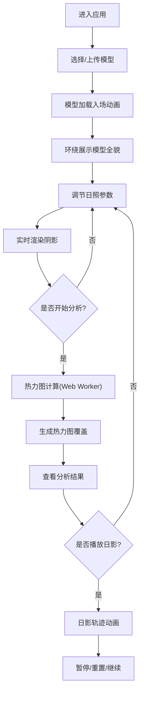

## 1. 产品概述

交互式3D日照阴影模拟与分析应用，为建筑和城市规划设计师提供快速评估建筑对周围环境日照与阴影影响的工具。基于浏览器的实时3D交互，替代传统昂贵复杂的桌面模拟软件。

- **目标用户**：建筑设计师、城市规划师、景观设计师、房地产开发者
- **核心价值**：降低日照分析门槛，提供直观的可视化交互体验，加速设计决策流程

## 2. 核心功能

### 2.1 用户角色

| 角色 | 注册方式 | 核心权限 |
|------|----------|----------|
| 设计师用户 | 无需注册，直接使用 | 模型上传/选择、参数调节、阴影分析、结果导出 |

### 2.2 功能模块

1. **3D场景视图**：模型加载渲染、地形网格、实时阴影、热力图覆盖、日影动画
2. **控制面板**：日期时间调节、地理位置设置、模型管理、播放控制
3. **分析结果面板**：日照时长统计、热力图图例、阴影覆盖百分比、叠加区域分析
4. **计算引擎**：太阳位置计算、阴影采样分析、热力图生成

### 2.3 功能详情

| 模块名称 | 子功能 | 功能描述 |
|----------|--------|----------|
| 模型加载 | 预置模型选择 | 提供摩天大楼、独立别墅、商业综合体等预置模型 |
| 模型加载 | 本地模型上传 | 支持glTF/GLB格式文件上传，最多加载3个模型 |
| 模型加载 | 入场动画 | 模型从屏幕上方缓缓降落到地面中心 |
| 场景初始化 | 地面网格 | 半透明网格地面，标注N/S/E/W方向指示 |
| 场景初始化 | 天空渐变 | 根据时间动态变化，晴天蓝橙渐变，阴天灰白渐变 |
| 场景初始化 | 环绕展示 | 加载完成后自动2秒全视角平滑环绕动画 |
| 日照参数 | 日期滑块 | 全年365天可调，显示节气信息 |
| 日照参数 | 时间滑块 | 6:00-19:00，步长10分钟，大字动画弹出显示 |
| 日照参数 | 地理位置 | 经纬度输入，支持预设城市（北京、纽约、新加坡） |
| 实时阴影 | 阴影映射 | Three.js Shadow Map硬阴影 + PCF软阴影 |
| 实时阴影 | 阴影颜色 | 随地面材质颜色自适应变化 |
| 实时阴影 | 边缘柔和度 | 正午尖锐，傍晚柔和，随时间自适应 |
| 热力图分析 | 采样计算 | 20x20采样点，26个时间点（6:00-19:00每30分钟） |
| 热力图分析 | 热力图渲染 | 蓝到红渐变，半透明边框，科学可视化风格 |
| 热力图分析 | 交互查询 | 点击采样点显示具体日照时长（精确到0.1h） |
| 日影动画 | 播放控制 | 播放/暂停/重置，时间从6:00推进到19:00 |
| 日影动画 | 速度调节 | 1倍/2倍/4倍播放速度 |
| 日影动画 | 实时指示 | 场景角落显示实时时钟和太阳高度角指示器 |
| 多模型管理 | 模型变换 | TransformControls实现拖拽平移和旋转 |
| 多模型管理 | 阴影着色 | 每个模型阴影不同半透明颜色（红/蓝/绿） |
| 多模型管理 | 叠加分析 | 计算阴影叠加区域占比百分比 |

## 3. 核心流程

### 3.1 主流程描述
用户进入应用 → 选择或上传建筑模型 → 模型加载并展示入场动画 → 调节日期/时间/地理位置参数 → 实时查看阴影变化 → 点击开始分析生成热力图 → 查看分析结果和数据统计 → 可播放日影动画观察全天变化

### 3.2 流程图

## 4. 用户界面设计

### 4.1 设计风格
- **整体风格**：科技感深色主题，专业建筑分析工具风格
- **主色调**：深色背景 #1a1a2e → #16213e 垂直渐变
- **强调色**：霓虹蓝 #00d4ff，用于描边和交互反馈
- **热力图色**：蓝色 #0066ff → 黄色 #ffff00 → 红色 #ff3300 渐变
- **材质效果**：毛玻璃面板（backdrop-filter: blur），半透明背景
- **按钮风格**：圆角矩形，霓虹描边，悬停呼吸灯效果，点击按压动画
- **字体**：现代无衬线字体，数字使用等宽字体增强科技感
- **图标风格**：线性简约图标，配合动画效果

### 4.2 页面布局

| 区域 | 模块名称 | UI元素 |
|------|----------|--------|
| 中央区域 | 3D场景视图 | 建筑模型、地面网格、阴影、热力图、方向指示、时钟指示器 |
| 左侧区域 | 控制面板 | 日期滑块、时间滑块、地理位置、模型选择、播放控制、分析按钮 |
| 右侧区域 | 分析结果面板 | 日照时长统计、热力图图例、阴影覆盖率、叠加区域占比 |
| 底部区域 | 状态栏 | 当前参数摘要、性能指标提示 |

### 4.3 响应式设计
- **宽屏 (>1200px)**：左右双面板固定布局，场景居中
- **中屏 (768-1200px)**：底部工具栏，标签页切换控制面板和分析面板
- **小屏 (<768px)**：悬浮按钮触发半屏抽屉，收拢所有控制功能
- **过渡动画**：面板切换伴随300ms ease-in-out宽度和透明度过渡

### 4.4 3D场景设计
- **环境**：渐变色天空背景，随时间动态变化色调
- **光照**：主方向光模拟太阳光，配合环境光提供基础照明
- **相机**：透视相机，OrbitControls环绕控制，支持缩放平移
- **地面**：半透明网格平面，带有方向标识（N/S/E/W）
- **后处理**：轻微泛光效果增强霓虹科技感，阴影柔和处理
- **动画**：模型下落入场、相机环绕、滑块数值弹出动画、按钮呼吸灯效果
