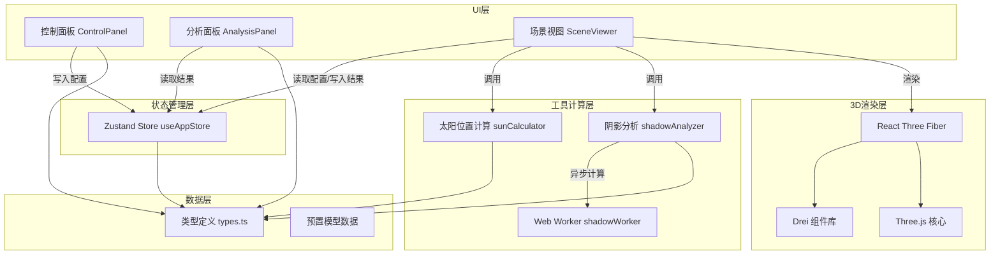

## 1. 架构设计



## 2. 技术描述

### 2.1 前端技术栈
- **框架**: React 18 + TypeScript 5
- **构建工具**: Vite 5
- **3D渲染**: Three.js r160 + @react-three/fiber 8 + @react-three/drei 9
- **状态管理**: Zustand 4
- **唯一ID**: uuid 9
- **样式方案**: CSS Modules + 内联样式（3D场景）

### 2.2 核心技术选型理由
- **@react-three/fiber**: React声明式Three.js渲染，组件化开发3D场景
- **@react-three/drei**: 提供OrbitControls、TransformControls等常用3D组件
- **Zustand**: 轻量状态管理，跨组件共享场景配置和分析结果
- **Web Worker**: 热力图计算放至Worker线程，避免阻塞主线程
- **TypeScript严格模式**: 确保类型安全，减少运行时错误

## 3. 目录结构

```
src/
├── types.ts                    # 全局类型定义
├── store/
│   └── useAppStore.ts          # Zustand全局状态
├── components/
│   ├── SceneViewer.tsx         # 3D场景主组件
│   ├── ControlPanel.tsx        # 左侧控制面板
│   ├── AnalysisPanel.tsx       # 右侧分析面板
│   ├── SunLight.tsx            # 太阳光组件
│   ├── GroundPlane.tsx         # 地面网格组件
│   ├── Heatmap.tsx             # 热力图组件
│   ├── BuildingModel.tsx       # 建筑模型组件
│   ├── ClockIndicator.tsx      # 时钟指示器组件
│   ├── ValuePopup.tsx          # 数值弹出动画组件
│   └── MobileDrawer.tsx        # 移动端抽屉组件
├── utils/
│   ├── sunCalculator.ts        # 太阳位置计算
│   ├── shadowAnalyzer.ts       # 阴影分析计算
│   ├── colorUtils.ts           # 颜色工具函数
│   └── dateUtils.ts            # 日期工具函数
├── workers/
│   └── shadowWorker.ts         # 热力图计算Web Worker
├── assets/
│   └── models/                 # 预置glTF模型
├── App.tsx                     # 根组件
├── main.tsx                    # 入口文件
└── index.css                   # 全局样式
```

## 4. 数据模型定义

### 4.1 核心类型定义

```typescript
// 地理位置
interface GeoLocation {
  latitude: number;      // 纬度
  longitude: number;     // 经度
  cityName?: string;     // 城市名称
}

// 建筑模型数据
interface BuildingModel {
  id: string;            // 唯一标识
  name: string;          // 模型名称
  url?: string;          // 模型文件URL
  position: [number, number, number];   // 位置 [x, y, z]
  rotation: [number, number, number];   // 旋转 [x, y, z] 弧度
  scale: [number, number, number];      // 缩放 [x, y, z]
  shadowColor: string;   // 阴影颜色
  isSelected: boolean;   // 是否被选中
}

// 太阳位置
interface SunPosition {
  azimuth: number;       // 方位角（弧度）
  altitude: number;      // 高度角（弧度）
  direction: THREE.Vector3;  // 方向向量
}

// 热力图采样点
interface HeatmapSample {
  x: number;             // 网格x坐标
  z: number;             // 网格z坐标
  sunlightHours: number; // 日照时长（小时）
  isShadowed: boolean[]; // 每个时间点是否被遮挡
}

// 阴影分析结果
interface ShadowAnalysisResult {
  samples: HeatmapSample[][];  // 20x20采样点数据
  totalHours: number;          // 总分析时长
  avgSunlightHours: number;    // 平均日照时长
  shadowCoveragePercent: number; // 阴影覆盖百分比
  overlapPercent?: number;     // 多模型阴影叠加占比
  isComputing: boolean;        // 是否正在计算
  progress: number;            // 计算进度 0-1
}

// 场景配置
interface SceneConfig {
  date: number;           // 一年中的第几天 1-365
  time: number;           // 小时 6-19，支持小数
  location: GeoLocation;  // 地理位置
  isPlaying: boolean;     // 日影动画是否播放
  playSpeed: number;      // 播放速度 1/2/4
  showHeatmap: boolean;   // 是否显示热力图
  isCloudy: boolean;      // 是否阴天
  gridSize: number;       // 地面网格大小
  sampleResolution: number; // 热力图采样分辨率
}

// 应用全局状态
interface AppState {
  config: SceneConfig;
  buildings: BuildingModel[];
  analysisResult: ShadowAnalysisResult | null;
  selectedBuildingId: string | null;
  activePanelTab: 'control' | 'analysis';
  isMobileDrawerOpen: boolean;
  
  // Actions
  setConfig: (config: Partial<SceneConfig>) => void;
  addBuilding: (building: Omit<BuildingModel, 'id'>) => void;
  removeBuilding: (id: string) => void;
  updateBuilding: (id: string, updates: Partial<BuildingModel>) => void;
  selectBuilding: (id: string | null) => void;
  setAnalysisResult: (result: ShadowAnalysisResult | null) => void;
  setAnalysisProgress: (progress: number) => void;
  setActivePanelTab: (tab: 'control' | 'analysis') => void;
  toggleMobileDrawer: () => void;
  startPlayback: () => void;
  pausePlayback: () => void;
  resetPlayback: () => void;
}
```

## 5. 核心模块说明

### 5.1 sunCalculator - 太阳位置计算
- **输入**: 日期(一年中第几天)、时间(小时)、经纬度
- **输出**: 太阳方位角、高度角、方向向量
- **算法**: 基于标准太阳位置计算公式，包括时差修正、赤纬角计算
- **调用方**: SceneViewer组件（实时渲染）、shadowAnalyzer（批量计算）

### 5.2 shadowAnalyzer - 阴影分析
- **输入**: 建筑模型列表、地理位置、日期、采样配置
- **输出**: 热力图采样数据、统计指标
- **实现**: 使用射线检测或深度图方法判断采样点是否被遮挡
- **优化**: Web Worker后台计算，增量更新进度

### 5.3 SceneViewer - 3D场景
- **职责**: 模型加载渲染、阴影映射、相机控制、热力图叠加
- **核心组件**: SunLight、GroundPlane、BuildingModel、Heatmap
- **动画**: 模型入场动画、相机环绕动画、日影播放动画
- **交互**: OrbitControls视角控制、TransformControls模型变换

### 5.4 ControlPanel - 控制面板
- **职责**: 参数调节、模型管理、播放控制
- **组件**: 滑块组件（带动画）、下拉选择、按钮组、上传组件
- **动画**: 数值弹出动画、滑块拖动反馈、按钮呼吸灯效果

### 5.5 AnalysisPanel - 分析面板
- **职责**: 结果展示、数据统计、图例说明
- **组件**: 数据卡片、图例条、进度指示器
- **数据**: 从store读取分析结果，响应式更新

## 6. 性能优化策略

### 6.1 渲染性能
- 阴影贴图分辨率适中（1024x1024），平衡质量与性能
- 使用PCFSoftShadowMap实现软阴影
- 模型使用BufferGeometry，减少draw call
- 热力图使用InstancedMesh批量渲染

### 6.2 计算性能
- 热力图计算在Web Worker中执行
- 20x20采样点，26个时间点，目标1秒内完成
- 采样计算使用简化的包围盒碰撞检测加速

### 6.3 帧率目标
- 阴影实时更新：≥30fps
- 多模型场景：≥24fps
- 热力图计算期间：保持UI响应

## 7. 预置模型数据

由于没有实际glTF文件，使用Three.js程序化生成建筑几何体作为预置模型：
- **摩天大楼**: 多层Box组合，模拟现代摩天楼形态
- **独立别墅**: 低层建筑+坡屋顶，模拟住宅形态
- **商业综合体**: 多个体块组合，模拟商业建筑形态
