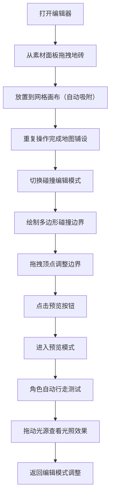

## 1. 产品概述

本产品是一款面向关卡设计师的2D横版卷轴游戏关卡地图生成与预览工具，解决手动平铺地图元素、调整碰撞边界效率低、无法快速查看动态光照效果的痛点。通过可视化拖拽编辑、实时光照预览和碰撞边界编辑，大幅提升关卡设计效率。

- 核心价值：将关卡设计从繁琐的手动操作中解放出来，提供所见即所得的编辑体验
- 目标用户：游戏关卡设计师、独立游戏开发者

---

## 2. 核心功能

### 2.1 功能模块列表

1. **地图编辑器模块**：左侧素材面板拖拽、网格画布放置、自动吸附
2. **关卡预览模块**：2D侧卷轴视角、动态光照效果、角色自动行走与跳跃
3. **碰撞编辑模块**：多边形碰撞边界绘制、顶点拖拽调整、碰撞区域可视化
4. **画布交互模块**：鼠标滚轮缩放、画布平移、网格线自适应

### 2.2 页面详情

| 页面名称 | 模块名称 | 功能描述 |
|-----------|-------------|---------------------|
| 主编辑页面 | 顶部工具栏 | 模式切换（编辑/预览）、碰撞编辑开关、光源控制、撤销重做 |
| 主编辑页面 | 素材面板 | 按类别折叠显示地砖素材、拖拽放置、悬停放大效果 |
| 主编辑页面 | 画布区域 | 地砖绘制、网格吸附、缩放平移、光照效果渲染、碰撞边界显示 |
| 主编辑页面 | 碰撞编辑面板 | 绘制多边形边界、顶点拖拽、碰撞区域半透明覆盖 |
| 预览页面 | 角色模拟 | 像素小人自动行走、跳跃、碰撞检测、动画效果 |
| 预览页面 | 光照系统 | 可拖动光源、距离衰减、暗部渲染 |

---

## 3. 核心流程

### 3.1 关卡设计主流程

### 3.2 交互细节说明

1. **拖拽放置**：从素材面板拖动地砖到画布，拖放时有弹性缩放动画，释放后自动吸附到网格交叉点
2. **预览模式**：点击预览按钮后，编辑器切换为玩家视角，角色从左向右自动行走，遇到高台边缘自动跳跃，遇到墙壁停止
3. **光照效果**：光源位置可拖动，光照强度随距离线性衰减，超出范围的地砖变为暗色
4. **碰撞编辑**：绘制多边形边界，顶点可拖拽，碰撞区域用半透明蓝色覆盖

---

## 4. 用户界面设计

### 4.1 设计风格

- **主题色调**：深灰色背景（#2b2b2b）配荧光绿高亮（#00ff88），悬停变为亮黄色（#ffdd00）
- **毛玻璃效果**：顶部工具栏采用半透明背景带模糊效果
- **按钮交互**：悬停时略微上浮，点击时弹性缩小再恢复
- **侧边栏动画**：素材面板和碰撞编辑面板收起时从左向右平滑收缩

### 4.2 字体与排版

- **主字体**：使用具有科技感的等宽字体（如 JetBrains Mono）
- **层级清晰**：标题使用荧光绿，正文使用浅灰色，确保深色背景下的可读性
- **图标风格**：线性简约图标，与整体科技感风格统一

### 4.3 页面设计概览

| 页面名称 | 模块名称 | UI元素 |
|-----------|-------------|-------------|
| 主编辑页面 | 顶部工具栏 | 毛玻璃背景、荧光绿按钮、模式切换开关、光源控制滑块 |
| 主编辑页面 | 素材面板 | 分类折叠标题、素材卡片（悬停放大显示名称）、拖拽手柄 |
| 主编辑页面 | 画布区域 | 深灰背景、动态网格线、地砖精灵、光照光晕、紫色碰撞边界、蓝色半透明覆盖层 |
| 主编辑页面 | 碰撞编辑面板 | 多边形绘制按钮、顶点编辑工具、清除按钮 |
| 预览页面 | 角色模拟 | 像素小人、行走摆动动画、跳跃弧线 |
| 预览页面 | 光照系统 | 可拖动光源图标、衰减渐变、暗色过渡 |

### 4.4 动画效果

- **地砖放置**：弹性缩放动画（scale 0.8 → 1.1 → 1.0）
- **按钮悬停**：translateY(-2px) + 颜色过渡（#00ff88 → #ffdd00）
- **按钮点击**：scale(0.95) → scale(1.0) 弹性恢复
- **侧边栏收起**：width 从280px过渡到0px，ease-in-out曲线
- **角色行走**：头部和腿部轻微摆动（±5°旋转）
- **缩放平移**：平滑过渡，避免突兀跳变

### 4.5 响应式设计

- 桌面端优先，支持1280px以上分辨率
- 画布区域自适应剩余空间
- 侧边栏可折叠，为画布腾出更多空间
- 触控设备支持双指缩放和单指平移

---

## 5. 性能指标

| 指标 | 要求 |
|------|------|
| 100个地砖加载 | 编辑器保持60fps帧率 |
| 预览模式 | 角色行走动画不卡顿 |
| 拖拽响应 | 从拖动到放置的视觉反馈延迟 < 16ms |
| 光照计算 | 实时动态光照渲染不低于30fps |
| 碰撞检测 | 多边形碰撞计算单次耗时 < 1ms |
