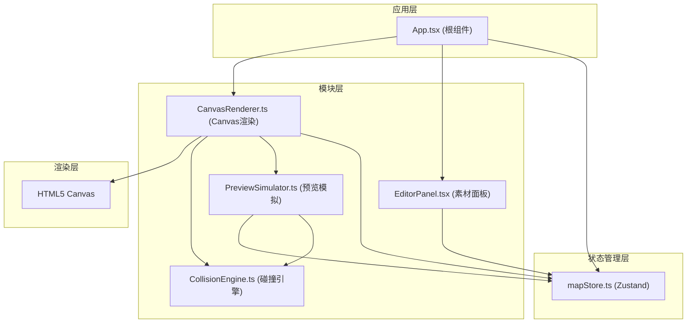

## 1. 架构设计



---

## 2. 技术栈描述

| 类别 | 技术选型 | 版本 | 用途 |
|------|----------|------|------|
| 框架 | React | ^18.2.0 | UI组件框架 |
| 渲染 | React DOM | ^18.2.0 | DOM渲染 |
| 语言 | TypeScript | ^5.0.0 | 类型安全 |
| 构建 | Vite | ^5.0.0 | 构建工具与开发服务器 |
| 状态 | Zustand | ^4.4.0 | 轻量级状态管理 |
| 工具 | UUID | ^9.0.0 | 唯一ID生成 |
| 类型 | @types/react | ^18.2.0 | React类型定义 |
| 类型 | @types/react-dom | ^18.2.0 | React DOM类型定义 |

---

## 3. 目录结构

```
auto114/
├── index.html                          # 入口HTML
├── package.json                        # 依赖配置
├── tsconfig.json                       # TypeScript配置
├── vite.config.js                      # Vite配置
└── src/
    ├── App.tsx                         # 根组件
    ├── main.tsx                        # 应用入口
    ├── store/
    │   └── mapStore.ts                 # Zustand状态管理
    └── modules/
        ├── editor/
        │   ├── EditorPanel.tsx         # 素材面板组件
        │   └── CanvasRenderer.ts       # Canvas渲染器
        ├── preview/
        │   └── PreviewSimulator.ts     # 预览模拟器
        └── engine/
            └── CollisionEngine.ts      # 碰撞检测引擎
```

---

## 4. 核心数据模型

### 4.1 类型定义

```typescript
// 地砖类型
type TileType = 'grass' | 'stone' | 'wall' | 'water';

// 地砖数据
interface Tile {
  id: string;
  type: TileType;
  x: number;      // 网格坐标X
  y: number;      // 网格坐标Y
}

// 素材定义
interface Material {
  id: string;
  type: TileType;
  name: string;
  category: string;
  color: string;
}

// 多边形顶点
interface Point {
  x: number;
  y: number;
}

// 碰撞多边形
interface CollisionPolygon {
  id: string;
  vertices: Point[];
  isClosed: boolean;
}

// 光源
interface LightSource {
  x: number;
  y: number;
  intensity: number;
  range: number;
}

// 角色状态
interface Character {
  x: number;
  y: number;
  velocityX: number;
  velocityY: number;
  isJumping: boolean;
  isWalking: boolean;
  walkFrame: number;
}

// 应用模式
type AppMode = 'editor' | 'preview';

// 编辑模式
type EditMode = 'tile' | 'collision';
```

### 4.2 Store 状态

```typescript
interface MapState {
  // 地图数据
  tiles: Tile[];
  materials: Material[];
  collisionPolygons: CollisionPolygon[];
  
  // 光源
  lightSource: LightSource;
  
  // 模式
  appMode: AppMode;
  editMode: EditMode;
  
  // 视图
  zoom: number;
  panX: number;
  panY: number;
  gridSize: number;
  
  // 选中状态
  selectedMaterial: Material | null;
  selectedPolygonId: string | null;
  selectedVertexIndex: number | null;
  
  // 角色
  character: Character;
  
  // Actions
  addTile: (type: TileType, x: number, y: number) => void;
  removeTile: (id: string) => void;
  setSelectedMaterial: (material: Material | null) => void;
  setAppMode: (mode: AppMode) => void;
  setEditMode: (mode: EditMode) => void;
  addCollisionPolygon: (polygon: CollisionPolygon) => void;
  updateCollisionPolygon: (id: string, vertices: Point[]) => void;
  removeCollisionPolygon: (id: string) => void;
  setLightSource: (light: Partial<LightSource>) => void;
  setZoom: (zoom: number) => void;
  setPan: (x: number, y: number) => void;
  setCharacter: (char: Partial<Character>) => void;
  resetMap: () => void;
}
```

---

## 5. 核心模块说明

### 5.1 CanvasRenderer.ts

负责Canvas渲染，使用requestAnimationFrame驱动60fps渲染循环：

| 方法 | 功能 |
|------|------|
| `start()` | 启动渲染循环 |
| `stop()` | 停止渲染循环 |
| `render()` | 主渲染方法，按图层绘制 |
| `drawGrid()` | 绘制自适应网格线 |
| `drawTiles()` | 绘制地砖，应用光照效果 |
| `drawLighting()` | 绘制光照衰减效果 |
| `drawCollisionPolygons()` | 绘制紫色碰撞边界和蓝色覆盖层 |
| `drawCharacter()` | 绘制像素小人及动画 |
| `handleZoom()` | 处理滚轮缩放 |
| `handlePan()` | 处理画布平移 |

### 5.2 PreviewSimulator.ts

预览模式下的角色物理模拟：

| 方法 | 功能 |
|------|------|
| `start()` | 启动模拟循环 |
| `stop()` | 停止模拟循环 |
| `update()` | 每帧更新角色状态 |
| `checkCollisions()` | 检测角色与碰撞多边形的碰撞 |
| `checkPlatformEdge()` | 检测高台边缘触发跳跃 |
| `updateWalkAnimation()` | 更新行走帧动画 |

### 5.3 CollisionEngine.ts

碰撞检测工具模块：

| 方法 | 功能 |
|------|------|
| `pointInPolygon()` | 检测点是否在多边形内 |
| `lineIntersectsPolygon()` | 检测线段是否与多边形相交 |
| `rectIntersectsPolygon()` | 检测矩形是否与多边形相交 |
| `getCollisionDirection()` | 返回碰撞方向（上/下/左/右） |
| `sweepTest()` | 扫描测试，预测移动中的碰撞 |

### 5.4 EditorPanel.tsx

左侧素材面板组件：

- 按类别折叠显示素材卡片
- 拖拽开始时创建半透明拖拽预览
- 悬停时素材卡片放大并显示名称
- 接收store中的选中素材和缩放比例

---

## 6. 性能优化策略

### 6.1 渲染优化

- **离屏Canvas**：地砖静态层预渲染到离屏Canvas，避免每帧重绘
- **脏矩形**：只重绘变化的区域
- **光照缓存**：光源未移动时缓存光照计算结果
- **空间分区**：使用网格空间分区加速碰撞检测

### 6.2 状态优化

- **选择器**：使用Zustand的selector避免不必要的重渲染
- **批量更新**：多个状态变更合并为一次更新
- **引用稳定**：回调函数使用useCallback包装

### 6.3 动画优化

- **transform动画**：使用CSS transform而非top/left
- **will-change**：对频繁变化的元素添加will-change提示
- **requestAnimationFrame**：所有动画统一使用RAF调度

---

## 7. 启动脚本

```json
{
  "scripts": {
    "dev": "vite",
    "build": "tsc && vite build",
    "preview": "vite preview"
  }
}
```

运行命令：`npm install && npm run dev`，访问 `http://localhost:5173`
