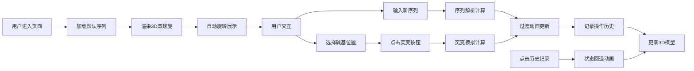

## 1. 产品概述

本产品是一个交互式3D基因序列结构探索与突变模拟应用，让用户能够在浏览器中查看并操作高精度的DNA双螺旋3D模型，模拟基因突变（点突变、插入、缺失）并实时观察突变对蛋白质折叠结构产生的影响。

- 主要目的：为生物教育和研究提供直观的DNA结构可视化和突变模拟工具
- 解决问题：传统基因序列分析缺乏直观的3D可视化，难以理解突变对结构的影响
- 目标用户：生物专业学生、基因研究人员、科学教育工作者
- 市场价值：降低基因结构学习门槛，提供沉浸式的分子生物学交互体验

## 2. 核心功能

### 2.2 功能模块

1. **3D场景模块**：DNA双螺旋模型渲染、场景光照、相机控制
2. **序列解析模块**：碱基序列输入、验证、3D坐标计算
3. **突变模拟模块**：点突变、插入、缺失三种突变类型的模拟与可视化
4. **交互控制模块**：序列输入、突变操作按钮、历史记录面板
5. **观察导出模块**：视角重置、截图、动画录制

### 2.3 页面详情

| 页面名称 | 模块名称 | 功能描述 |
|-----------|-------------|---------------------|
| 主页面 | 3D场景区 | 展示DNA双螺旋3D模型，支持鼠标拖拽旋转、滚轮缩放 |
| 主页面 | 左侧工具栏 | 重置视角、截图、录制动画功能按钮 |
| 主页面 | 底部控制面板 | 序列输入文本框、突变操作按钮组（点突变、插入、删除） |
| 主页面 | 右侧历史面板 | 可折叠的突变操作历史记录，支持撤销和状态回退 |

## 3. 核心流程

### 3.1 主操作流程

用户进入页面 → 系统自动加载默认DNA序列并渲染3D模型 → 模型自动旋转展示 → 用户可通过鼠标交互查看 → 用户输入新序列或进行突变操作 → 系统实时更新3D模型并展示动画效果 → 所有操作记录到历史面板 → 用户可随时回退到任意历史状态

### 3.2 突变操作流程

用户点击模型碱基选中 → 点击突变类型按钮 → 系统执行突变动画（粒子效果、结构扭曲）→ 更新序列数据 → 重新渲染3D模型 → 记录到历史栈

## 4. 用户界面设计

### 4.1 设计风格

- **设计理念**：分子生物实验室暗场风格，科学感与未来感结合
- **主色调**：深色背景 #0a0a1a，蓝紫色渐变按钮，彩色碱基（A红、T蓝、G绿、C黄）
- **辅助色**：主链蓝绿色渐变，脉冲光效为白色半透明
- **按钮样式**：蓝紫色渐变圆角按钮，悬停时光晕效果，点击时涟漪扩散
- **字体**：等宽字体（JetBrains Mono 或 Fira Code），模拟终端风格
- **布局风格**：全屏3D场景作为背景，控制面板悬浮于底部，历史面板悬浮于右侧，工具栏悬浮于左上角
- **材质效果**：控制面板采用半透明毛玻璃材质（backdrop-filter: blur(10px)）

### 4.2 页面设计概述

| 页面名称 | 模块名称 | UI元素 |
|-----------|-------------|-------------|
| 主页面 | 3D场景区 | 深色太空背景、发光DNA双螺旋、流动粒子、突变动画效果 |
| 主页面 | 左上角工具栏 | 三个圆形图标按钮（重置、相机、录制），悬停时放大发光 |
| 主页面 | 底部控制面板 | 半透明毛玻璃面板、序列输入框（带字符计数）、三个突变操作按钮、输入框聚焦时光效动画 |
| 主页面 | 右侧历史面板 | 可折叠竖排卡片列表、每张卡片显示突变摘要和颜色预览点、卡片间发光分隔线 |

### 4.3 响应式设计

- 桌面端（>=1200px）：控制面板宽度600px，历史面板宽度280px，完整功能展示
- 平板端（768px-1199px）：控制面板宽度自适应，历史面板可收起为图标
- 移动端（<768px）：控制面板改为底部抽屉式，历史面板改为顶部下拉菜单，优化触摸交互

### 4.4 3D场景指导

- **环境设置**：纯深色背景（#0a0a1a），无环境贴图，营造暗场显微镜效果
- **光照设置**：两盏主光源（冷白色聚光灯 + 暖色补光灯），碱基对自发光效果，主链荧光材质
- **相机设置**：PerspectiveCamera，初始位置(0, 5, 15)，fov=60，近裁剪面0.1，远裁剪面1000
- **相机运动**：自动旋转（y轴，速度0.005），用户交互时暂停，OrbitControls支持阻尼效果
- **构图**：DNA模型居中，占屏幕高度70%，上下留有呼吸空间
- **交互效果**：点击碱基时高亮放大并产生光晕，悬停时显示碱基类型标签
- **后处理**：Bloom效果增强发光质感，轻微FXAA抗锯齿
- **性能优化**：实例化渲染碱基对，Geometry合并，LOD控制，目标帧率50FPS+

### 4.5 动画效果

- **页面加载**：DNA模型从粒子云汇聚成形，持续2秒
- **序列更新**：旧模型碎片化溶解 → 粒子过渡 → 新模型汇聚，持续2秒
- **点突变**：原碱基爆炸粒子 → 结构扭曲振荡 → 新碱基光点扩散成形，持续1.5秒
- **插入突变**：主链撑开间隙 → 新碱基逐一闪烁出现（间隔0.15秒）→ 主链平滑连接
- **缺失突变**：碱基旋转缩小坠落 → 主链弹性拉合
- **历史回退**：突变动画倒放
- **微交互**：按钮悬停光晕、点击涟漪、输入框聚焦光效、卡片翻转消失
