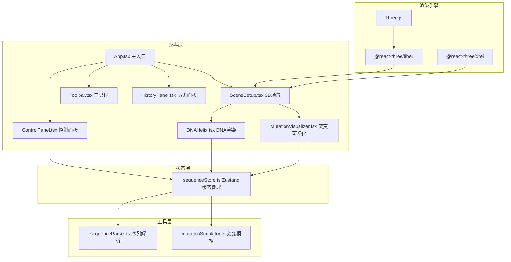

## 1. 架构设计

本项目采用纯前端架构，基于React + TypeScript + Vite构建，使用Three.js生态进行3D渲染，Zustand进行状态管理。整体采用模块化设计，将3D渲染、数据处理、交互控制分离。



## 2. 技术描述

- **前端框架**：React@18 + TypeScript@5
- **构建工具**：Vite@5（配置路径别名、Three.js优化）
- **3D渲染**：Three.js@0.160 + @react-three/fiber@8 + @react-three/drei@9
- **状态管理**：Zustand@4
- **唯一ID**：uuid@9
- **样式方案**：原生CSS + CSS变量，配合Tailwind CSS（按需引入）
- **无后端**：纯前端应用，所有数据在浏览器内存中处理

## 3. 项目文件结构

```
auto117/
├── package.json
├── index.html
├── tsconfig.json
├── vite.config.js
├── src/
│   ├── main.tsx              # 应用入口
│   ├── App.tsx               # 根组件
│   ├── index.css             # 全局样式
│   ├── store/
│   │   └── sequenceStore.ts  # 状态管理
│   ├── utils/
│   │   ├── sequenceParser.ts # 序列解析工具
│   │   └── mutationSimulator.ts # 突变模拟工具
│   ├── renderer/
│   │   ├── SceneSetup.tsx    # 3D场景初始化
│   │   ├── DNAHelix.tsx      # DNA双螺旋渲染
│   │   └── MutationVisualizer.tsx # 突变可视化
│   └── components/
│       ├── ControlPanel.tsx  # 控制面板
│       ├── Toolbar.tsx       # 顶部工具栏
│       └── HistoryPanel.tsx  # 历史记录面板
```

## 4. 核心数据模型

### 4.1 类型定义

```typescript
// 碱基类型
type BaseType = 'A' | 'T' | 'G' | 'C';

// 碱基对数据
interface BasePair {
  id: string;
  index: number;
  base1: BaseType;
  base2: BaseType;
  position: [number, number, number]; // 3D空间坐标
  rotation: [number, number, number]; // 欧拉角旋转
  helixAngle: number; // 螺旋角度
  selected?: boolean;
  mutated?: boolean;
}

// 突变类型
type MutationType = 'point' | 'insertion' | 'deletion';

// 突变操作记录
interface MutationRecord {
  id: string;
  type: MutationType;
  position: number;
  oldBase?: BaseType;
  newBase?: BaseType;
  insertedBases?: BaseType[];
  deletedBases?: BaseType[];
  timestamp: number;
  sequenceSnapshot: string; // 突变后的完整序列
}

// 突变效果数据
interface MutationEffect {
  position: number;
  twistOffset: number; // 局部结构扭转偏移量
  affectedRange: [number, number]; // 影响范围
  intensity: number; // 效果强度
}

// 视图参数
interface ViewParams {
  autoRotate: boolean;
  rotationSpeed: number;
  zoom: number;
  showLabels: boolean;
  showBackbone: boolean;
  showBases: boolean;
}

// Store状态
interface SequenceState {
  // 数据
  rawSequence: string;
  basePairs: BasePair[];
  mutationHistory: MutationRecord[];
  currentHistoryIndex: number;
  
  // 视图
  viewParams: ViewParams;
  selectedBaseIndex: number | null;
  
  // 动画状态
  isTransitioning: boolean;
  activeMutation: MutationEffect | null;
  
  // Actions
  setSequence: (seq: string) => void;
  selectBase: (index: number | null) => void;
  applyPointMutation: (position: number, newBase: BaseType) => void;
  applyInsertion: (position: number, bases: BaseType[]) => void;
  applyDeletion: (position: number, count: number) => void;
  revertToHistory: (index: number) => void;
  clearHistory: () => void;
  updateViewParams: (params: Partial<ViewParams>) => void;
  toggleAutoRotate: () => void;
}
```

### 4.2 碱基颜色映射

| 碱基 | 颜色 | 十六进制 |
|------|------|----------|
| A | 红色 | #ff4757 |
| T | 蓝色 | #3742fa |
| G | 绿色 | #2ed573 |
| C | 黄色 | #ffa502 |

## 5. 核心算法

### 5.1 DNA双螺旋坐标计算

```typescript
// 螺旋参数
const HELIX_RADIUS = 2;          // 螺旋半径
const HELIX_PITCH = 3.5;         // 螺距（每转上升高度）
const BASES_PER_TURN = 10;       // 每圈碱基数
const BASE_PAIR_HEIGHT = 0.35;   // 碱基对垂直间距

// 计算第i个碱基对的3D坐标
function calculateBasePairPosition(index: number, totalBases: number): {
  position: [number, number, number];
  rotation: [number, number, number];
  helixAngle: number;
} {
  const angle = (index / BASES_PER_TURN) * Math.PI * 2;
  const y = (index - totalBases / 2) * BASE_PAIR_HEIGHT;
  const x = Math.cos(angle) * HELIX_RADIUS;
  const z = Math.sin(angle) * HELIX_RADIUS;
  
  return {
    position: [x, y, z],
    rotation: [0, -angle, 0],
    helixAngle: angle
  };
}
```

### 5.2 突变效果计算

```typescript
// 计算突变引起的局部扭转偏移
function calculateTwistOffset(
  mutationPosition: number,
  distance: number,
  mutationType: MutationType
): number {
  const maxOffset = mutationType === 'deletion' ? 0.3 : 0.2;
  const decayFactor = Math.exp(-Math.abs(distance) / 3); // 距离衰减
  const oscillation = Math.sin(distance * 0.8) * 0.5; // 正弦振荡
  return maxOffset * decayFactor * (1 + oscillation);
}
```

## 6. 性能优化策略

### 6.1 3D渲染优化

1. **实例化渲染**：使用`InstancedMesh`渲染大量重复的碱基对几何体
2. **几何体合并**：将主链TubeGeometry合并为单一BufferGeometry
3. **LOD控制**：根据相机距离动态切换几何体细节
4. **材质复用**：为相同类型的碱基共享MeshStandardMaterial实例
5. **帧率控制**：使用`useFrame`的delta参数进行帧率独立的动画

### 6.2 状态更新优化

1. **选择器优化**：使用Zustand的selector避免不必要的重渲染
2. **批量更新**：序列解析和突变计算使用requestIdleCallback
3. **Web Workers**：将复杂的坐标计算移至Web Worker（后续优化）

### 6.3 动画优化

1. **CSS动画**：UI层动画优先使用CSS transform和opacity
2. **requestAnimationFrame**：所有3D动画通过R3F的useFrame hook
3. **对象池**：粒子效果使用对象池复用THREE.Object3D实例

## 7. 关键技术点

### 7.1 路径别名配置（vite.config.js）

```javascript
resolve: {
  alias: {
    '@': path.resolve(__dirname, './src'),
    '@store': path.resolve(__dirname, './src/store'),
    '@utils': path.resolve(__dirname, './src/utils'),
    '@renderer': path.resolve(__dirname, './src/renderer'),
    '@components': path.resolve(__dirname, './src/components'),
    three: path.resolve(__dirname, 'node_modules/three/src/Three.js'),
  }
}
```

### 7.2 Three.js优化配置

- 启用`antialias: true`但使用`FXAA`后处理平衡性能
- `powerPreference: 'high-performance'`请求高性能GPU
- 启用`logarithmicDepthBuffer`处理大场景深度精度
- `dpr: Math.min(window.devicePixelRatio, 2)`限制像素比

### 7.3 录制功能实现

使用`MediaRecorder API`捕获Canvas元素的视频流，配合`canvas.captureStream()`实现WebM格式录制。
