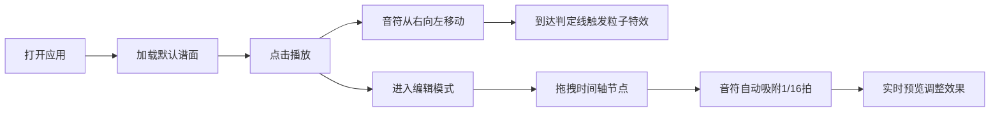

## 1. 产品概述

节奏光剑打点器是一款面向音游玩家和谱面作者的2D侧视角节奏游戏谱面预览工具。用户可以快速生成并预览谱面效果，音符从右侧飞向左端判定线，命中时产生粒子爆炸和闪光反馈，解决谱面制作后无法直观预览打击节奏和视觉效果的问题。

- **核心价值**：让谱面作者在制作阶段即可直观预览节奏和视觉效果，无需上机测试
- **目标用户**：音游玩家、谱面制作者、节奏游戏爱好者

## 2. 核心功能

### 2.1 功能模块

1. **主画布预览区**：实时渲染谱面播放效果，包含判定线、移动音符、粒子爆炸特效
2. **时间轴编辑器**：底部时间轴，支持音符节点的增删改、刻度吸附、滚动同步
3. **顶部工具栏**：播放/暂停控制、速度调节、音轨切换等操作

### 2.2 页面详情

| 页面名称 | 模块名称 | 功能描述 |
|-----------|-------------|---------------------|
| 主页面 | 判定线渲染 | 左侧垂直发光白色判定线，带周期性呼吸光效 |
| 主页面 | 音符系统 | 八边形音符，红/蓝/黄三色对应不同音轨，带脉动发光效果 |
| 主页面 | 粒子特效 | 音符命中判定线时产生粒子爆炸和闪光反馈 |
| 主页面 | 游戏引擎 | 时间线驱动、音符移动碰撞检测、粒子更新、60FPS稳定运行 |
| 主页面 | 时间轴编辑器 | 拖拽生成/移动/删除音符，1/16拍吸附，弹性动画 |
| 主页面 | 播放控制 | 播放/暂停、进度显示、速度调节 |

## 3. 核心流程

用户打开应用 → 查看默认谱面演示 → 点击播放预览效果 → 在时间轴上拖拽编辑音符 → 实时预览调整效果 → 完成谱面设计

## 4. 用户界面设计

### 4.1 设计风格

- **主色调**：深紫黑色背景（#0a0a12），cyan（#00ffff）和 magenta（#ff00ff）霓虹光效点缀
- **音符颜色**：红（#ff3366 主旋律）、蓝（#3399ff 鼓点）、黄（#ffcc00 和声）
- **视觉风格**：赛博朋克霓虹风格，深色背景配合强烈的发光效果
- **交互动画**：所有交互元素带0.2秒弹簧动画效果
- **字体**：现代无衬线字体，数字使用等宽字体增强节奏感

### 4.2 页面设计概述

| 页面名称 | 模块名称 | UI元素 |
|-----------|-------------|-------------|
| 主页面 | 画布区 | 深紫黑背景、发光判定线、八边形音符、粒子爆炸、光晕效果 |
| 主页面 | 时间轴 | 节拍刻度线、红色播放进度线、可拖拽音符节点、吸附反馈 |
| 主页面 | 工具栏 | 播放按钮、速度滑块、音轨选择、重置按钮 |

### 4.3 响应式设计

- **桌面端**：左侧留出编辑器面板（两倍宽度），右侧画布区
- **平板端**：顶部工具栏，中部画布，底部时间轴
- **手机竖屏**：判定线靠左，画布占满剩余空间，时间轴可横向滚动
- **触摸优化**：增大触摸区域，支持双指缩放时间轴

### 4.4 性能优化

- **帧率目标**：稳定60FPS运行
- **粒子降级**：粒子数量超过300个时自动降级为低配模式
- **渲染优化**：减少半透明叠加层，使用离屏Canvas缓存静态元素
- **内存管理**：及时清理过期粒子和音符对象
