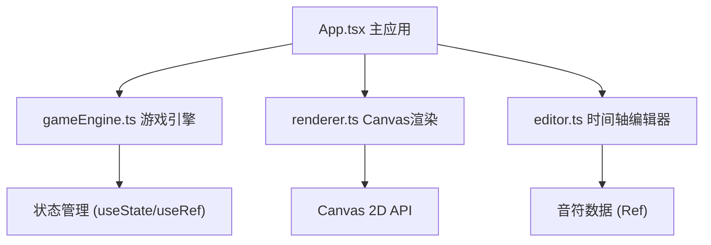

## 1. 架构设计



## 2. 技术描述

- **前端框架**：React 18 + TypeScript
- **构建工具**：Vite
- **渲染技术**：Canvas 2D API
- **状态管理**：React useState / useRef（轻量级，无需额外状态库）
- **动画系统**：requestAnimationFrame + 自定义弹簧动画函数
- **样式方案**：CSS Modules / 内联样式（Canvas绘制为主）

## 3. 核心模块划分

| 模块 | 文件 | 职责 |
|------|------|------|
| 主应用 | src/App.tsx | 全局状态管理、UI布局、子模块协调 |
| 游戏引擎 | src/gameEngine.ts | 时间线驱动、音符移动、碰撞检测、粒子更新 |
| Canvas渲染 | src/renderer.ts | 判定线、音符、粒子、背景光效的绘制 |
| 编辑器 | src/editor.ts | 音符增删改、刻度吸附、滚动同步 |

## 4. 数据模型

### 4.1 音符数据结构

```typescript
interface Note {
  id: string;
  time: number;        // 时间位置（秒）
  track: 'melody' | 'drum' | 'harmony';  // 音轨类型
  y: number;           // 纵向位置（0-100百分比）
}
```

### 4.2 粒子数据结构

```typescript
interface Particle {
  id: string;
  x: number;
  y: number;
  vx: number;
  vy: number;
  color: string;
  life: number;        // 剩余生命值
  maxLife: number;
  size: number;
}
```

### 4.3 游戏状态

```typescript
interface GameState {
  isPlaying: boolean;
  currentTime: number;
  speed: number;
  notes: Note[];
  particles: Particle[];
  performanceMode: 'normal' | 'low';  // 性能模式
}
```

## 5. 核心算法

### 5.1 音符移动计算
- 音符速度 = 画布宽度 / 音符飞行时间（约2秒）
- 当前位置 = 起始位置 - (当前时间 - 生成时间) × 速度

### 5.2 碰撞检测
- 判定线位置固定在画布左侧某一位置
- 当音符时间与当前时间差在判定窗口内时触发命中

### 5.3 刻度吸附
- 计算1/16拍对应的时间值
- 拖拽结束时将音符时间四舍五入到最近的1/16拍
- 使用弹簧缓动函数产生吸附动画

### 5.4 粒子系统
- 命中时生成放射状粒子（20-30个）
- 粒子具有初速度、重力、空气阻力
- 生命值随时间衰减，透明度线性降低

## 6. 性能优化策略

1. **对象池模式**：复用粒子对象，避免频繁GC
2. **离屏Canvas**：缓存背景和静态元素
3. **粒子上限**：超过300个粒子时进入低配模式
4. **降帧检测**：连续3帧低于45FPS时自动降级
5. **批量绘制**：同色粒子一次性绘制，减少状态切换
