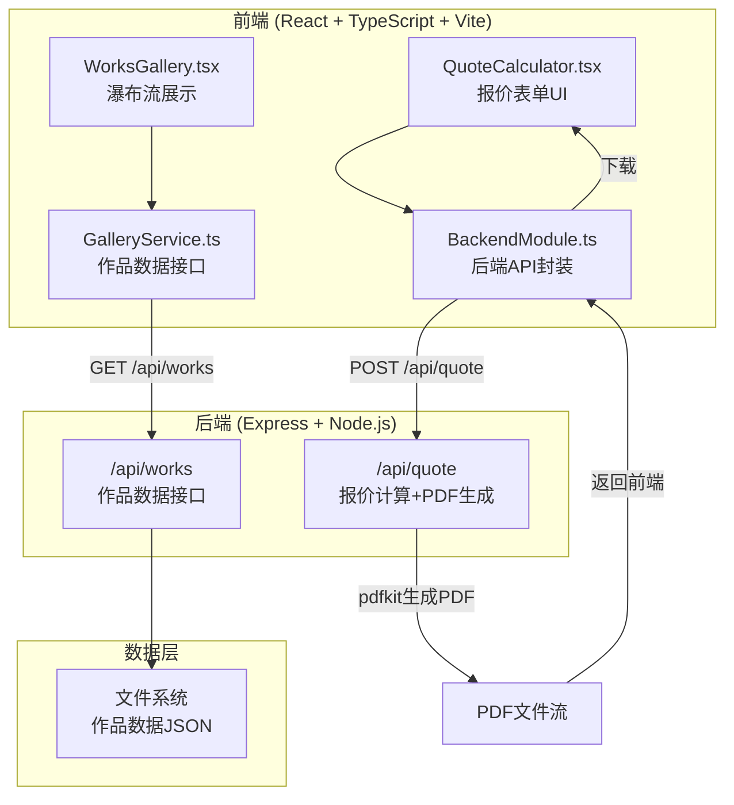
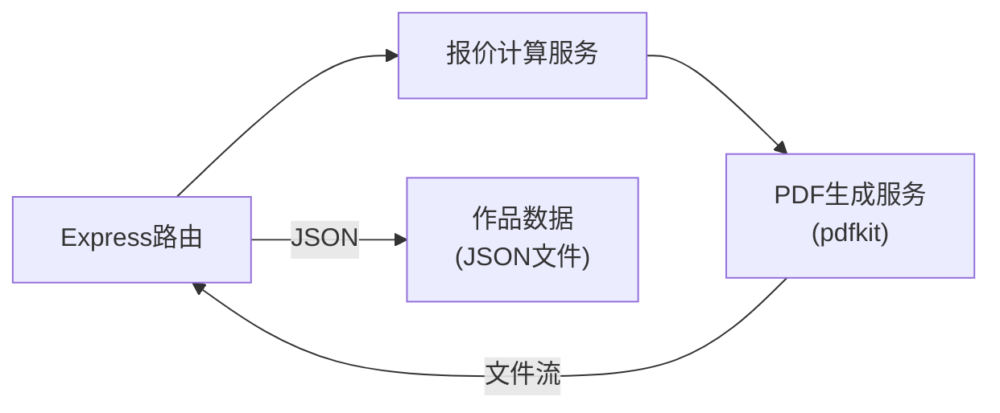
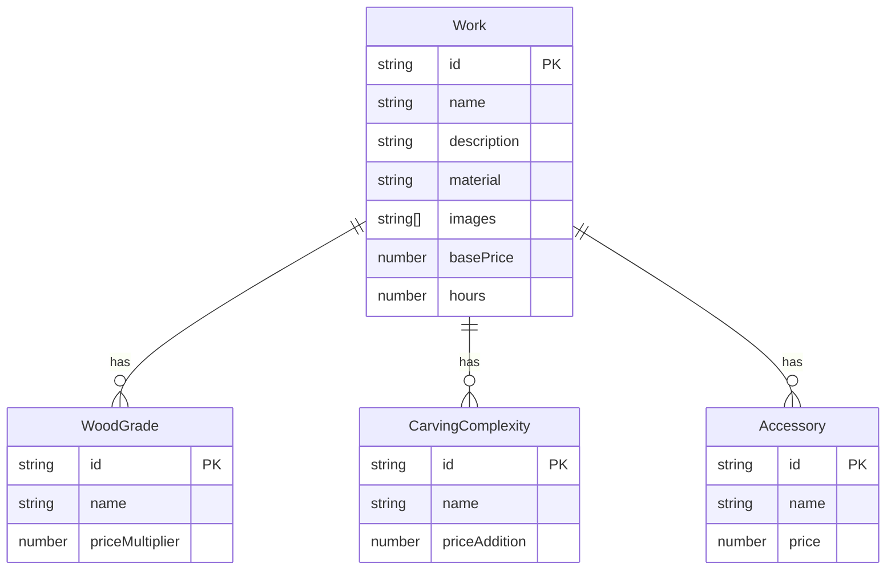

## 1. 架构设计



## 2. 技术说明

- **前端**：React@18 + TypeScript + Vite + CSS Modules（暖色木纹风格）
- **初始化工具**：vite-init（react-express-ts 模板）
- **后端**：Express@4 + pdfkit + uuid + cors
- **数据库**：文件系统JSON（mock数据，无需外部数据库）
- **路由**：react-router-dom 前端路由

## 3. 路由定义

| 路由 | 用途 |
|------|------|
| / | 首页画廊，瀑布流展示所有作品 |
| /work/:id | 作品详情页，含定制选项和报价计算 |

## 4. API 定义

### 4.1 GET /api/works

获取所有作品列表

**响应类型：**
```typescript
interface Work {
  id: string;
  name: string;
  description: string;
  material: string;
  materials: string[];
  dimensions: { label: string; value: string }[];
  images: string[];
  basePrice: number;
  hours: number;
  woodGrades: WoodGrade[];
  carvingComplexity: CarvingComplexity[];
  accessories: Accessory[];
}

interface WoodGrade {
  id: string;
  name: string;
  priceMultiplier: number;
}

interface CarvingComplexity {
  id: string;
  name: string;
  priceAddition: number;
}

interface Accessory {
  id: string;
  name: string;
  price: number;
}
```

### 4.2 GET /api/works/:id

获取单个作品详情

### 4.3 POST /api/quote

提交定制选项，计算价格并生成PDF

**请求类型：**
```typescript
interface QuoteRequest {
  workId: string;
  woodGradeId: string;
  carvingComplexityId: string;
  accessoryIds: string[];
  urgent: boolean;
}
```

**响应类型：**
- Content-Type: application/pdf
- 文件流（A4竖版PDF报价单）

## 5. 服务端架构图



## 6. 数据模型

### 6.1 数据模型定义



### 6.2 报价计算逻辑

```
总价 = 基价 × 木料等级乘数 + 雕刻复杂度附加价 + 配件总价 + (加急 ? 基价 × 0.3 : 0)
```

木料等级（5种）：
| 等级 | 乘数 |
|------|------|
| 松木（经济） | 1.0 |
| 桦木（标准） | 1.3 |
| 橡木（优质） | 1.6 |
| 胡桃木（高级） | 2.0 |
| 黑檀木（奢华） | 2.8 |

雕刻复杂度（3种）：
| 复杂度 | 附加价 |
|--------|--------|
| 简单线条 | 0 |
| 中等浮雕 | +200 |
| 精细圆雕 | +500 |

配件选项：
| 配件 | 价格 |
|------|------|
| 签名木盒 | +150 |
| 定制铭牌 | +80 |
| 防尘展示罩 | +120 |

加急费用：基价 × 30%

## 7. 文件结构与调用关系

```
project/
├── package.json                          # 依赖与脚本
├── index.html                            # 入口页面
├── tsconfig.json                         # TypeScript严格模式
├── vite.config.js                        # 构建配置，代理/api到后端
├── server.js                             # Express后端（路由+PDF生成）
├── data/
│   └── works.json                        # 作品mock数据
├── src/
│   ├── main.tsx                          # React入口
│   ├── App.tsx                           # 路由配置
│   ├── components/
│   │   ├── WorksGallery.tsx              # 瀑布流画廊（← GalleryService）
│   │   ├── WorkCard.tsx                  # 单个作品卡片
│   │   ├── QuoteCalculator.tsx           # 报价表单（→ BackendModule）
│   │   ├── ImageCarousel.tsx             # 图片轮播
│   │   └── QuotePreview.tsx              # 报价单预览弹窗
│   ├── services/
│   │   ├── GalleryService.ts             # 作品数据接口（← 后端API）
│   │   └── BackendModule.ts              # 后端API封装（→ Express）
│   ├── pages/
│   │   ├── HomePage.tsx                  # 首页
│   │   └── WorkDetailPage.tsx            # 详情页
│   └── styles/
│       └── global.css                    # 全局样式+木纹背景
```

数据流向：
- **作品展示**：后端 /api/works → GalleryService → WorksGallery → WorkCard
- **报价计算**：用户输入 → QuoteCalculator → BackendModule → POST /api/quote → PDF文件流 → 前端下载
